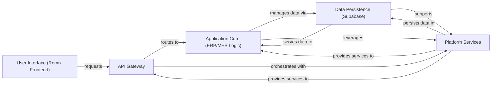

## Details

One paragraph explaining the functionality which is represented by this graph. What the main flow is and what is its purpose.

### User Interface (Remix Frontend)
The client-side application providing the user experience, handling user input, and displaying data.

**Related Classes/Methods**:

- `apps/academy/app/root.tsx` (1:1)

### API Gateway [[Expand]](./API_Gateway.md)
The unified entry point for all client and service requests, responsible for routing, validation, and orchestrating interactions with backend logic and services.

**Related Classes/Methods**:

- `packages/database/supabase/functions/lib/api/accounting.ts` (1:1)

### Application Core (ERP/MES Logic) [[Expand]](./Application_Core_ERP_MES_Logic_.md)
Encapsulates the primary business logic for manufacturing operations and enterprise resource planning, including core functionalities like order processing, inventory management, and production scheduling.

**Related Classes/Methods**:

- `packages/database/supabase/functions/lib/scheduling/scheduling-engine.ts` (1:1)

### Data Persistence (Supabase)
Manages all persistent data storage and retrieval for the application, leveraging PostgreSQL and Supabase features like Row-Level Security.

**Related Classes/Methods**:

- `packages/database/supabase/config.toml` (1:1)

### Platform Services [[Expand]](./Platform_Services.md)
A consolidated component providing essential cross-cutting functionalities such as user authentication and authorization, asynchronous job processing, communication (email/notifications), billing, and analytics.

**Related Classes/Methods**:

- `packages/auth/src/services/auth.server.ts` (1:1)

### [FAQ](https://github.com/CodeBoarding/GeneratedOnBoardings/tree/main?tab=readme-ov-file#faq)