```mermaid
graph LR
    lib_cartopy_io___init__["lib.cartopy.io.__init__"]
    lib_cartopy_io_shapereader["lib.cartopy.io.shapereader"]
    lib_cartopy_io_ogc_clients["lib.cartopy.io.ogc_clients"]
    lib_cartopy_io_srtm["lib.cartopy.io.srtm"]
    lib_cartopy_io_img_tiles["lib.cartopy.io.img_tiles"]
    lib_cartopy_io_img_nest["lib.cartopy.io.img_nest"]
    lib_cartopy_io___init__ -- "delegates to" --> lib_cartopy_io_shapereader
    lib_cartopy_io___init__ -- "delegates to" --> lib_cartopy_io_srtm
    lib_cartopy_io_shapereader -- "acquires data from" --> external_shapefile_resources
    lib_cartopy_io_ogc_clients -- "connects to" --> external_OGC_web_services
    lib_cartopy_io_srtm -- "fetches data from" --> external_SRTM_data_servers
```

## Details

The `lib.cartopy.io` subsystem forms the core data acquisition and management layer of `cartopy`, providing a unified interface for diverse geospatial data sources. It centralizes I/O operations through its `__init__` module, which acts as a facade, delegating specific tasks to specialized components. Key components like `shapereader` manage local vector data and implicitly handle external shapefile resource acquisition, while `ogc_clients` and `srtm` facilitate direct interactions with external web services for dynamic geospatial and elevation data. This modular design ensures efficient handling of various data formats and external resource dependencies, making the subsystem crucial for `cartopy`'s mapping capabilities.

### lib.cartopy.io.__init__
Serves as the primary entry point and facade for common I/O operations, providing a unified interface for data acquisition. It delegates specific data fetching tasks to specialized sub-components, adhering to the Adapter/Facade Pattern.

**Related Classes/Methods**:

- <a href="https://github.com/SciTools/cartopy/blob/main/lib/cartopy/io/__init__.py" target="_blank" rel="noopener noreferrer">`lib.cartopy.io.__init__`</a>

### lib.cartopy.io.shapereader
Manages the reading and acquisition of vector data specifically from ESRI Shapefiles. It provides an interface to iterate over records and handles the implicit downloading of common shapefile resources from external sources.

**Related Classes/Methods**:

- <a href="https://github.com/SciTools/cartopy/blob/main/lib/cartopy/io/shapereader.py" target="_blank" rel="noopener noreferrer">`lib.cartopy.io.shapereader`</a>

### lib.cartopy.io.ogc_clients
Handles the fetching of geospatial data (both raster and vector) from external Open Geospatial Consortium (OGC) web services, including WMS and WMTS.

**Related Classes/Methods**:

- <a href="https://github.com/SciTools/cartopy/blob/main/lib/cartopy/io/ogc_clients.py" target="_blank" rel="noopener noreferrer">`lib.cartopy.io.ogc_clients`</a>

### lib.cartopy.io.srtm
Specializes in the ingestion and processing of SRTM (Shuttle Radar Topography Mission) elevation data, including downloading, reading, and combining data tiles from external SRTM servers.

**Related Classes/Methods**:

- <a href="https://github.com/SciTools/cartopy/blob/main/lib/cartopy/io/srtm.py" target="_blank" rel="noopener noreferrer">`lib.cartopy.io.srtm`</a>

### lib.cartopy.io.img_tiles
Responsible for fetching and managing image tiles, commonly used for web mapping services. It includes functionality for caching and merging individual tiles.

**Related Classes/Methods**:

- <a href="https://github.com/SciTools/cartopy/blob/main/lib/cartopy/io/img_tiles.py" target="_blank" rel="noopener noreferrer">`lib.cartopy.io.img_tiles`</a>

### lib.cartopy.io.img_nest
Deals with nested image collections, providing functionality to work with images organized in nested directory structures or defined by world files.

**Related Classes/Methods**:

- <a href="https://github.com/SciTools/cartopy/blob/main/lib/cartopy/io/img_nest.py" target="_blank" rel="noopener noreferrer">`lib.cartopy.io.img_nest`</a>

### [FAQ](https://github.com/CodeBoarding/GeneratedOnBoardings/tree/main?tab=readme-ov-file#faq)