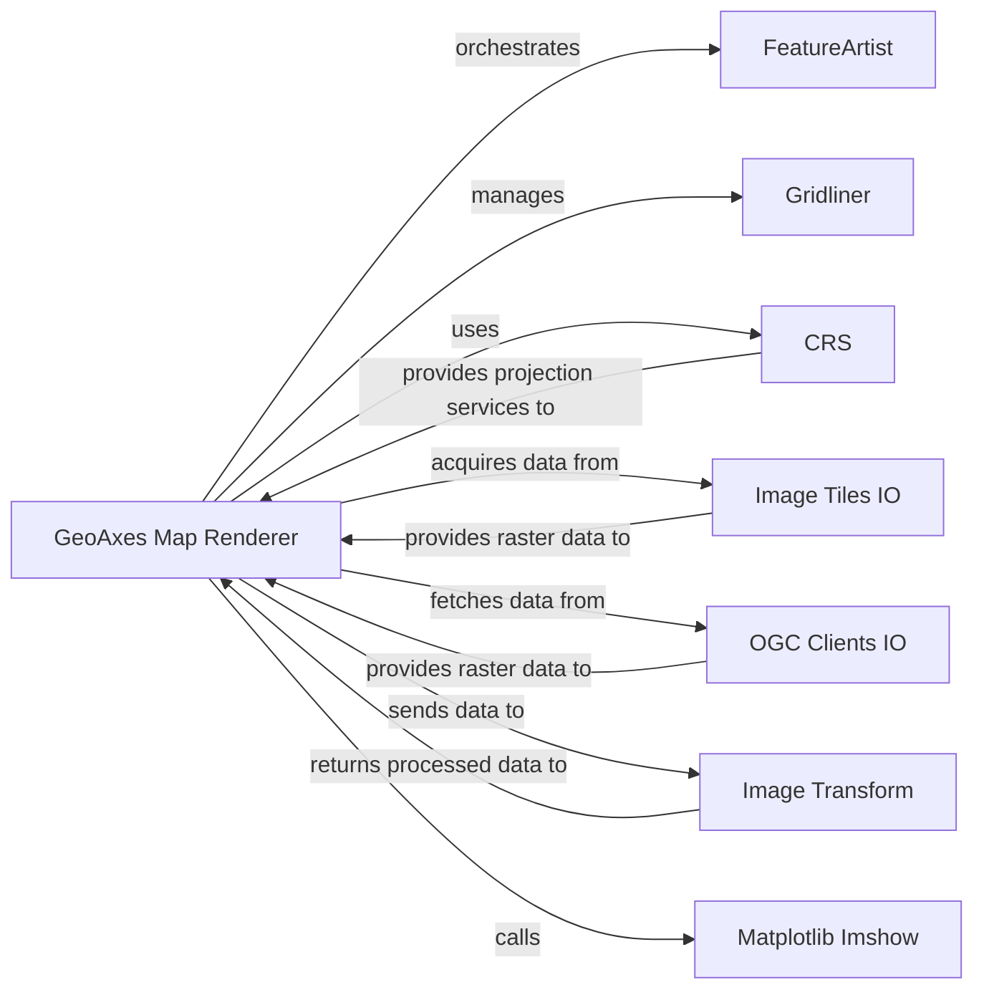

## Details

The `cartopy.mpl.geoaxes` subsystem, centered around the `GeoAxes` class, extends Matplotlib's `Axes` to provide geospatial plotting capabilities. `GeoAxes` acts as the primary orchestrator, leveraging `cartopy.crs.Projection` for coordinate system management and transformations. It interacts with `cartopy.mpl.feature_artist.FeatureArtist` to render vector data and `cartopy.mpl.gridliner.Gridliner` for drawing map grids. For raster data, `GeoAxes` utilizes `cartopy.io.img_tiles.GoogleTiles` and `cartopy.io.ogc_clients.WMTSRasterSource` (and `WMSRasterSource`) to acquire image tiles from various sources. Before display, raster data may undergo transformations via `cartopy.img_transform.warp_array`. Finally, `GeoAxes` relies on the core `matplotlib.axes.Axes.imshow` method for the actual rendering of image data onto the plot. This architecture ensures a clear separation of concerns, with specialized components handling projections, feature rendering, gridlines, data acquisition, and image processing, all coordinated by the central `GeoAxes` component.

### GeoAxes Map Renderer
The central component orchestrating the rendering of all geospatial data and map elements onto a Matplotlib `Axes` object. It extends Matplotlib's capabilities to handle geographical coordinates and projections, managing the display of features, gridlines, and various data overlays. It acts as the primary interface for users to create and manipulate geographical plots.

**Related Classes/Methods**:

- <a href="https://github.com/SciTools/cartopy/blob/main/lib/cartopy/mpl/geoaxes.py#L339-L2287" target="_blank" rel="noopener noreferrer">`cartopy.mpl.geoaxes.GeoAxes`:339-2287</a>

### CRS
Manages map projections and performs coordinate transformations, ensuring geospatial data is correctly positioned and displayed according to the chosen projection.

**Related Classes/Methods**:

- <a href="https://github.com/SciTools/cartopy/blob/main/lib/cartopy/crs.py" target="_blank" rel="noopener noreferrer">`cartopy.crs.Projection`</a>

### FeatureArtist
Responsible for rendering geographical features by converting geometries into Matplotlib paths, enabling the visualization of vector data like coastlines, borders, or custom shapes.

**Related Classes/Methods**:

- <a href="https://github.com/SciTools/cartopy/blob/main/lib/cartopy/mpl/feature_artist.py#L60-L255" target="_blank" rel="noopener noreferrer">`cartopy.mpl.feature_artist.FeatureArtist`:60-255</a>

### Gridliner
Draws latitude and longitude gridlines and their labels on the map, providing geographical context and reference points for the displayed data.

**Related Classes/Methods**:

- <a href="https://github.com/SciTools/cartopy/blob/main/lib/cartopy/mpl/gridliner.py#L107-L1257" target="_blank" rel="noopener noreferrer">`cartopy.mpl.gridliner.Gridliner`:107-1257</a>

### Image Tiles IO
Component for acquiring raster data for background imagery or overlays from image tile services (e.g., OpenStreetMap, Stamen).

**Related Classes/Methods**:

- <a href="https://github.com/SciTools/cartopy/blob/main/lib/cartopy/io/img_tiles.py#L237-L286" target="_blank" rel="noopener noreferrer">`cartopy.io.img_tiles.GoogleTiles`:237-286</a>

### OGC Clients IO
Component for acquiring raster data from OGC (Open Geospatial Consortium) clients, such as WMS (Web Map Service) or WMTS (Web Map Tile Service).

**Related Classes/Methods**:

- <a href="https://github.com/SciTools/cartopy/blob/main/lib/cartopy/io/ogc_clients.py#L339-L727" target="_blank" rel="noopener noreferrer">`cartopy.io.ogc_clients.WMTSRasterSource`:339-727</a>

### Image Transform
Performs transformations (e.g., regridding, reprojection) of raster data before display, ensuring compatibility with the map's projection and desired resolution.

**Related Classes/Methods**:

- <a href="https://github.com/SciTools/cartopy/blob/main/lib/cartopy/img_transform.py#L124-L196" target="_blank" rel="noopener noreferrer">`cartopy.img_transform.warp_array`:124-196</a>

### Matplotlib Imshow
The underlying Matplotlib function utilized for the actual display of image data (raster arrays) onto the `Axes` object.

**Related Classes/Methods**:

### [FAQ](https://github.com/CodeBoarding/GeneratedOnBoardings/tree/main?tab=readme-ov-file#faq)