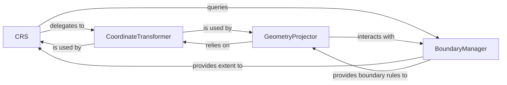

## Details

The `cartopy.crs` subsystem provides a comprehensive framework for defining and manipulating coordinate reference systems. The `CRS` component serves as the primary interface, abstracting projection details and initiating transformations. It offloads the mathematical specifics of coordinate conversion to the `CoordinateTransformer`. For more intricate geospatial geometries, the `GeometryProjector` orchestrates their projection, leveraging the `CoordinateTransformer` and collaborating with the `BoundaryManager` to manage spatial extents and ensure correct handling of shapes at projection boundaries. This collaborative structure ensures accurate and visually consistent representation of geographical data.

### CRS
The central facade and primary interface for defining and encapsulating the properties of various geographic and projected coordinate systems (e.g., PlateCarree, Mercator). It manages the internal representation of projection parameters and provides high-level methods for coordinate and geometry transformations. This component acts as the main entry point for users to interact with different projection systems.

**Related Classes/Methods**:

- <a href="https://github.com/SciTools/cartopy/blob/main/lib/cartopy/crs.py" target="_blank" rel="noopener noreferrer">`cartopy.crs.CRS`</a>

### CoordinateTransformer
Responsible for the low-level mathematical transformation of individual coordinates (points, arrays of points, or vectors) from one CRS to another. It performs the actual projection calculations, likely leveraging an underlying library like PROJ, ensuring precise numerical conversions.

**Related Classes/Methods**: _None_

### GeometryProjector
Handles the projection of complex geospatial geometries (e.g., points, lines, polygons, multi-geometries) while ensuring their topological integrity. It manages issues such as anti-meridian wrapping, boundary clipping, and the correct formation of projected shapes, which are critical for accurate visual representation on a map.

**Related Classes/Methods**: _None_

### BoundaryManager
Defines and provides access to the spatial extent and boundary characteristics of a CRS. It also contains logic for managing how geometries interact with these boundaries during projection, ensuring that shapes are correctly handled when they cross or extend beyond the defined projection limits (e.g., clipping polygons at the map edge).

**Related Classes/Methods**: _None_

### [FAQ](https://github.com/CodeBoarding/GeneratedOnBoardings/tree/main?tab=readme-ov-file#faq)