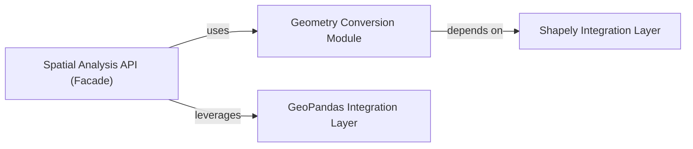

## Details

This analysis focuses on the spatial analysis and geometry utility components within the `cartopy` library, highlighting their interdependencies and integration points with external libraries like Shapely and GeoPandas. The goal is to provide a clearer understanding of how spatial operations are performed and managed within Cartopy.

### Spatial Analysis API (Facade)
Provides a simplified interface for spatial analysis operations, potentially aggregating functionalities from other modules like `cartopy.prepared` and `cartopy.vector_utils`.

**Related Classes/Methods**:

### Geometry Conversion Module
Handles conversions between different geometry types and coordinate systems, likely interacting with `shapely` for core geometry operations.

**Related Classes/Methods**:

### Shapely Integration Layer
Acts as an intermediary, translating Cartopy's internal geometry representations to Shapely objects and vice-versa, ensuring compatibility.

**Related Classes/Methods**:

### GeoPandas Integration Layer
Facilitates the use of GeoPandas DataFrames within Cartopy, enabling advanced geospatial operations and data handling.

**Related Classes/Methods**:

### [FAQ](https://github.com/CodeBoarding/GeneratedOnBoardings/tree/main?tab=readme-ov-file#faq)