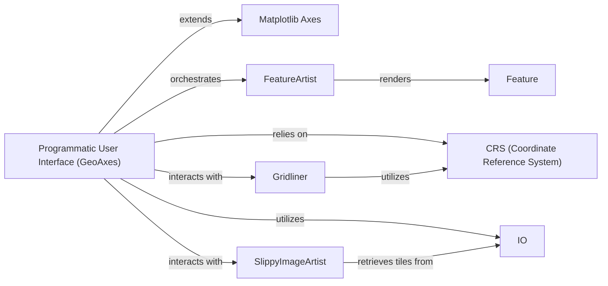

## Details

The Cartopy library's geospatial visualization subsystem is built around a core set of components that extend Matplotlib's capabilities to handle geographical data.

### Programmatic User Interface (GeoAxes)
The primary user-facing component, extending Matplotlib's `Axes` to provide a geographical context. It allows users to define map projections, set extents, and add geospatial data layers. It orchestrates the rendering of features, gridlines, and background imagery.

**Related Classes/Methods**:

- <a href="https://github.com/SciTools/cartopy/blob/main/lib/cartopy/mpl/geoaxes.py#L339-L2287" target="_blank" rel="noopener noreferrer">`cartopy.mpl.geoaxes.GeoAxes`:339-2287</a>

### Matplotlib Axes
The fundamental Matplotlib class that `GeoAxes` extends. It provides the base functionality for plotting and rendering graphical elements, serving as the underlying canvas for all visualizations.

**Related Classes/Methods**:

### FeatureArtist
Responsible for rendering abstract geographical features (defined by `Feature`) onto the `GeoAxes` instance, translating high-level feature definitions into visual elements like polygons and lines.

**Related Classes/Methods**:

- <a href="https://github.com/SciTools/cartopy/blob/main/lib/cartopy/mpl/feature_artist.py#L60-L255" target="_blank" rel="noopener noreferrer">`cartopy.mpl.feature_artist.FeatureArtist`:60-255</a>

### Gridliner
Manages the drawing of latitude and longitude gridlines and their corresponding labels on the map, enhancing readability and providing geographical context.

**Related Classes/Methods**:

- <a href="https://github.com/SciTools/cartopy/blob/main/lib/cartopy/mpl/gridliner.py#L107-L1257" target="_blank" rel="noopener noreferrer">`cartopy.mpl.gridliner.Gridliner`:107-1257</a>

### CRS (Coordinate Reference System)
Handles all coordinate transformations for geospatial plotting, ensuring that geographical data is correctly projected and displayed according to the chosen map projection. This is a core module providing projection definitions and transformation utilities.

**Related Classes/Methods**:

### SlippyImageArtist
Facilitates fetching and display of background imagery from online tile services (e.g., OpenStreetMap, Stamen), providing contextual base maps for the geospatial data.

**Related Classes/Methods**:

- <a href="https://github.com/SciTools/cartopy/blob/main/lib/cartopy/mpl/slippy_image_artist.py#L16-L72" target="_blank" rel="noopener noreferrer">`cartopy.mpl.slippy_image_artist.SlippyImageArtist`:16-72</a>

### Feature
Represents abstract geographical features (e.g., land, ocean, borders) that can be added to a map. These are typically high-level definitions that `FeatureArtist` then renders. This is a core module providing access to common geographical features.

**Related Classes/Methods**:

### IO
Handles general data fetching for Cartopy, including various geospatial data formats and online sources. It provides the raw data that other components then process and visualize. This is a core module for input/output operations.

**Related Classes/Methods**:

### [FAQ](https://github.com/CodeBoarding/GeneratedOnBoardings/tree/main?tab=readme-ov-file#faq)