```mermaid
graph LR
    Data_Ingestion_Module["Data Ingestion Module"]
    Projection_Transformation_Engine["Projection & Transformation Engine"]
    Spatial_Analysis_Toolkit["Spatial Analysis Toolkit"]
    Map_Rendering_Visualization_Module["Map Rendering & Visualization Module"]
    User_Interface_UI_["User Interface (UI)"]
    Data_Ingestion_Module -- "processes data from" --> Projection_Transformation_Engine
    Projection_Transformation_Engine -- "utilizes data from" --> Spatial_Analysis_Toolkit
    Spatial_Analysis_Toolkit -- "visualizes output from" --> Map_Rendering_Visualization_Module
    Data_Ingestion_Module -- "interacts with" --> User_Interface_UI_
    Map_Rendering_Visualization_Module -- "interacts with" --> User_Interface_UI_
    click Data_Ingestion_Module href "https://github.com/CodeBoarding/GeneratedOnBoardings/blob/main/cartopy/Data_Ingestion_Module.md" "Details"
    click Projection_Transformation_Engine href "https://github.com/CodeBoarding/GeneratedOnBoardings/blob/main/cartopy/Projection_Transformation_Engine.md" "Details"
    click Spatial_Analysis_Toolkit href "https://github.com/CodeBoarding/GeneratedOnBoardings/blob/main/cartopy/Spatial_Analysis_Toolkit.md" "Details"
    click Map_Rendering_Visualization_Module href "https://github.com/CodeBoarding/GeneratedOnBoardings/blob/main/cartopy/Map_Rendering_Visualization_Module.md" "Details"
    click User_Interface_UI_ href "https://github.com/CodeBoarding/GeneratedOnBoardings/blob/main/cartopy/User_Interface_UI_.md" "Details"
```

## Details

This analysis describes a geospatial data processing system. It outlines the key components involved in ingesting, processing, analyzing, and visualizing geospatial data, along with their interdependencies.

### Data Ingestion Module [[Expand]](./Data_Ingestion_Module.md)
Handles the initial loading and parsing of geospatial data from various formats (e.g., Shapefiles, GeoJSON, NetCDF). It ensures data integrity and prepares it for further processing.

**Related Classes/Methods**:

### Projection & Transformation Engine [[Expand]](./Projection_Transformation_Engine.md)
Manages the transformation of geospatial coordinates between different Coordinate Reference Systems (CRSs). It includes functionalities for reprojection, datum transformations, and unit conversions.

**Related Classes/Methods**:

### Spatial Analysis Toolkit [[Expand]](./Spatial_Analysis_Toolkit.md)
Provides a suite of tools for spatial analysis, such as buffering, overlay operations, spatial joins, and distance calculations. It leverages efficient algorithms for large datasets.

**Related Classes/Methods**:

### Map Rendering & Visualization Module [[Expand]](./Map_Rendering_Visualization_Module.md)
Responsible for rendering geospatial data onto maps and generating various visualizations. It supports different map projections, symbology, and annotation options.

**Related Classes/Methods**:

- <a href="https://github.com/SciTools/cartopy/blob/main/lib/cartopy/mpl/geoaxes.py#L339-L2287" target="_blank" rel="noopener noreferrer">`cartopy.mpl.geoaxes.GeoAxes`:339-2287</a>

### User Interface (UI) [[Expand]](./User_Interface_UI_.md)
Offers an interface for users to interact with the system, define analysis parameters, and visualize results. It could be a web-based or desktop application.

**Related Classes/Methods**: _None_

### [FAQ](https://github.com/CodeBoarding/GeneratedOnBoardings/tree/main?tab=readme-ov-file#faq)