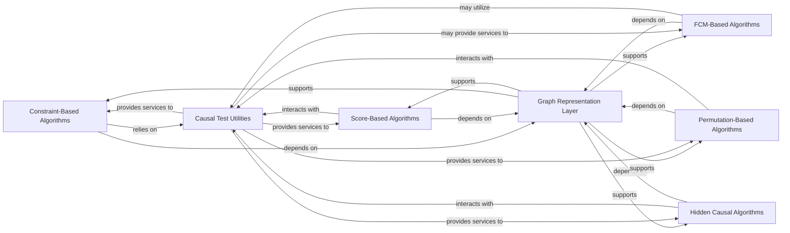

## Details

The `causal-learn` project is structured around various causal discovery algorithms, categorized by their underlying principles: Constraint-Based, FCM-Based, Permutation-Based, Hidden Causal, and Score-Based. These algorithms primarily interact with a central `Graph Representation Layer` for managing causal graph structures and rely on a `Causal Test Utilities` component for statistical tests and score calculations. This modular design allows for independent development and extension of different causal discovery methodologies while ensuring a consistent approach to graph manipulation and statistical inference.

### Constraint-Based Algorithms
This component implements causal discovery methods that rely on conditional independence tests to construct and orient causal graphs. It includes algorithms like PC and FCI, which are fundamental to this paradigm. It also implicitly includes helper functions specific to these algorithms.

**Related Classes/Methods**:

- <a href="https://github.com/py-why/causal-learn/blob/main/causallearn/search/ConstraintBased/PC.py" target="_blank" rel="noopener noreferrer">`causallearn.search.ConstraintBased.PC`</a>
- <a href="https://github.com/py-why/causal-learn/blob/main/causallearn/search/ConstraintBased/FCI.py" target="_blank" rel="noopener noreferrer">`causallearn.search.ConstraintBased.FCI`</a>

### FCM-Based Algorithms
This component groups algorithms that infer causal relationships based on Functional Causal Models (FCMs). This includes methods like Additive Noise Models (ANM), Linear Non-Gaussian Acyclic Models (LiNGAM), and Post-Nonlinear (PNL) models, which leverage specific assumptions about the functional relationship between cause and effect.

**Related Classes/Methods**:

- <a href="https://github.com/py-why/causal-learn/blob/main/causallearn/search/FCMBased/ANM/ANM.py" target="_blank" rel="noopener noreferrer">`causallearn.search.FCMBased.ANM.ANM`</a>
- <a href="https://github.com/py-why/causal-learn/blob/main/causallearn/search/FCMBased/lingam/bottom_up_parce_lingam.py" target="_blank" rel="noopener noreferrer">`causallearn.search.FCMBased.lingam.bottom_up_parce_lingam`</a>
- <a href="https://github.com/py-why/causal-learn/blob/main/causallearn/search/FCMBased/lingam/direct_lingam.py" target="_blank" rel="noopener noreferrer">`causallearn.search.FCMBased.lingam.direct_lingam`</a>
- <a href="https://github.com/py-why/causal-learn/blob/main/causallearn/search/FCMBased/lingam/ica_lingam.py" target="_blank" rel="noopener noreferrer">`causallearn.search.FCMBased.lingam.ica_lingam`</a>
- <a href="https://github.com/py-why/causal-learn/blob/main/causallearn/search/FCMBased/lingam/rcd.py" target="_blank" rel="noopener noreferrer">`causallearn.search.FCMBased.lingam.rcd`</a>
- <a href="https://github.com/py-why/causal-learn/blob/main/causallearn/search/FCMBased/lingam/var_lingam.py" target="_blank" rel="noopener noreferrer">`causallearn.search.FCMBased.lingam.var_lingam`</a>
- <a href="https://github.com/py-why/causal-learn/blob/main/causallearn/search/FCMBased/lingam/varma_lingam.py" target="_blank" rel="noopener noreferrer">`causallearn.search.FCMBased.lingam.varma_lingam`</a>
- <a href="https://github.com/py-why/causal-learn/blob/main/causallearn/search/FCMBased/PNL/PNL.py" target="_blank" rel="noopener noreferrer">`causallearn.search.FCMBased.PNL.PNL`</a>

### Permutation-Based Algorithms
This component focuses on causal discovery by searching through permutations of variables to identify causal orderings. Algorithms like BOSS and GRaSP fall into this category, often optimizing a score function during the search process.

**Related Classes/Methods**:

- <a href="https://github.com/py-why/causal-learn/blob/main/causallearn/search/PermutationBased/BOSS.py" target="_blank" rel="noopener noreferrer">`causallearn.search.PermutationBased.BOSS`</a>
- <a href="https://github.com/py-why/causal-learn/blob/main/causallearn/search/PermutationBased/GRaSP.py" target="_blank" rel="noopener noreferrer">`causallearn.search.PermutationBased.GRaSP`</a>

### Hidden Causal Algorithms
This component implements causal discovery methods specifically designed to address the challenge of hidden confounders. It focuses on learning latent representations and performing causal inference on these representations, exemplified by the GIN algorithm.

**Related Classes/Methods**:

- <a href="https://github.com/py-why/causal-learn/blob/main/causallearn/search/HiddenCausal/GIN/GIN.py" target="_blank" rel="noopener noreferrer">`causallearn.search.HiddenCausal.GIN.GIN`</a>

### Score-Based Algorithms
This component contains algorithms that discover causal graphs by optimizing a predefined score function. These methods search for the graph structure that best fits the observed data according to the chosen scoring criterion, including algorithms like CALM and Exact Search.

**Related Classes/Methods**:

- <a href="https://github.com/py-why/causal-learn/blob/main/causallearn/search/ScoreBased/CALM.py" target="_blank" rel="noopener noreferrer">`causallearn.search.ScoreBased.CALM`</a>
- <a href="https://github.com/py-why/causal-learn/blob/main/causallearn/search/ScoreBased/ExactSearch.py" target="_blank" rel="noopener noreferrer">`causallearn.search.ScoreBased.ExactSearch`</a>

### Graph Representation Layer [[Expand]](./Graph_Representation_Layer.md)
This component provides the fundamental data structures and operations for representing and manipulating causal graphs. It ensures a consistent and unified way for all causal discovery algorithms to interact with graph objects.

**Related Classes/Methods**:

- <a href="https://github.com/py-why/causal-learn/blob/main/causallearn/graph/Graph.py" target="_blank" rel="noopener noreferrer">`causallearn.graph.Graph`</a>

### Causal Test Utilities
This component centralizes various statistical tests and score calculation functions that are commonly used across different causal discovery algorithms. This includes conditional independence tests, which are crucial for constraint-based methods, and graph score evaluation functions for score-based methods.

**Related Classes/Methods**:

- <a href="https://github.com/py-why/causal-learn/blob/main/causallearn/utils/KCI/KCI.py" target="_blank" rel="noopener noreferrer">`causallearn.utils.KCI.KCI`</a>

### [FAQ](https://github.com/CodeBoarding/GeneratedOnBoardings/tree/main?tab=readme-ov-file#faq)