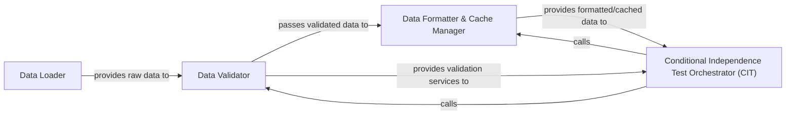

## Details

The Data Management subsystem is primarily defined by the functionalities within causallearn.utils.Dataset and causallearn.utils.cit. It serves as the initial data ingress and preparation layer for all causal discovery algorithms within the causal-learn project.

### Data Loader
Responsible for fetching raw datasets from external sources (e.g., URLs) and parsing them into fundamental data structures like NumPy arrays and lists of labels. It is the initial entry point for external data into the system.

**Related Classes/Methods**:

- <a href="https://github.com/py-why/causal-learn/blob/main/causallearn/utils/Dataset.py" target="_blank" rel="noopener noreferrer">`causallearn.utils.Dataset:load_dataset`</a>

### Data Validator
Performs comprehensive structural and content validation on the raw input data. This includes crucial checks for dimensions, data types, and handling of missing values, ensuring the data adheres to the strict requirements of downstream causal discovery algorithms.

**Related Classes/Methods**:

- <a href="https://github.com/py-why/causal-learn/blob/main/causallearn/utils/cit.py" target="_blank" rel="noopener noreferrer">`causallearn.utils.cit:assert_input_data_is_valid`</a>

### Data Formatter & Cache Manager
Transforms the validated input data into a standardized format (e.g., X, Y, Z for conditional independence tests) suitable for direct consumption by algorithms. It also generates a unique cache key for the formatted data to optimize performance by avoiding redundant computations.

**Related Classes/Methods**:

- <a href="https://github.com/py-why/causal-learn/blob/main/causallearn/utils/cit.py" target="_blank" rel="noopener noreferrer">`causallearn.utils.cit:get_formatted_XYZ_and_cachekey`</a>

### Conditional Independence Test Orchestrator (CIT)
Orchestrates the execution of conditional independence tests, which are fundamental building blocks for many causal discovery algorithms. While not strictly a data management component, it acts as the primary consumer and orchestrator of the prepared data, ensuring it is validated and formatted correctly before initiating the tests. It bridges the data preparation layer with the core algorithmic layer.

**Related Classes/Methods**:

- <a href="https://github.com/py-why/causal-learn/blob/main/causallearn/utils/cit.py" target="_blank" rel="noopener noreferrer">`causallearn.utils.cit`</a>

### [FAQ](https://github.com/CodeBoarding/GeneratedOnBoardings/tree/main?tab=readme-ov-file#faq)