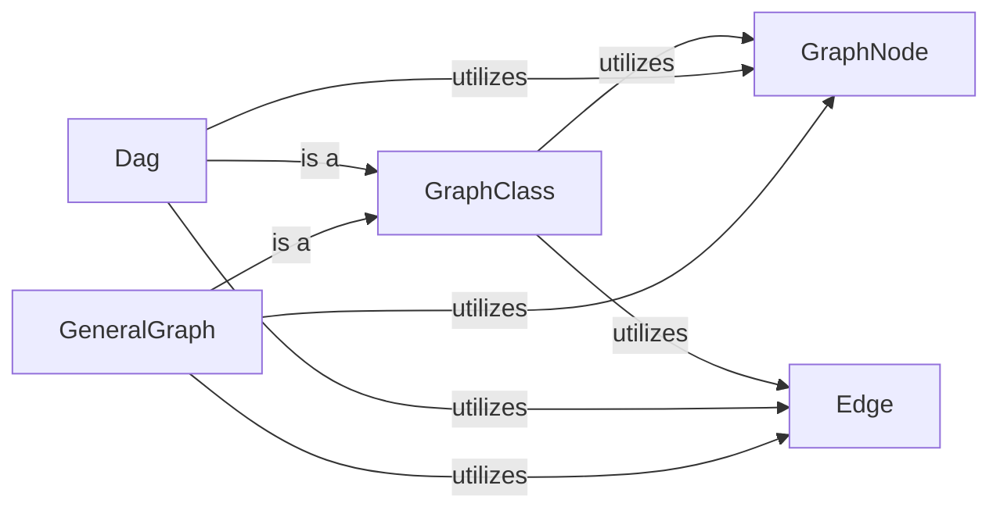

## Details

The Graph Representation Layer subsystem provides the foundational data structures and interfaces for defining, storing, and managing various types of causal graphs, including their nodes and edges.

### GraphNode
Manages the identity (name) and attributes of a graph node. It serves as the atomic unit for representing entities within any graph structure.

**Related Classes/Methods**:

- <a href="https://github.com/py-why/causal-learn/blob/main/causallearn/graph/GraphNode.py#L8-L97" target="_blank" rel="noopener noreferrer">`GraphNode`:8-97</a>

### Edge
Defines the two endpoints of a connection and its directionality (e.g., directed, undirected, bi-directed). It represents the relationships between GraphNode instances.

**Related Classes/Methods**:

- <a href="https://github.com/py-why/causal-learn/blob/main/causallearn/graph/Edges.py#L12-L14" target="_blank" rel="noopener noreferrer">`Edge`:12-14</a>

### GraphClass
Serves as a foundational abstract base for various graph types, offering common functionalities such as identifying edge types, determining adjacency, detecting structural patterns (e.g., unshielded triples), finding conditioning sets, and converting to NetworkX graph formats. It establishes the common interface for all graph implementations.

**Related Classes/Methods**:

- <a href="https://github.com/py-why/causal-learn/blob/main/causallearn/graph/GraphClass.py" target="_blank" rel="noopener noreferrer">`GraphClass`</a>

### Dag
Manages the structure and properties unique to Directed Acyclic Graphs (DAGs). This includes operations like adding/removing nodes and edges while preserving acyclicity, computing node degrees, identifying ancestors and descendants, checking d-separation, and converting the DAG to a Partial Ancestral Graph (PAG).

**Related Classes/Methods**:

- <a href="https://github.com/py-why/causal-learn/blob/main/causallearn/graph/Dag.py#L19-L790" target="_blank" rel="noopener noreferrer">`Dag`:19-790</a>

### GeneralGraph
Provides functionalities for managing general graph structures, which can contain both directed and undirected edges, and cycles. This includes adding/removing nodes and edges, computing degrees, identifying ancestors and descendants, and checking d-separation. It offers a more flexible graph representation than Dag.

**Related Classes/Methods**:

- <a href="https://github.com/py-why/causal-learn/blob/main/causallearn/graph/GeneralGraph.py#L24-L1005" target="_blank" rel="noopener noreferrer">`GeneralGraph`:24-1005</a>

### [FAQ](https://github.com/CodeBoarding/GeneratedOnBoardings/tree/main?tab=readme-ov-file#faq)