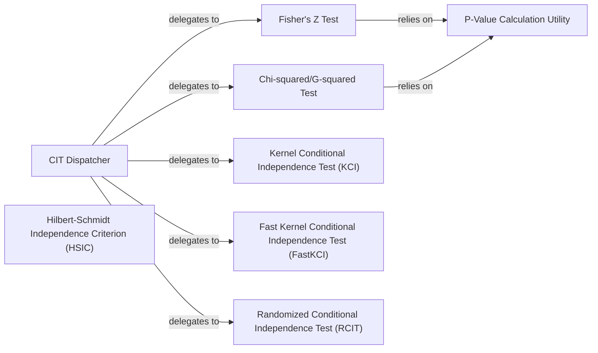

## Details

The Conditional Independence Test (CIT) subsystem in `causal-learn` provides a flexible framework for assessing conditional independence between variables. At its core, the `CIT Dispatcher` acts as a central entry point, abstracting the complexities of various underlying CIT implementations. It intelligently routes requests to specialized components such as `Fisher's Z Test` for continuous Gaussian data, `Chi-squared/G-squared Test` for discrete data, and `Kernel Conditional Independence Test (KCI)`, `Fast Kernel Conditional Independence Test (FastKCI)`, and `Randomized Conditional Independence Test (RCIT)` for non-parametric scenarios. Many of these tests, particularly `Fisher's Z Test` and `Chi-squared/G-squared Test`, rely on a shared `P-Value Calculation Utility` to determine statistical significance, centralizing this common functionality. The `Hilbert-Schmidt Independence Criterion (HSIC)` component, while related to independence testing, serves a distinct role within Functional Causal Model-based algorithms. This modular design allows for easy extension with new CIT methods and promotes reusability of common statistical utilities.

### CIT Dispatcher
Provides a high-level, unified interface for various conditional independence tests. It acts as a dispatcher, routing requests to specific CIT implementations based on the test type.

**Related Classes/Methods**:

- <a href="https://github.com/py-why/causal-learn/blob/main/causallearn/utils/cit.py#L50-L83" target="_blank" rel="noopener noreferrer">`causallearn.utils.cit.CIT`:50-83</a>

### Fisher's Z Test
Implements Fisher's Z-test for conditional independence, specifically designed for continuous, Gaussian data. It computes the test statistic and relies on a utility for p-value calculation.

**Related Classes/Methods**:

- <a href="https://github.com/py-why/causal-learn/blob/main/causallearn/utils/cit.py#L192-L225" target="_blank" rel="noopener noreferrer">`causallearn.utils.cit.FisherZ`:192-225</a>

### Chi-squared/G-squared Test
Conducts Chi-squared or G-squared tests for conditional independence, which are suitable for discrete data. It calculates the test statistic and uses a utility for p-value determination.

**Related Classes/Methods**:

- <a href="https://github.com/py-why/causal-learn/blob/main/causallearn/utils/cit.py#L294-L442" target="_blank" rel="noopener noreferrer">`causallearn.utils.cit.Chisq_or_Gsq`:294-442</a>

### Kernel Conditional Independence Test (KCI)
The primary implementation of the Kernel Conditional Independence test. It performs the core statistical computation for non-parametric independence testing.

**Related Classes/Methods**: _None_

### Fast Kernel Conditional Independence Test (FastKCI)
Provides an optimized version of the KCI test, offering improved performance for kernel-based conditional independence testing.

**Related Classes/Methods**: _None_

### Randomized Conditional Independence Test (RCIT)
Implements the Randomized Conditional Independence Test, another non-parametric approach for assessing conditional independence.

**Related Classes/Methods**: _None_

### Hilbert-Schmidt Independence Criterion (HSIC)
The core implementation of the Hilbert-Schmidt Independence Criterion (HSIC) test. HSIC is a measure of dependence used in non-linear causal discovery, particularly within Functional Causal Model-based algorithms.

**Related Classes/Methods**:

- <a href="https://github.com/py-why/causal-learn/blob/main/causallearn/search/FCMBased/lingam/hsic.py#L112-L176" target="_blank" rel="noopener noreferrer">`causallearn.search.FCMBased.lingam.hsic.hsic_test_gamma`:112-176</a>

### P-Value Calculation Utility
A shared utility function responsible for calculating p-values for statistical tests from a given test statistic and degrees of freedom. This component centralizes the p-value computation logic.

**Related Classes/Methods**:

- <a href="https://github.com/py-why/causal-learn/blob/main/causallearn/utils/cit.py#L392-L423" target="_blank" rel="noopener noreferrer">`causallearn.utils.cit._CalculatePValue`:392-423</a>

### [FAQ](https://github.com/CodeBoarding/GeneratedOnBoardings/tree/main?tab=readme-ov-file#faq)