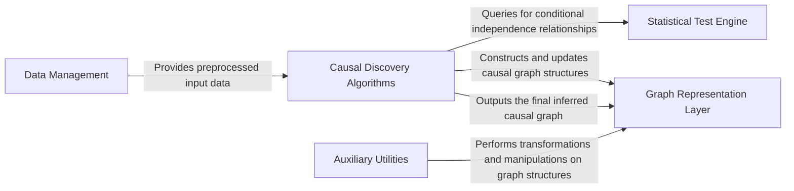

## Details

The `causal-learn` project is structured around a core set of components designed for comprehensive causal discovery. The process begins with the Data Management component, responsible for ingesting and preparing raw data. This preprocessed data then feeds into the Causal Discovery Algorithms, which represent the analytical heart of the system. These algorithms leverage the Statistical Test Engine to perform crucial conditional independence tests and other statistical evaluations, guiding the discovery process. All discovered causal relationships and graph structures are managed and represented by the Graph Representation Layer. Finally, the Auxiliary Utilities provide a suite of supporting functions for graph manipulation, conversions, and other common tasks, ensuring flexibility and extensibility within the causal inference workflow. This modular design facilitates clear data flow, allowing for independent development and integration of new algorithms and statistical tests.

### Data Management [[Expand]](./Data_Management.md)
Handles the loading, validation, and initial preparation of input data for all causal discovery algorithms. It serves as the primary data ingress point.

**Related Classes/Methods**:

- <a href="https://github.com/py-why/causal-learn/blob/main/causallearn/utils/Dataset.py" target="_blank" rel="noopener noreferrer">`causallearn/utils/data_utils.py`</a>

### Graph Representation Layer [[Expand]](./Graph_Representation_Layer.md)
Provides the foundational data structures and interfaces for defining, storing, and managing various types of causal graphs (e.g., DAGs, PAGs, general graphs), including their nodes and edges.

**Related Classes/Methods**:

- <a href="https://github.com/py-why/causal-learn/blob/main/causallearn/graph/Dag.py" target="_blank" rel="noopener noreferrer">`causallearn/graph/Dag.py`</a>
- <a href="https://github.com/py-why/causal-learn/blob/main/causallearn/graph/GeneralGraph.py" target="_blank" rel="noopener noreferrer">`causallearn/graph/GeneralGraph.py`</a>
- <a href="https://github.com/py-why/causal-learn/blob/main/causallearn/graph/Edge.py" target="_blank" rel="noopener noreferrer">`causallearn/graph/Edge.py`</a>
- <a href="https://github.com/py-why/causal-learn/blob/main/causallearn/graph/GraphNode.py" target="_blank" rel="noopener noreferrer">`causallearn/graph/GraphNode.py`</a>

### Causal Discovery Algorithms [[Expand]](./Causal_Discovery_Algorithms.md)
The central component encapsulating all implemented causal discovery methodologies, including constraint-based, FCM-based, permutation-based, hidden causal representation learning, and score-based algorithms. It orchestrates the discovery process.

**Related Classes/Methods**:

- <a href="https://github.com/py-why/causal-learn/blob/main/causallearn/search/ConstraintBased/PC.py" target="_blank" rel="noopener noreferrer">`causallearn/search/ConstraintBased/PC.py`</a>
- <a href="https://github.com/py-why/causal-learn/blob/main/causallearn/search/FCMBased/ANM/ANM.py" target="_blank" rel="noopener noreferrer">`causallearn/search/FCMBased/lingam/ANM.py`</a>
- <a href="https://github.com/py-why/causal-learn/blob/main/causallearn/search/PermutationBased/BOSS.py" target="_blank" rel="noopener noreferrer">`causallearn/search/PermutationBased/BOSS.py`</a>
- <a href="https://github.com/py-why/causal-learn/blob/main/causallearn/search/HiddenCausal/GIN/GIN.py" target="_blank" rel="noopener noreferrer">`causallearn/search/HiddenCausal/GIN.py`</a>
- <a href="https://github.com/py-why/causal-learn/blob/main/causallearn/search/ScoreBased/CALM.py" target="_blank" rel="noopener noreferrer">`causallearn/search/ScoreBased/CALM.py`</a>

### Statistical Test Engine [[Expand]](./Statistical_Test_Engine.md)
Offers a unified interface for various statistical tests, including conditional independence tests (CIT) and non-linear independence criteria (HSIC), crucial for many causal discovery algorithms.

**Related Classes/Methods**:

- <a href="https://github.com/py-why/causal-learn/blob/main/causallearn/utils/cit.py" target="_blank" rel="noopener noreferrer">`causallearn/utils/cit/CIT.py`</a>
- <a href="https://github.com/py-why/causal-learn/blob/main/causallearn/utils/KCI/KCI.py" target="_blank" rel="noopener noreferrer">`causallearn/utils/KCI/KCI.py`</a>
- <a href="https://github.com/py-why/causal-learn/blob/main/causallearn/search/FCMBased/lingam/hsic.py" target="_blank" rel="noopener noreferrer">`causallearn/search/FCMBased/lingam/hsic.py`</a>

### Auxiliary Utilities
A collection of supporting functions for graph manipulation, conversion utilities (e.g., DAG to PAG), PC/FCI-specific helpers, statistical resampling (bootstrapping), and causal effect estimation.

**Related Classes/Methods**:

- <a href="https://github.com/py-why/causal-learn/blob/main/causallearn/utils/GraphUtils.py" target="_blank" rel="noopener noreferrer">`causallearn.utils.GraphUtils.py`</a>
- <a href="https://github.com/py-why/causal-learn/blob/main/causallearn/utils/DAG2PAG.py" target="_blank" rel="noopener noreferrer">`causallearn/utils/DAG2PAG.py`</a>
- <a href="https://github.com/py-why/causal-learn/blob/main/causallearn/utils/PCUtils/Helper.py" target="_blank" rel="noopener noreferrer">`causallearn/utils/PCUtils/Helper.py`</a>
- <a href="https://github.com/py-why/causal-learn/blob/main/causallearn/search/FCMBased/lingam/bootstrap.py" target="_blank" rel="noopener noreferrer">`causallearn/search/FCMBased/lingam/bootstrap.py`</a>

### [FAQ](https://github.com/CodeBoarding/GeneratedOnBoardings/tree/main?tab=readme-ov-file#faq)