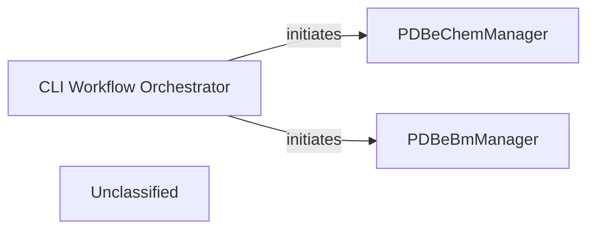

## Details

The `pdbeccdutils` architecture is centered around two distinct command-line-driven workflows for chemical component processing. The `CLI Workflow Orchestrator`, represented by the `main` functions in `process_components_cif_cli.py` and `boundmolecule_cli.py`, serves as the primary entry point, interpreting user commands and initiating the appropriate processing pipeline. For general chemical components, the `PDBeChemManager` takes charge, overseeing the entire lifecycle from data ingestion to the generation of various structural and chemical outputs. Concurrently, the `PDBeBmManager` handles the specialized processing of bound molecules, identifying and characterizing them within a given entry. Both manager components encapsulate complex computational steps, ensuring the accurate and comprehensive analysis of chemical entities.

### CLI Workflow Orchestrator [[Expand]](./CLI_Workflow_Orchestrator.md)
This conceptual component represents the overarching user-facing interface responsible for initiating and managing diverse chemical component processing workflows. It provides the entry points for different processing pipelines, delegating specific orchestration tasks to specialized manager components based on user input.

**Related Classes/Methods**:

- <a href="https://github.com/PDBeurope/ccdutils/blob/masterpdbeccdutils/scripts/process_components_cif_cli.py#L447-L471" target="_blank" rel="noopener noreferrer">`pdbeccdutils.scripts.process_components_cif_cli.main`:447-471</a>
- <a href="https://github.com/PDBeurope/ccdutils/blob/masterpdbeccdutils/scripts/boundmolecule_cli.py" target="_blank" rel="noopener noreferrer">`pdbeccdutils.scripts.boundmolecule_cli.main`</a>

### PDBeChemManager
Manages the end-to-end workflow for processing general chemical components from CIF files. Its responsibilities include parsing command-line arguments to configure processing, initiating the ingestion of chemical component data, orchestrating a sequence of computational steps (e.g., 2D depiction, 3D conformer generation, physicochemical property calculation), and managing the generation and output of processed chemical component data. This component embodies a specific, comprehensive data processing pipeline for standard chemical components.

**Related Classes/Methods**:

- <a href="https://github.com/PDBeurope/ccdutils/blob/masterpdbeccdutils/scripts/process_components_cif_cli.py#L63-L374" target="_blank" rel="noopener noreferrer">`pdbeccdutils.scripts.process_components_cif_cli.PDBeChemManager`:63-374</a>

### PDBeBmManager
Manages the specialized workflow for processing bound molecules. It handles command-line argument parsing tailored for bound molecule tasks, initiates the reading of bound molecule-specific input data, orchestrates relevant computational steps (which may differ from general chemical components), and manages the generation and output of bound molecule processing results. This component represents another distinct data processing pipeline, focused on a specific molecular context.

**Related Classes/Methods**:

- <a href="https://github.com/PDBeurope/ccdutils/blob/masterpdbeccdutils/scripts/boundmolecule_cli.py#L35-L385" target="_blank" rel="noopener noreferrer">`pdbeccdutils.scripts.boundmolecule_cli.PDBeBmManager`:35-385</a>

### Unclassified
Component for all unclassified files and utility functions (Utility functions/External Libraries/Dependencies)

**Related Classes/Methods**: _None_

### [FAQ](https://github.com/CodeBoarding/GeneratedOnBoardings/tree/main?tab=readme-ov-file#faq)