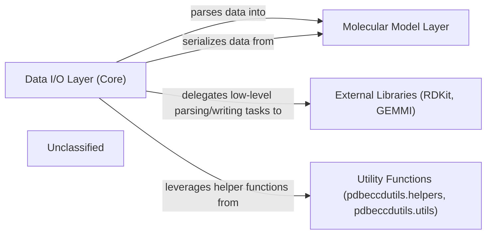

## Details

The `pdbeccdutils` project is structured around a core `Molecular Model Layer` that provides an in-memory representation of chemical components. The `Data I/O Layer (Core)` handles the crucial tasks of parsing various chemical data formats into this molecular model and serializing the model back into external file formats. This layer leverages `External Libraries (RDKit, GEMMI)` for complex, low-level chemical data manipulation and relies on `Utility Functions (pdbeccdutils.helpers, pdbeccdutils.utils)` for common helper operations. This architecture ensures a clear separation of concerns, with dedicated components for data representation, input/output operations, and external library integration.

### Data I/O Layer (Core)
This component is responsible for the direct parsing of various chemical data formats (CIF, PDB, SDF, XML, JSON, CML, XYZ) into the internal molecular model and the serialization of these models back into external file formats. It encapsulates the logic for handling different chemical component definition types (CCD, CLC, PRD).

**Related Classes/Methods**:

- <a href="https://github.com/PDBeurope/ccdutils/blob/masterpdbeccdutils/core/ccd_reader.py#L56-L75" target="_blank" rel="noopener noreferrer">`pdbeccdutils.core.ccd_reader.CCDReader`:56-75</a>
- <a href="https://github.com/PDBeurope/ccdutils/blob/masterpdbeccdutils/core/clc_reader.py" target="_blank" rel="noopener noreferrer">`pdbeccdutils.core.clc_reader.CLCReader`</a>
- <a href="https://github.com/PDBeurope/ccdutils/blob/masterpdbeccdutils/core/prd_reader.py" target="_blank" rel="noopener noreferrer">`pdbeccdutils.core.prd_reader.PRDReader`</a>
- <a href="https://github.com/PDBeurope/ccdutils/blob/masterpdbeccdutils/core/ccd_writer.py" target="_blank" rel="noopener noreferrer">`pdbeccdutils.core.ccd_writer.CCDWriter`</a>
- <a href="https://github.com/PDBeurope/ccdutils/blob/masterpdbeccdutils/core/clc_writer.py" target="_blank" rel="noopener noreferrer">`pdbeccdutils.core.clc_writer.CLCWriter`</a>
- <a href="https://github.com/PDBeurope/ccdutils/blob/masterpdbeccdutils/core/prd_writer.py" target="_blank" rel="noopener noreferrer">`pdbeccdutils.core.prd_writer.PRDWriter`</a>

### Molecular Model Layer
This component provides the standardized, in-memory representation of chemical components. It serves as the target for data parsed by the Data I/O Layer and the source for data written by it. It defines the data structures that hold the chemical information.

**Related Classes/Methods**:

- <a href="https://github.com/PDBeurope/ccdutils/blob/masterpdbeccdutils/core/component.py#L47-L813" target="_blank" rel="noopener noreferrer">`pdbeccdutils.core.component.Component`:47-813</a>
- <a href="https://github.com/PDBeurope/ccdutils/blob/masterpdbeccdutils/core/models.py#L61-L76" target="_blank" rel="noopener noreferrer">`pdbeccdutils.core.models.Conformer`:61-76</a>

### External Libraries (RDKit, GEMMI)
These are third-party scientific computing libraries that provide low-level functionalities for chemical data manipulation, including advanced parsing, structural validation, and writing of specific chemical file formats. The Data I/O Layer delegates complex format-specific tasks to these libraries.

**Related Classes/Methods**:

- <a href="https://github.com/PDBeurope/ccdutils/blob/masterpdbeccdutils/core/component.py#L222-L236" target="_blank" rel="noopener noreferrer">`rdkit`:222-236</a>
- `gemmi`

### Utility Functions (pdbeccdutils.helpers, pdbeccdutils.utils)
This component provides common helper functions that support the Data I/O Layer's operations. This might include file path manipulation, basic data transformations, or other general-purpose utilities that simplify the reading and writing processes.

**Related Classes/Methods**:

- <a href="https://github.com/PDBeurope/ccdutils/blob/masterpdbeccdutils/helpers/helper.py" target="_blank" rel="noopener noreferrer">`pdbeccdutils.helpers.helper.Helper`</a>
- <a href="https://github.com/PDBeurope/ccdutils/blob/masterpdbeccdutils/helpers/mol_tools.py" target="_blank" rel="noopener noreferrer">`pdbeccdutils.helpers.mol_tools.MolTools`</a>

### Unclassified
Component for all unclassified files and utility functions (Utility functions/External Libraries/Dependencies)

**Related Classes/Methods**: _None_

### [FAQ](https://github.com/CodeBoarding/GeneratedOnBoardings/tree/main?tab=readme-ov-file#faq)