```mermaid
graph LR
    CLI_Workflow_Orchestrator["CLI Workflow Orchestrator"]
    Data_I_O_Layer["Data I/O Layer"]
    Core_Molecular_Model["Core Molecular Model"]
    Molecular_Processing_Analysis_Services["Molecular Processing & Analysis Services"]
    External_Data_Integration["External Data Integration"]
    Unclassified["Unclassified"]
    CLI_Workflow_Orchestrator -- "Initiates Read/Write Operations" --> Data_I_O_Layer
    Data_I_O_Layer -- "Populates Chemical Component Data" --> Core_Molecular_Model
    Core_Molecular_Model -- "Provides Molecular Data for Analysis" --> Molecular_Processing_Analysis_Services
    Molecular_Processing_Analysis_Services -- "Updates with Processed Molecular Data" --> Core_Molecular_Model
    Core_Molecular_Model -- "Requests External Mappings/Templates" --> External_Data_Integration
    External_Data_Integration -- "Supplies External Chemical Data" --> Core_Molecular_Model
    External_Data_Integration -- "Provides Depiction Templates" --> Molecular_Processing_Analysis_Services
    click CLI_Workflow_Orchestrator href "https://github.com/CodeBoarding/GeneratedOnBoardings/blob/main/ccdutils/CLI_Workflow_Orchestrator.md" "Details"
    click Data_I_O_Layer href "https://github.com/CodeBoarding/GeneratedOnBoardings/blob/main/ccdutils/Data_I_O_Layer.md" "Details"
```

## Details

The `ccdutils` project is structured around a core molecular model, providing services for processing and analyzing chemical components. The system is initiated through CLI workflows, which interact with a dedicated Data I/O Layer to manage the reading and writing of various chemical data formats. The Core Molecular Model serves as the central data representation, enriched and manipulated by the Molecular Processing & Analysis Services. These services perform complex computations, such as 2D depiction generation, bound molecule inference, and fragment library searches. Additionally, the system integrates with external data sources through the External Data Integration component to retrieve supplementary chemical information. This modular design ensures clear separation of concerns, facilitating maintainability and extensibility, and is optimized for generating clear data flow diagrams.

### CLI Workflow Orchestrator [[Expand]](./CLI_Workflow_Orchestrator.md)
The user-facing interface for initiating and managing chemical component processing workflows. It orchestrates the reading of input data, execution of various molecular processing steps, and the final output generation.

**Related Classes/Methods**:

- <a href="https://github.com/PDBeurope/ccdutils/blob/masterpdbeccdutils/scripts/process_components_cif_cli.py" target="_blank" rel="noopener noreferrer">`pdbeccdutils.scripts.process_components_cif_cli.PDBeChemManager`</a>
- <a href="https://github.com/PDBeurope/ccdutils/blob/masterpdbeccdutils/scripts/boundmolecule_cli.py" target="_blank" rel="noopener noreferrer">`pdbeccdutils.scripts.boundmolecule_cli.PDBeBmManager`</a>

### Data I/O Layer [[Expand]](./Data_I_O_Layer.md)
Responsible for all data persistence and retrieval, handling various chemical data formats (CCD, CLC, PRD) from/to CIF, PDB, SDF, XML, JSON, CML, and XYZ files. It acts as the gateway for raw and processed chemical data.

**Related Classes/Methods**:

- <a href="https://github.com/PDBeurope/ccdutils/blob/masterpdbeccdutils/core/ccd_reader.py" target="_blank" rel="noopener noreferrer">`pdbeccdutils.core.ccd_reader`</a>
- <a href="https://github.com/PDBeurope/ccdutils/blob/masterpdbeccdutils/core/clc_reader.py" target="_blank" rel="noopener noreferrer">`pdbeccdutils.core.clc_reader`</a>
- <a href="https://github.com/PDBeurope/ccdutils/blob/masterpdbeccdutils/core/prd_reader.py" target="_blank" rel="noopener noreferrer">`pdbeccdutils.core.prd_reader`</a>
- <a href="https://github.com/PDBeurope/ccdutils/blob/masterpdbeccdutils/core/ccd_writer.py" target="_blank" rel="noopener noreferrer">`pdbeccdutils.core.ccd_writer`</a>
- <a href="https://github.com/PDBeurope/ccdutils/blob/masterpdbeccdutils/core/clc_writer.py" target="_blank" rel="noopener noreferrer">`pdbeccdutils.core.clc_writer`</a>
- <a href="https://github.com/PDBeurope/ccdutils/blob/masterpdbeccdutils/core/prd_writer.py" target="_blank" rel="noopener noreferrer">`pdbeccdutils.core.prd_writer`</a>

### Core Molecular Model
The central data structure representing a chemical component, encapsulating its molecular structure, physicochemical properties, and managing 2D/3D conformers. It serves as the canonical representation throughout the processing pipeline.

**Related Classes/Methods**:

- <a href="https://github.com/PDBeurope/ccdutils/blob/masterpdbeccdutils/core/component.py" target="_blank" rel="noopener noreferrer">`pdbeccdutils.core.component.Component`</a>

### Molecular Processing & Analysis Services
A suite of services dedicated to advanced molecular computations and analyses. This includes generating 2D depictions, inferring and processing bound molecules, searching fragment libraries, performing molecular comparisons, and general molecular utility functions.

**Related Classes/Methods**:

- <a href="https://github.com/PDBeurope/ccdutils/blob/masterpdbeccdutils/core/depictions.py" target="_blank" rel="noopener noreferrer">`pdbeccdutils.core.depictions.DepictionManager`</a>
- <a href="https://github.com/PDBeurope/ccdutils/blob/masterpdbeccdutils/helpers/drawing.py" target="_blank" rel="noopener noreferrer">`pdbeccdutils.helpers.drawing`</a>
- <a href="https://github.com/PDBeurope/ccdutils/blob/masterpdbeccdutils/core/boundmolecule.py" target="_blank" rel="noopener noreferrer">`pdbeccdutils.core.boundmolecule`</a>
- <a href="https://github.com/PDBeurope/ccdutils/blob/masterpdbeccdutils/core/fragment_library.py" target="_blank" rel="noopener noreferrer">`pdbeccdutils.core.fragment_library.FragmentLibrary`</a>
- <a href="https://github.com/PDBeurope/ccdutils/blob/masterpdbeccdutils/computations/parity_method.py" target="_blank" rel="noopener noreferrer">`pdbeccdutils.computations.parity_method`</a>
- <a href="https://github.com/PDBeurope/ccdutils/blob/masterpdbeccdutils/helpers/mol_tools.py" target="_blank" rel="noopener noreferrer">`pdbeccdutils.helpers.mol_tools`</a>

### External Data Integration
Manages interactions with external web services and data sources (e.g., UniChem, PubChem) to retrieve chemical mappings, templates, and other supplementary information.

**Related Classes/Methods**:

- <a href="https://github.com/PDBeurope/ccdutils/blob/masterpdbeccdutils/utils/web_services.py" target="_blank" rel="noopener noreferrer">`pdbeccdutils.utils.web_services`</a>
- <a href="https://github.com/PDBeurope/ccdutils/blob/masterpdbeccdutils/utils/pubchem_downloader.py" target="_blank" rel="noopener noreferrer">`pdbeccdutils.utils.pubchem_downloader.PubChemDownloader`</a>

### Unclassified
Component for all unclassified files and utility functions (Utility functions/External Libraries/Dependencies)

**Related Classes/Methods**: _None_

### [FAQ](https://github.com/CodeBoarding/GeneratedOnBoardings/tree/main?tab=readme-ov-file#faq)