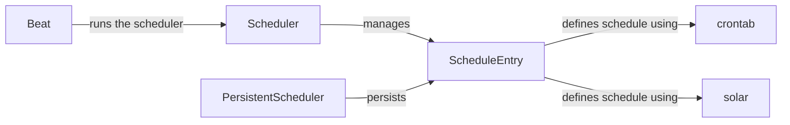

## Component Details

The Celery Beat Scheduling component is responsible for scheduling and dispatching periodic tasks. It uses a scheduler to manage schedule entries, determining when tasks are due for execution. The scheduler can persist schedule information to a storage mechanism. Schedule entries define the task to be executed and the schedule for execution, which can be defined using cron-style expressions or solar events. The Celery Beat application manages the scheduler process, ensuring that tasks are dispatched at the specified intervals.

### Scheduler
The base class for all Celery schedulers. It defines the interface for managing and retrieving schedule entries. It's responsible for loading schedules, determining when tasks are due, and persisting schedule information.

**Related Classes/Methods**:

- `celery.beat.Scheduler` (full file reference)

### PersistentScheduler
A scheduler that persists schedule information to a database or other storage mechanism. It extends the base `Scheduler` class and adds functionality for reading and writing schedule entries to persistent storage.

**Related Classes/Methods**:

- `celery.beat.PersistentScheduler` (full file reference)

### ScheduleEntry
Represents a single entry in the schedule. It contains information about the task to be executed, the schedule for execution, and other metadata.

**Related Classes/Methods**:

- `celery.beat.ScheduleEntry` (full file reference)

### crontab
Represents a cron-style schedule. It allows you to define task execution times using a cron-like syntax (e.g., every minute, every hour, every day).

**Related Classes/Methods**:

- `celery.schedules.crontab` (full file reference)

### solar
Represents a schedule based on solar events (e.g., sunrise, sunset). It allows you to schedule tasks to run at specific times relative to solar events.

**Related Classes/Methods**:

- `celery.schedules.solar` (full file reference)

### Beat
The main application class for Celery Beat. It's responsible for starting and managing the scheduler process.

**Related Classes/Methods**:

- <a href="https://github.com/celery/celery/blob/master/celery/apps/beat.py#L40-L160" target="_blank" rel="noopener noreferrer">`celery.apps.beat.Beat` (40:160)</a>