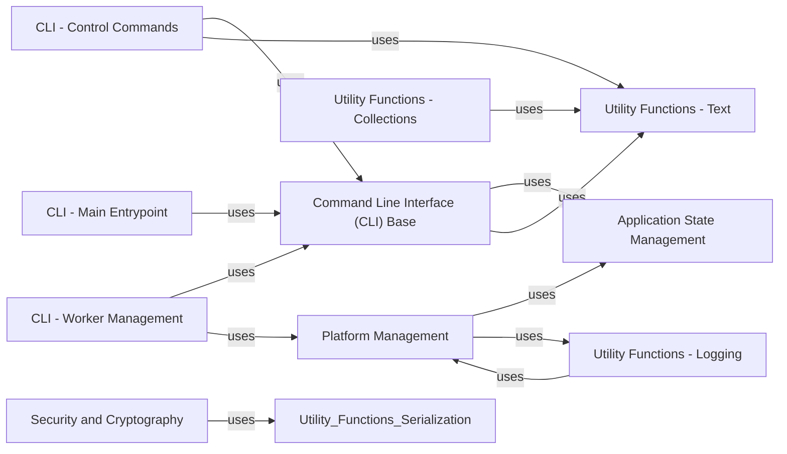

## Component Details

This component overview describes the Command Line Interface (CLI) and core utility functions within Celery. The CLI provides various commands for interacting with Celery, such as starting workers, inspecting the cluster, and managing tasks. The core utilities encompass general-purpose helper functions, including text manipulation, collection management, logging, platform-specific adaptations, and security-related functionalities. The main flow involves users interacting with the CLI, which then leverages the core utilities and platform management components to perform requested operations, often affecting the application's global state.

### Command Line Interface (CLI) Base
This component provides the foundational elements for Celery's command-line interface. It defines base classes for CLI contexts, commands, and options, handling common functionalities like styling output, echoing messages, and parsing command-line arguments. It also includes custom parameter types for various data formats.

**Related Classes/Methods**:

- `celery.celery.bin.base` (full file reference)

### CLI - Main Entrypoint
This component serves as the main entry point for the Celery command-line interface. It defines the top-level 'celery' command group and handles global options, application discovery, and error reporting. It dispatches to various subcommands for specific functionalities.

**Related Classes/Methods**:

- <a href="https://github.com/celery/celery/blob/master/celery/bin/celery.py#L117-L167" target="_blank" rel="noopener noreferrer">`celery.celery.bin.celery` (117:167)</a>
- <a href="https://github.com/celery/celery/blob/master/celery/__main__.py#L10-L15" target="_blank" rel="noopener noreferrer">`celery.celery.__main__.main` (10:15)</a>

### CLI - Worker Management
This component provides the command-line interface for starting and managing Celery workers. It handles various worker configurations, including hostname, pool type, and autoscale settings. It also integrates with platform management for daemonization and privilege dropping.

**Related Classes/Methods**:

- <a href="https://github.com/celery/celery/blob/master/celery/bin/worker.py#L298-L360" target="_blank" rel="noopener noreferrer">`celery.celery.bin.worker` (298:360)</a>

### CLI - Control Commands
This component provides command-line tools for controlling Celery workers. It allows users to inspect worker status, send remote control commands, and manage various aspects of worker operation. It leverages the base CLI framework for argument parsing and output formatting.

**Related Classes/Methods**:

- <a href="https://github.com/celery/celery/blob/master/celery/bin/control.py#L229-L252" target="_blank" rel="noopener noreferrer">`celery.celery.bin.control` (229:252)</a>

### Utility Functions - Text
This component offers a collection of utility functions for text manipulation. It includes functionalities like converting strings to lists, dedenting text, filling paragraphs, joining strings, abbreviating text, indenting, truncating, pretty-printing, and simple string formatting. It also provides a custom StringIO-like class for flexible text I/O.

**Related Classes/Methods**:

- `celery.celery.utils.text` (full file reference)

### Utility Functions - Collections
This component provides various specialized collection data structures and utilities. It includes implementations for ordered dictionaries, attribute-accessible dictionaries, chain maps for layered configurations, limited sets with eviction policies, and message buffers. These utilities enhance data handling and management within Celery.

**Related Classes/Methods**:

- `celery.celery.utils.collections` (full file reference)

### Utility Functions - Logging
This component provides utilities for logging within Celery. It includes functions to retrieve loggers, manage log file descriptors, and a custom formatter for colored output. It also offers a logging proxy to redirect output to a logger, ensuring consistent log handling across the application.

**Related Classes/Methods**:

- `celery.celery.utils.log` (full file reference)

### Platform Management
This component handles low-level operating system interactions for Celery. It manages process identifiers (PID files), facilitates daemonization of processes, manages user and group privileges for security, and provides an interface for handling system signals. It ensures that Celery workers can run reliably in the background with appropriate permissions.

**Related Classes/Methods**:

- <a href="https://github.com/celery/celery/blob/master/celery/platforms.py#L125-L238" target="_blank" rel="noopener noreferrer">`celery.celery.platforms.Pidfile` (125:238)</a>
- <a href="https://github.com/celery/celery/blob/master/celery/platforms.py#L310-L373" target="_blank" rel="noopener noreferrer">`celery.celery.platforms.DaemonContext` (310:373)</a>
- <a href="https://github.com/celery/celery/blob/master/celery/platforms.py#L594-L691" target="_blank" rel="noopener noreferrer">`celery.celery.platforms.Signals` (594:691)</a>
- <a href="https://github.com/celery/celery/blob/master/celery/platforms.py#L723-L732" target="_blank" rel="noopener noreferrer">`celery.celery.platforms.set_process_title` (723:732)</a>
- <a href="https://github.com/celery/celery/blob/master/celery/platforms.py#L528-L555" target="_blank" rel="noopener noreferrer">`celery.celery.platforms.maybe_drop_privileges` (528:555)</a>
- <a href="https://github.com/celery/celery/blob/master/celery/platforms.py#L788-L830" target="_blank" rel="noopener noreferrer">`celery.celery.platforms.check_privileges` (788:830)</a>
- <a href="https://github.com/celery/celery/blob/master/celery/platforms.py#L376-L429" target="_blank" rel="noopener noreferrer">`celery.celery.platforms.detached` (376:429)</a>
- <a href="https://github.com/celery/celery/blob/master/celery/platforms.py#L244-L263" target="_blank" rel="noopener noreferrer">`celery.celery.platforms.create_pidlock` (244:263)</a>

### Application State Management
This component is responsible for managing the global state of the Celery application, including the current active application instance and worker task context. It provides functions to register and deregister applications, connect to finalization signals, and retrieve the current application or task, ensuring consistent access to the application's runtime environment.

**Related Classes/Methods**:

- `celery.celery._state` (full file reference)

### Security and Cryptography
This component provides cryptographic functionalities for secure communication within Celery. It includes classes for managing private keys and certificates, verifying signatures, and securely serializing and deserializing messages. It integrates with underlying cryptographic libraries to ensure data integrity and authenticity.

**Related Classes/Methods**:

- <a href="https://github.com/celery/celery/blob/master/celery/security/key.py#L12-L35" target="_blank" rel="noopener noreferrer">`celery.celery.security.key.PrivateKey` (12:35)</a>
- <a href="https://github.com/celery/celery/blob/master/celery/security/certificate.py#L31-L73" target="_blank" rel="noopener noreferrer">`celery.celery.security.certificate.Certificate` (31:73)</a>
- <a href="https://github.com/celery/celery/blob/master/celery/security/certificate.py#L76-L97" target="_blank" rel="noopener noreferrer">`celery.celery.security.certificate.CertStore` (76:97)</a>
- <a href="https://github.com/celery/celery/blob/master/celery/security/serialization.py#L20-L77" target="_blank" rel="noopener noreferrer">`celery.celery.security.serialization.SecureSerializer` (20:77)</a>
- `celery.celery.security.setup_security` (full file reference)

### [FAQ](https://github.com/CodeBoarding/GeneratedOnBoardings/tree/main?tab=readme-ov-file#faq)