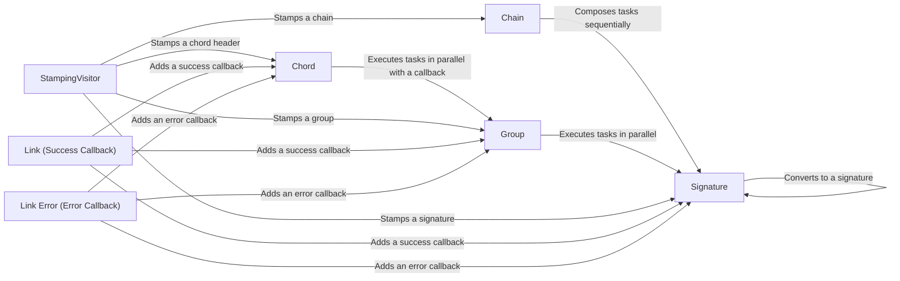

## Component Details

The Canvas Workflow Composition component in Celery provides a set of primitives for defining and executing complex task workflows. It enables users to compose tasks into chains, groups, and chords, allowing for the creation of sophisticated asynchronous workflows with dependencies and coordinated execution. The core functionality revolves around the `signature` object, which represents a task invocation, and the higher-level constructs like `chain`, `group`, and `chord` that define the relationships and execution order between these tasks. The `StampingVisitor` is used to add metadata to the task signatures, while methods like `link` and `link_error` allow for defining callbacks and error handlers.

### Signature
Represents a task that can be executed asynchronously. It encapsulates the task's name, arguments, and options. It serves as the fundamental building block for composing more complex workflows.
- **Related Classes/Methods**: `celery.canvas:signature`, `celery.canvas:maybe_signature`

### Chain
Represents a sequence of tasks that are executed one after the other. The result of each task is passed as an argument to the next task in the chain, enabling sequential data processing.
- **Related Classes/Methods**: `celery.canvas:chain`, `celery.canvas:_chain`, `celery.canvas:_chain.apply_async`, `celery.canvas:_chain.stamp`

### Group
Represents a collection of tasks that are executed in parallel. The results of the tasks are collected and can be processed by a callback task or simply returned as a list.
- **Related Classes/Methods**: `celery.canvas:group`, `celery.canvas.group.link`, `celery.canvas.group.link_error`, `celery.canvas.group.stamp`, `celery.canvas.group.apply`, `celery.canvas.group.skew`

### Chord
Represents a group of tasks that are executed in parallel, followed by a callback task that is executed when all tasks in the group have completed. The callback task receives the results of the group tasks as arguments, enabling aggregation and final processing of parallel task results.
- **Related Classes/Methods**: `celery.canvas:_chord`, `celery.canvas._chord.link`, `celery.canvas._chord.link_error`, `celery.canvas._chord.stamp`, `celery.canvas._chord.apply_async`

### StampingVisitor
A visitor class used to add metadata (e.g., task IDs, timestamps) to task signatures and workflow structures (chains, groups, chords). It traverses the workflow and stamps each component with relevant information for tracking and monitoring.
- **Related Classes/Methods**: `celery.canvas.StampingVisitor.on_chord_header_start`, `celery.canvas.StampingVisitor.on_signature`, `celery.canvas.StampingVisitor.on_group_start`, `celery.canvas.StampingVisitor.on_chain_start`

### Link (Success Callback)
Mechanism to attach a callback task to be executed upon successful completion of another task (signature, group, or chord).
- **Related Classes/Methods**: `celery.canvas.Signature.link`, `celery.canvas.group.link`, `celery.canvas._chord.link`

### Link Error (Error Callback)
Mechanism to attach an error handler task to be executed if another task (signature, group, or chord) fails.
- **Related Classes/Methods**: `celery.canvas.Signature.link_error`, `celery.canvas.group.link_error`, `celery.canvas._chord.link_error`
