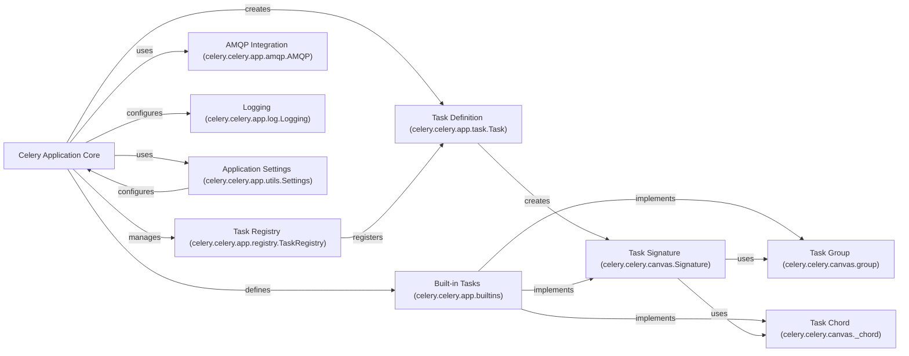

## Component Details

This graph illustrates the core components of a Celery application, focusing on the central `Celery Application Core` and its interactions with key functionalities. The `Celery Application Core` acts as the central hub, responsible for managing the application's lifecycle, loading configurations, and providing access to essential services. It creates and manages `Task Definition` objects, which represent the asynchronous tasks themselves. The `Task Registry` is used by the application core to keep track of all registered tasks. Communication with the message broker is handled by the `AMQP Integration` component, while logging is managed by the `Logging` component. Application-wide settings are provided by the `Application Settings` component. The `Built-in Tasks` module provides fundamental task primitives like `Task Signature`, `Task Group`, and `Task Chord`, which are used to define and orchestrate complex workflows. `Task Signature` objects can utilize `Task Group` and `Task Chord` to create more elaborate task structures.

### Celery Application Core
The central application instance that serves as the entry point for defining, configuring, and interacting with Celery. It manages the overall application lifecycle, loads configurations, registers tasks, and provides access to core services like AMQP, event dispatchers, and result backends.

**Related Classes/Methods**:

- <a href="https://github.com/celery/celery/blob/master/celery/app/base.py#L213-L1505" target="_blank" rel="noopener noreferrer">`celery.celery.app.base.Celery` (213:1505)</a>
- <a href="https://github.com/celery/celery/blob/master/celery/app/base.py#L169-L210" target="_blank" rel="noopener noreferrer">`celery.celery.app.base.PendingConfiguration` (169:210)</a>
- <a href="https://github.com/celery/celery/blob/master/celery/app/utils.py#L70-L209" target="_blank" rel="noopener noreferrer">`celery.celery.app.utils.Settings` (70:209)</a>
- <a href="https://github.com/celery/celery/blob/master/celery/app/utils.py#L289-L313" target="_blank" rel="noopener noreferrer">`celery.celery.app.utils.AppPickler` (289:313)</a>
- `celery.celery.app.builtins` (full file reference)
- `celery.celery.app.shared_task` (full file reference)
- `celery.celery.app.defaults` (full file reference)
- `celery.celery.app.autoretry` (full file reference)
- `celery.celery.app.log` (full file reference)
- `celery.celery.app.registry` (full file reference)
- `celery.celery.app.annotations` (full file reference)
- `celery.celery.app.backends` (full file reference)

### Task Signature (celery.celery.canvas.Signature)
The `Signature` class represents a reusable object that defines how a task should be called, including its arguments, keyword arguments, and execution options. It allows for deferred execution and chaining of tasks. It can be stamped with headers, linked to other tasks, and cloned. It also supports various canvas primitives like `chain`, `group`, and `chord` through its `__or__` operator.

**Related Classes/Methods**:

- <a href="https://github.com/celery/celery/blob/master/celery/canvas.py#L232-L871" target="_blank" rel="noopener noreferrer">`celery.celery.canvas.Signature` (232:871)</a>

### Task Definition (celery.celery.app.task.Task)
The `Task` class is the fundamental building block for defining asynchronous tasks in Celery. It provides methods for task execution (`run`), delayed execution (`delay`, `apply_async`), result retrieval (`AsyncResult`), and integration with canvas primitives (`signature`, `chunks`, `map`, `starmap`). It also handles task context management and retry mechanisms.

**Related Classes/Methods**:

- <a href="https://github.com/celery/celery/blob/master/celery/app/task.py#L164-L1158" target="_blank" rel="noopener noreferrer">`celery.celery.app.task.Task` (164:1158)</a>

### Task Registry (celery.celery.app.registry.TaskRegistry)
The `TaskRegistry` is responsible for registering and unregistering tasks within the Celery application. It allows for lookup of tasks by name and provides filtering capabilities for different task types (regular, periodic).

**Related Classes/Methods**:

- <a href="https://github.com/celery/celery/blob/master/celery/app/registry.py#L12-L58" target="_blank" rel="noopener noreferrer">`celery.celery.app.registry.TaskRegistry` (12:58)</a>

### AMQP Integration (celery.celery.app.amqp.AMQP)
The `AMQP` class provides the interface for interacting with the AMQP broker. It handles sending task messages, managing queues, and routing tasks. It also includes functionalities for converting task messages to different AMQP versions.

**Related Classes/Methods**:

- <a href="https://github.com/celery/celery/blob/master/celery/app/amqp.py#L193-L621" target="_blank" rel="noopener noreferrer">`celery.celery.app.amqp.AMQP` (193:621)</a>
- <a href="https://github.com/celery/celery/blob/master/celery/app/amqp.py#L41-L190" target="_blank" rel="noopener noreferrer">`celery.celery.app.amqp.Queues` (41:190)</a>

### Logging (celery.celery.app.log.Logging)
The `Logging` class is responsible for setting up and managing the logging subsystem within Celery. It configures loggers, handlers, and formatters, and can redirect standard output streams to the logger.

**Related Classes/Methods**:

- <a href="https://github.com/celery/celery/blob/master/celery/app/log.py#L46-L248" target="_blank" rel="noopener noreferrer">`celery.celery.app.log.Logging` (46:248)</a>

### Application Settings (celery.celery.app.utils.Settings)
The `Settings` class provides a structured way to access and manage Celery application configuration. It extends `ConfigurationView` to offer methods for retrieving broker URLs, result backend, task defaults, and other settings, with support for default values and deprecation warnings.

**Related Classes/Methods**:

- <a href="https://github.com/celery/celery/blob/master/celery/app/utils.py#L70-L209" target="_blank" rel="noopener noreferrer">`celery.celery.app.utils.Settings` (70:209)</a>

### Built-in Tasks (celery.celery.app.builtins)
This module contains built-in tasks and functions that extend Celery's core capabilities, such as tasks for accumulating results, unlocking chords, mapping, starmap, chunking, grouping, chaining, and chord operations.

**Related Classes/Methods**:

- `celery.celery.app.builtins` (full file reference)

### Task Group (celery.celery.canvas.group)
The `group` class represents a collection of tasks that can be executed concurrently. It provides methods for applying and freezing the group, as well as managing links and error handling for the tasks within the group.

**Related Classes/Methods**:

- <a href="https://github.com/celery/celery/blob/master/celery/canvas.py#L1478-L1946" target="_blank" rel="noopener noreferrer">`celery.celery.canvas.group` (1478:1946)</a>

### Task Chord (celery.celery.canvas._chord)
The `_chord` class represents a chord, which is a group of tasks (header) that, once all are completed, trigger a final callback task (body). It manages the execution flow and result handling for this pattern.

**Related Classes/Methods**:

- <a href="https://github.com/celery/celery/blob/master/celery/canvas.py#L1950-L2364" target="_blank" rel="noopener noreferrer">`celery.celery.canvas._chord` (1950:2364)</a>

### [FAQ](https://github.com/CodeBoarding/GeneratedOnBoardings/tree/main?tab=readme-ov-file#faq)