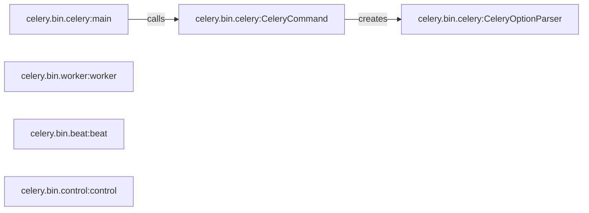

## Component Details

The Celery CLI provides a command-line interface for interacting with Celery, enabling users to manage and control Celery workers, beat schedulers, and tasks. It parses command-line arguments, configures the Celery application, and executes the specified command. The CLI uses subcommands for specific tasks like running workers, starting beat, and sending control commands.

### celery.bin.celery:main
The entry point for the Celery command-line interface. It parses command-line arguments, configures the Celery application, and executes the specified command using CeleryCommand.

**Related Classes/Methods**:

- <a href="https://github.com/celery/celery/blob/master/celery/bin/control.py#L278-L282" target="_blank" rel="noopener noreferrer">`celery.bin.celery:main` (278:282)</a>

### celery.bin.celery:CeleryCommand
Base class for Celery commands. It is responsible for creating the option parser (CeleryOptionParser) and executing the command. Subclasses define the specific command logic.

**Related Classes/Methods**:

- <a href="https://github.com/celery/celery/blob/master/celery/bin/control.py#L54-L124" target="_blank" rel="noopener noreferrer">`celery.bin.celery:CeleryCommand` (54:124)</a>

### celery.bin.celery:CeleryOptionParser
Option parser for Celery commands. It defines the command-line options and parses them using run_from_argv, preload_options and prepare_args.

**Related Classes/Methods**:

- <a href="https://github.com/celery/celery/blob/master/celery/bin/control.py#L126-L276" target="_blank" rel="noopener noreferrer">`celery.bin.celery:CeleryOptionParser` (126:276)</a>

### celery.bin.worker:worker
The entry point for the Celery worker process. It initializes and starts the worker, which consumes tasks from the broker and executes them. It interacts with the Celery application to process tasks.

**Related Classes/Methods**:

- <a href="https://github.com/celery/celery/blob/master/celery/bin/control.py#L154-L200" target="_blank" rel="noopener noreferrer">`celery.bin.worker:worker` (154:200)</a>

### celery.bin.beat:beat
The entry point for the Celery beat process. It starts the beat scheduler, which periodically sends tasks to the broker. It uses the Celery application to schedule tasks.

**Related Classes/Methods**:

- <a href="https://github.com/celery/celery/blob/master/celery/bin/control.py#L137-L179" target="_blank" rel="noopener noreferrer">`celery.bin.beat:beat` (137:179)</a>

### celery.bin.control:control
The entry point for the Celery control command. It allows sending commands to Celery workers. It interacts with the Celery application to send commands.

**Related Classes/Methods**:

- <a href="https://github.com/celery/celery/blob/master/celery/bin/control.py#L229-L252" target="_blank" rel="noopener noreferrer">`celery.bin.control:control` (229:252)</a>