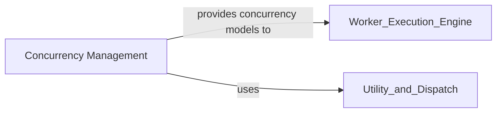

## Component Details

The Concurrency Management component in Celery is responsible for handling the parallel execution of tasks within the worker. It offers various concurrency models like prefork, eventlet, gevent, threads, and solo, allowing users to choose the most suitable approach for their workload. This component manages the worker pool, allocating resources efficiently for task execution. It interacts with the Worker Execution Engine to provide the underlying concurrency mechanism and utilizes the Utility and Dispatch component for common utilities and signal handling.

### Concurrency Management
Provides various concurrency models (e.g., prefork, eventlet, gevent, threads, solo) to execute tasks in parallel within the worker. It manages the worker pool and the allocation of resources for task execution.

**Related Classes/Methods**:

- <a href="https://github.com/celery/celery/blob/master/celery/concurrency/base.py#L47-L180" target="_blank" rel="noopener noreferrer">`celery.concurrency.base.BasePool` (47:180)</a>
- <a href="https://github.com/celery/celery/blob/master/celery/concurrency/thread.py#L30-L64" target="_blank" rel="noopener noreferrer">`celery.concurrency.thread.TaskPool` (30:64)</a>
- <a href="https://github.com/celery/celery/blob/master/celery/concurrency/solo.py#L11-L31" target="_blank" rel="noopener noreferrer">`celery.concurrency.solo.TaskPool` (11:31)</a>
- <a href="https://github.com/celery/celery/blob/master/celery/concurrency/prefork.py#L92-L172" target="_blank" rel="noopener noreferrer">`celery.concurrency.prefork.TaskPool` (92:172)</a>
- <a href="https://github.com/celery/celery/blob/master/celery/concurrency/gevent.py#L85-L166" target="_blank" rel="noopener noreferrer">`celery.concurrency.gevent.TaskPool` (85:166)</a>
- <a href="https://github.com/celery/celery/blob/master/celery/concurrency/eventlet.py#L88-L181" target="_blank" rel="noopener noreferrer">`celery.concurrency.eventlet.TaskPool` (88:181)</a>
- `celery.concurrency.asynpool` (full file reference)
- `celery.concurrency.get_available_pool_names` (full file reference)

### [FAQ](https://github.com/CodeBoarding/GeneratedOnBoardings/tree/main?tab=readme-ov-file#faq)