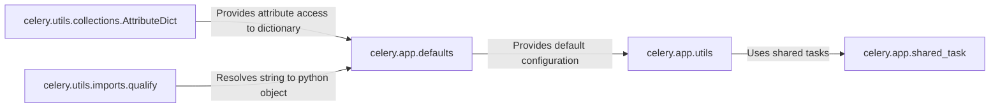

## Component Details

The Configuration and Utilities component in Celery is responsible for managing the application's configuration settings and providing utility functions used throughout the codebase. It ensures a consistent and flexible configuration system, allowing developers to customize Celery to their specific needs. The component encompasses default settings, utility functions, and mechanisms for extending and overriding configurations.

### celery.app.defaults
This module defines the default configuration settings for Celery. It provides a dictionary-like object that holds the default values for various Celery settings, such as the broker URL, backend URL, task serializer, and other parameters. It serves as the foundation for Celery's configuration, providing sensible defaults that can be overridden or extended by users.
- **Related Classes/Methods**: `celery.app.defaults`

### celery.app.utils
This module provides a collection of utility functions and helper classes used throughout the Celery codebase. These utilities might include functions for generating task IDs, working with timezones, or other common tasks. It promotes code reuse and simplifies common operations within Celery.
- **Related Classes/Methods**: `celery.app.utils`

### celery.app.shared_task
This decorator is used to create shared tasks within Celery. Shared tasks can be used across multiple Celery instances. It interacts with other components by allowing tasks to be defined and registered in a way that makes them available to all Celery workers, promoting code reuse and modularity.
- **Related Classes/Methods**: `celery.app.shared_task`

### celery.utils.collections.AttributeDict
The AttributeDict class allows accessing dictionary keys as attributes. This provides a more convenient and Pythonic way to access configuration settings. It enhances the user experience by providing a more intuitive interface for interacting with Celery's configuration.
- **Related Classes/Methods**: `celery.utils.collections`

### celery.utils.imports.qualify
This function resolves a string to an actual python object. It is used to import modules or classes based on their string representation in the configuration. This allows users to specify configuration values as strings, which are then dynamically resolved to the corresponding Python objects at runtime.
- **Related Classes/Methods**: `celery.utils.imports`
