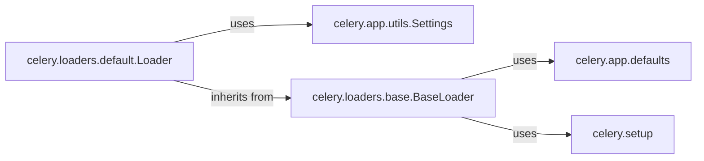

## Component Details

The Celery Configuration component is responsible for managing the application's settings. It involves loading default configurations, allowing overrides from various sources (like environment variables and configuration files), and providing a unified interface to access these settings. This ensures that all parts of the Celery application use consistent configuration values.

### celery.app.defaults
This module defines the default configuration settings for Celery. It contains a dictionary-like structure that holds the default values for various Celery options. These defaults are used if no other configuration source overrides them.

**Related Classes/Methods**:

- <a href="https://github.com/celery/celery/blob/master/celery/app/control.py#L1-L409" target="_blank" rel="noopener noreferrer">`celery.app.defaults` (1:409)</a>
- <a href="https://github.com/celery/celery/blob/master/celery/app/control.py#L411-L424" target="_blank" rel="noopener noreferrer">`celery.app.defaults:flatten` (411:424)</a>

### celery.app.utils.Settings
The `Settings` class provides a way to manage and access Celery application settings. It acts as a container for configuration values, allowing them to be accessed as attributes. It also handles merging settings from different sources and provides a consistent interface for retrieving configuration values.

**Related Classes/Methods**:

- <a href="https://github.com/celery/celery/blob/master/celery/app/control.py#L110-L203" target="_blank" rel="noopener noreferrer">`celery.app.utils.Settings` (110:203)</a>
- <a href="https://github.com/celery/celery/blob/master/celery/app/control.py#L117-L122" target="_blank" rel="noopener noreferrer">`celery.app.utils.Settings:__init__` (117:122)</a>

### celery.loaders.base.BaseLoader
The `BaseLoader` class serves as an abstract base class for loaders. It defines the interface for loading Celery application configurations. Concrete loader implementations inherit from this class and implement the `read_configuration` method to load settings from specific sources.

**Related Classes/Methods**:

- <a href="https://github.com/celery/celery/blob/master/celery/loaders/base.py#L33-L236" target="_blank" rel="noopener noreferrer">`celery.loaders.base.BaseLoader` (33:236)</a>
- <a href="https://github.com/celery/celery/blob/master/celery/loaders/base.py#L208-L216" target="_blank" rel="noopener noreferrer">`celery.loaders.base.BaseLoader:read_configuration` (208:216)</a>

### celery.loaders.default.Loader
The `Loader` class is a concrete implementation of a loader that loads Celery application configurations from the default sources, such as the Celery configuration module and environment variables. It inherits from `BaseLoader` and implements the `read_configuration` method to load settings from these sources.

**Related Classes/Methods**:

- <a href="https://github.com/celery/celery/blob/master/celery/loaders/base.py#L10-L102" target="_blank" rel="noopener noreferrer">`celery.loaders.default.Loader` (10:102)</a>
- <a href="https://github.com/celery/celery/blob/master/celery/loaders/base.py#L27-L54" target="_blank" rel="noopener noreferrer">`celery.loaders.default.Loader:read_configuration` (27:54)</a>
- <a href="https://github.com/celery/celery/blob/master/celery/loaders/base.py#L99-L102" target="_blank" rel="noopener noreferrer">`celery.loaders.default.Loader:test_read_configuration` (99:102)</a>

### celery.setup
This module handles project setup and configuration checks. It includes functions for validating project settings and ensuring that the Celery application is properly configured before it starts running.

**Related Classes/Methods**:

- <a href="https://github.com/celery/celery/blob/master/setup.py#L1-L109" target="_blank" rel="noopener noreferrer">`celery.setup` (1:109)</a>
- <a href="https://github.com/celery/celery/blob/master/setup.py#L79-L109" target="_blank" rel="noopener noreferrer">`celery.setup:configcheck_project_settings` (79:109)</a>