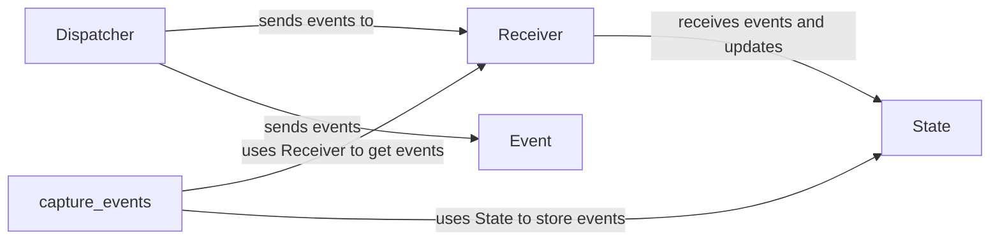

## Component Details

The Event Handling and Monitoring component in Celery provides the infrastructure for emitting, transporting, and processing events related to task execution and worker status. The core functionality revolves around the `Dispatcher` for sending events, the `Receiver` for capturing events, and the `State` for maintaining a real-time view of the Celery cluster's state. Events are generated during various stages of task processing (e.g., task started, succeeded, failed) and worker lifecycle (e.g., worker online, offline). These events are then used for monitoring, introspection, and debugging purposes, allowing users to gain insights into the behavior of their Celery-based applications.

### Dispatcher
The Dispatcher component is responsible for sending events to the Celery event stream. It establishes a connection to the message broker and publishes events as messages. It handles the serialization of events before sending them over the network. The dispatcher is typically used by Celery workers to emit events related to task execution.

**Related Classes/Methods**:

- <a href="https://github.com/celery/celery/blob/master/celery/events/dispatcher.py#L228-L281" target="_blank" rel="noopener noreferrer">`celery.events.Dispatcher` (228:281)</a>
- <a href="https://github.com/celery/celery/blob/master/celery/events/dispatcher.py#L237-L242" target="_blank" rel="noopener noreferrer">`celery.events.Dispatcher.__init__` (237:242)</a>
- <a href="https://github.com/celery/celery/blob/master/celery/events/dispatcher.py#L245-L259" target="_blank" rel="noopener noreferrer">`celery.events.Dispatcher.send` (245:259)</a>
- <a href="https://github.com/celery/celery/blob/master/celery/events/dispatcher.py#L262-L265" target="_blank" rel="noopener noreferrer">`celery.events.Dispatcher.close` (262:265)</a>
- <a href="https://github.com/celery/celery/blob/master/celery/events/dispatcher.py#L268-L279" target="_blank" rel="noopener noreferrer">`celery.events.Dispatcher.on_after_fork` (268:279)</a>

### Receiver
The Receiver component is responsible for consuming events from the Celery event stream. It connects to the message broker, subscribes to the event topic, and deserializes incoming event messages. The receiver then passes these events to the State component for processing and storage. It manages the event loop and handles potential connection errors.

**Related Classes/Methods**:

- <a href="https://github.com/celery/celery/blob/master/celery/events/dispatcher.py#L88-L225" target="_blank" rel="noopener noreferrer">`celery.events.Receiver` (88:225)</a>
- <a href="https://github.com/celery/celery/blob/master/celery/events/dispatcher.py#L104-L119" target="_blank" rel="noopener noreferrer">`celery.events.Receiver.__init__` (104:119)</a>
- <a href="https://github.com/celery/celery/blob/master/celery/events/dispatcher.py#L122-L164" target="_blank" rel="noopener noreferrer">`celery.events.Receiver.capture` (122:164)</a>
- <a href="https://github.com/celery/celery/blob/master/celery/events/dispatcher.py#L167-L176" target="_blank" rel="noopener noreferrer">`celery.events.Receiver.handle_message` (167:176)</a>
- <a href="https://github.com/celery/celery/blob/master/celery/events/dispatcher.py#L179-L182" target="_blank" rel="noopener noreferrer">`celery.events.Receiver.on_event` (179:182)</a>
- <a href="https://github.com/celery/celery/blob/master/celery/events/dispatcher.py#L185-L203" target="_blank" rel="noopener noreferrer">`celery.events.Receiver.itercapture` (185:203)</a>
- <a href="https://github.com/celery/celery/blob/master/celery/events/dispatcher.py#L206-L209" target="_blank" rel="noopener noreferrer">`celery.events.Receiver.close` (206:209)</a>
- <a href="https://github.com/celery/celery/blob/master/celery/events/dispatcher.py#L212-L223" target="_blank" rel="noopener noreferrer">`celery.events.Receiver.channel` (212:223)</a>

### State
The State component maintains the current state of the Celery cluster, including information about tasks, workers, and events. It stores this information in memory and provides methods for querying and updating the state. The State component is used by monitoring tools and other components that need to access the current state of the Celery cluster.

**Related Classes/Methods**:

- <a href="https://github.com/celery/celery/blob/master/celery/events/dispatcher.py#L284-L548" target="_blank" rel="noopener noreferrer">`celery.events.State` (284:548)</a>
- <a href="https://github.com/celery/celery/blob/master/celery/events/dispatcher.py#L294-L300" target="_blank" rel="noopener noreferrer">`celery.events.State.__init__` (294:300)</a>
- <a href="https://github.com/celery/celery/blob/master/celery/events/dispatcher.py#L303-L340" target="_blank" rel="noopener noreferrer">`celery.events.State.event` (303:340)</a>
- <a href="https://github.com/celery/celery/blob/master/celery/events/dispatcher.py#L343-L350" target="_blank" rel="noopener noreferrer">`celery.events.State.task_started` (343:350)</a>
- <a href="https://github.com/celery/celery/blob/master/celery/events/dispatcher.py#L353-L361" target="_blank" rel="noopener noreferrer">`celery.events.State.task_succeeded` (353:361)</a>
- <a href="https://github.com/celery/celery/blob/master/celery/events/dispatcher.py#L364-L372" target="_blank" rel="noopener noreferrer">`celery.events.State.task_failed` (364:372)</a>
- <a href="https://github.com/celery/celery/blob/master/celery/events/dispatcher.py#L375-L383" target="_blank" rel="noopener noreferrer">`celery.events.State.task_retried` (375:383)</a>
- <a href="https://github.com/celery/celery/blob/master/celery/events/dispatcher.py#L386-L394" target="_blank" rel="noopener noreferrer">`celery.events.State.task_revoked` (386:394)</a>
- <a href="https://github.com/celery/celery/blob/master/celery/events/dispatcher.py#L397-L404" target="_blank" rel="noopener noreferrer">`celery.events.State.worker_heartbeat` (397:404)</a>
- <a href="https://github.com/celery/celery/blob/master/celery/events/dispatcher.py#L407-L413" target="_blank" rel="noopener noreferrer">`celery.events.State.worker_online` (407:413)</a>
- <a href="https://github.com/celery/celery/blob/master/celery/events/dispatcher.py#L416-L422" target="_blank" rel="noopener noreferrer">`celery.events.State.worker_offline` (416:422)</a>
- <a href="https://github.com/celery/celery/blob/master/celery/events/dispatcher.py#L425-L430" target="_blank" rel="noopener noreferrer">`celery.events.State.clear` (425:430)</a>
- <a href="https://github.com/celery/celery/blob/master/celery/events/dispatcher.py#L433-L441" target="_blank" rel="noopener noreferrer">`celery.events.State.get_task_info` (433:441)</a>
- <a href="https://github.com/celery/celery/blob/master/celery/events/dispatcher.py#L444-L453" target="_blank" rel="noopener noreferrer">`celery.events.State.tasks_by_time` (444:453)</a>
- <a href="https://github.com/celery/celery/blob/master/celery/events/dispatcher.py#L456-L462" target="_blank" rel="noopener noreferrer">`celery.events.State.iteractive` (456:462)</a>
- <a href="https://github.com/celery/celery/blob/master/celery/events/dispatcher.py#L465-L474" target="_blank" rel="noopener noreferrer">`celery.events.State.last_worker_event` (465:474)</a>
- <a href="https://github.com/celery/celery/blob/master/celery/events/dispatcher.py#L477-L480" target="_blank" rel="noopener noreferrer">`celery.events.State.alive_workers` (477:480)</a>
- <a href="https://github.com/celery/celery/blob/master/celery/events/dispatcher.py#L483-L546" target="_blank" rel="noopener noreferrer">`celery.events.State.scale_graph` (483:546)</a>

### Event
The Event component represents a single event in the Celery system. It is a dictionary-like object that contains information about the event type, timestamp, and any associated data. Events are generated by the Dispatcher and consumed by the Receiver.

**Related Classes/Methods**:

- <a href="https://github.com/celery/celery/blob/master/celery/events/dispatcher.py#L9-L12" target="_blank" rel="noopener noreferrer">`celery.events.event.Event` (9:12)</a>

### capture_events
The capture_events function provides a curses-based monitor for capturing and displaying Celery events in real-time. It utilizes the Receiver to receive events from the Celery event stream and the State to store and process the event data. This function is useful for monitoring the Celery system and debugging issues.

**Related Classes/Methods**:

- <a href="https://github.com/celery/celery/blob/master/celery/events/dispatcher.py#L114-L174" target="_blank" rel="noopener noreferrer">`celery.events.cursesmon.capture_events` (114:174)</a>