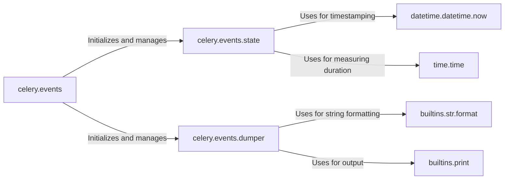

## Component Details

The Event Monitoring subsystem in Celery provides real-time insights into task execution and worker status. It captures events generated during the Celery process, maintains a state of the system, and allows for dumping of event data for debugging and analysis. The core components work together to enable monitoring, tracing, and management of asynchronous tasks.

### celery.events
This is the main entry point for Celery's event processing. It sets up listeners to capture events from the Celery broker and orchestrates the handling of these events. It initializes and manages the state and dumper components.
- **Related Classes/Methods**: `celery.events`

### celery.events.state
This component maintains the state of the Celery system based on the events received. It tracks information about tasks, workers, and other relevant entities, updating its internal representation as new events arrive. It uses `datetime.datetime.now` and `time.time` to record event timestamps and durations.
- **Related Classes/Methods**: `celery.events.state`

### celery.events.dumper
This component is responsible for formatting and outputting event data, typically for debugging or analysis. It converts event information into a human-readable string and prints it to the console or a file. It uses `builtins.str.format` for string formatting and `builtins.print` for output.
- **Related Classes/Methods**: `celery.events.dumper`

### datetime.datetime.now
This function from the `datetime` module is used to get the current date and time, providing a timestamp for events within the `celery.events.state` component.
- **Related Classes/Methods**: `datetime.datetime`

### time.time
This function from the `time` module is used to get the current time as a Unix timestamp, enabling the measurement of event durations within the `celery.events.state` component.
- **Related Classes/Methods**: `time`

### builtins.str.format
This method of the built-in `str` class is used for string formatting, allowing the `celery.events.dumper` component to create human-readable representations of events.
- **Related Classes/Methods**: `builtins`

### builtins.print
This built-in function is used for printing output to the console, enabling the `celery.events.dumper` component to display event information.
- **Related Classes/Methods**: `builtins`
