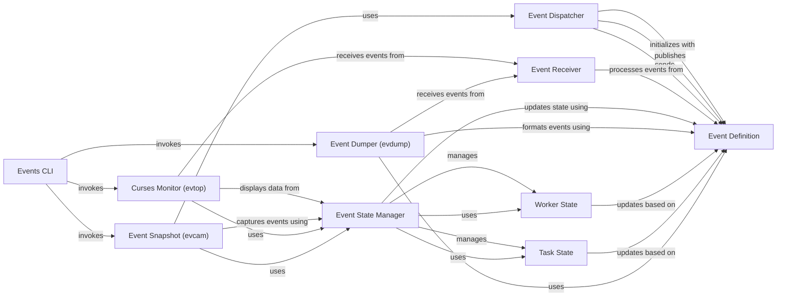

## Component Details

The Event System in Celery provides real-time monitoring and introspection capabilities for the Celery cluster. It enables workers and clients to dispatch various events (e.g., task lifecycle events, worker status changes) to an event bus. These events are then consumed by receivers, which update a centralized state manager to maintain an accurate representation of the cluster's current status. Various monitoring tools, such as terminal-based monitors (evtop), event dumpers (evdump), and snapshot utilities (evcam), leverage this event stream and state information to provide insights into the cluster's operations.

### Event Dispatcher
The Event Dispatcher is responsible for sending event messages from Celery workers and clients to the event bus. It manages the connection to the broker, buffers events if the connection is offline, and publishes events to the appropriate exchange. It can be enabled or disabled and supports different event groups.

**Related Classes/Methods**:

- <a href="https://github.com/celery/celery/blob/master/celery/events/dispatcher.py#L19-L229" target="_blank" rel="noopener noreferrer">`celery.events.dispatcher.EventDispatcher` (19:229)</a>

### Event Receiver
The Event Receiver is responsible for consuming event messages from the event bus. It processes incoming events, dispatches them to registered handlers, and can manage event queues and exchanges. It provides mechanisms for capturing and iterating over events.

**Related Classes/Methods**:

- <a href="https://github.com/celery/celery/blob/master/celery/events/receiver.py#L22-L135" target="_blank" rel="noopener noreferrer">`celery.events.receiver.EventReceiver` (22:135)</a>

### Event State Manager
The Event State Manager maintains the current state of the Celery cluster, including information about workers and tasks, by processing incoming events. It provides methods to query the state, such as active workers, tasks by time, type, or worker, and handles logical clock ordering for events.

**Related Classes/Methods**:

- <a href="https://github.com/celery/celery/blob/master/celery/events/state.py#L398-L720" target="_blank" rel="noopener noreferrer">`celery.events.state.State` (398:720)</a>

### Worker State
The Worker State component represents the state of an individual Celery worker. It stores information such as the worker's hostname, last heartbeat, and other attributes. It provides methods to update its state based on incoming events and determine if the worker is alive.

**Related Classes/Methods**:

- <a href="https://github.com/celery/celery/blob/master/celery/events/state.py#L149-L239" target="_blank" rel="noopener noreferrer">`celery.events.state.Worker` (149:239)</a>

### Task State
The Task State component represents the state of an individual Celery task. It stores details about the task's lifecycle, such as its ID, type, arguments, and current status. It provides methods to update its state based on events and retrieve task information.

**Related Classes/Methods**:

- <a href="https://github.com/celery/celery/blob/master/celery/events/state.py#L243-L395" target="_blank" rel="noopener noreferrer">`celery.events.state.Task` (243:395)</a>

### Event Definition
The Event Definition component defines the structure and properties of a Celery event. It encapsulates event data such as type, hostname, timestamp, and logical clock value, providing a standardized format for event messages.

**Related Classes/Methods**:

- <a href="https://github.com/celery/celery/blob/master/celery/events/event.py#L18-L30" target="_blank" rel="noopener noreferrer">`celery.events.event.Event` (18:30)</a>

### Curses Monitor (evtop)
The Curses Monitor provides a real-time, interactive terminal-based monitoring interface for Celery events. It displays worker and task states, allows for task inspection and control (e.g., revoking tasks), and updates dynamically as events are received.

**Related Classes/Methods**:

- <a href="https://github.com/celery/celery/blob/master/celery/events/cursesmon.py#L34-L476" target="_blank" rel="noopener noreferrer">`celery.events.cursesmon.CursesMonitor` (34:476)</a>

### Event Dumper (evdump)
The Event Dumper is a utility for printing Celery events to standard output in a human-readable format. It processes incoming events and formats them for display, providing a simple way to observe the event stream.

**Related Classes/Methods**:

- <a href="https://github.com/celery/celery/blob/master/celery/events/dumper.py#L36-L76" target="_blank" rel="noopener noreferrer">`celery.events.dumper.Dumper` (36:76)</a>

### Event Snapshot (evcam)
The Event Snapshot component, represented by Polaroid, captures and processes event snapshots. It can install timers to periodically capture the state of the Celery cluster and provides mechanisms for cleanup and shuttering (taking a snapshot).

**Related Classes/Methods**:

- <a href="https://github.com/celery/celery/blob/master/celery/events/snapshot.py#L24-L83" target="_blank" rel="noopener noreferrer">`celery.events.snapshot.Polaroid` (24:83)</a>
- <a href="https://github.com/celery/celery/blob/master/celery/events/snapshot.py#L86-L111" target="_blank" rel="noopener noreferrer">`celery.events.snapshot.evcam` (86:111)</a>

### Events CLI
The Events CLI component provides command-line interfaces for interacting with Celery events. It acts as a dispatcher for various event-related tools like `evdump`, `evcam`, and `evtop`, allowing users to monitor, record, or display events from the terminal.

**Related Classes/Methods**:

- <a href="https://github.com/celery/celery/blob/master/celery/bin/events.py#L82-L94" target="_blank" rel="noopener noreferrer">`celery.bin.events` (82:94)</a>

### [FAQ](https://github.com/CodeBoarding/GeneratedOnBoardings/tree/main?tab=readme-ov-file#faq)