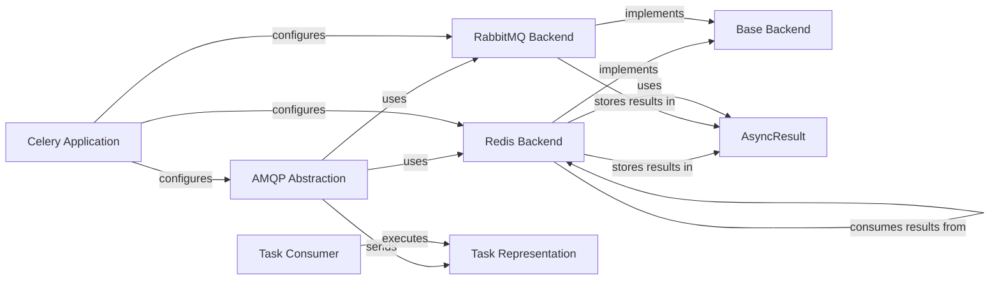

## Component Details

The Message Broker Communication subsystem in Celery is responsible for managing the interaction between the Celery application and the message broker (e.g., RabbitMQ, Redis). It handles sending tasks to the broker, receiving tasks from the broker, and managing the communication channels between the Celery application and the worker processes. This ensures reliable and efficient task distribution, enabling Celery to handle a large volume of asynchronous tasks. The core components involved are the AMQP abstraction, specific backend implementations for Redis and RabbitMQ, the task representation, and the consumer that pulls tasks from the broker.

### AMQP Abstraction
This component provides an abstraction layer for interacting with AMQP-based message brokers. It handles connection management, message sending, and message receiving using the AMQP protocol. It is used by Celery to communicate with brokers like RabbitMQ.
- **Related Classes/Methods**: `celery.app.amqp.AMQP`

### Redis Backend
This component implements the Celery backend for storing task results in Redis. It manages the connection to the Redis server, stores task results, and provides methods for retrieving these results. It also includes a result consumer for fetching results from Redis.
- **Related Classes/Methods**: `celery.backends.redis.RedisBackend`, `celery.backends.redis.ResultConsumer`

### RabbitMQ Backend
This component implements the Celery backend for storing task results in RabbitMQ. It manages the connection to the RabbitMQ server, stores task results as messages, and provides methods for retrieving these results.
- **Related Classes/Methods**: `celery.backends.rabbitmq.RabbitMQBackend`

### Task Representation
This component represents a Celery task. It defines the structure and metadata associated with a task, including its ID, arguments, and execution status. Tasks are sent to the message broker for asynchronous execution.
- **Related Classes/Methods**: `celery.app.task.Task`

### Task Consumer
This component is responsible for consuming tasks from the message broker. It receives task messages from the broker and passes them to worker processes for execution. It manages the message consumption loop and ensures that tasks are processed efficiently.
- **Related Classes/Methods**: `celery.worker.consumer.Consumer`

### Celery Application
This component represents the main Celery application. It configures the message broker connection, defines tasks, and manages the overall Celery application lifecycle. It serves as the central point for interacting with the Celery system.
- **Related Classes/Methods**: `celery.app.base.Celery`

### Base Backend
This abstract base class defines the common interface for all Celery backends. It specifies the methods that all backends must implement, such as storing and retrieving task results. RedisBackend and RabbitMQBackend inherit from this class.
- **Related Classes/Methods**: `celery.backends.base.Backend`

### AsyncResult
This component represents the result of an asynchronous task. It provides methods to check the status of the task, retrieve the result, and handle exceptions. It is used by clients to monitor the progress and retrieve the output of tasks.
- **Related Classes/Methods**: `celery.result.AsyncResult`
