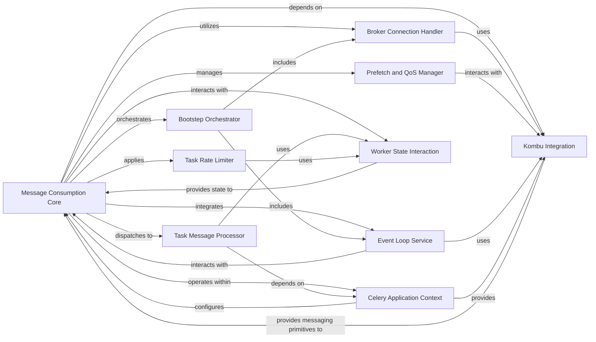

## Component Details

The Message Consumption subsystem in Celery workers is primarily driven by the `Consumer` component, which acts as the central orchestrator for connecting to the message broker, consuming task messages, and dispatching them for processing. It integrates various modular services, known as bootsteps, to manage its lifecycle, including handling broker connections, processing incoming tasks, managing prefetch counts, applying rate limits, and ensuring connection stability. This subsystem is crucial for the worker's ability to receive and initiate the execution of tasks from the message queue, with robust error handling for message decoding and connection issues.

### Message Consumption Core
The central orchestrator for message consumption within the Celery worker. It manages the lifecycle of the consumer, handles broker connections, dispatches tasks, and integrates various bootsteps.

**Related Classes/Methods**:

- <a href="https://github.com/celery/celery/blob/master/celery/worker/consumer/consumer.py#L138-L757" target="_blank" rel="noopener noreferrer">`celery.worker.consumer.consumer:Consumer` (138:757)</a>

### Broker Connection Handler
Responsible for establishing, maintaining, and re-establishing connections to the message broker. It handles connection errors and implements retry logic.

**Related Classes/Methods**:

- <a href="https://github.com/celery/celery/blob/master/celery/worker/consumer/consumer.py#L466-L475" target="_blank" rel="noopener noreferrer">`celery.worker.consumer.consumer:Consumer.connect` (466:475)</a>
- <a href="https://github.com/celery/celery/blob/master/celery/worker/consumer/consumer.py#L477-L479" target="_blank" rel="noopener noreferrer">`celery.worker.consumer.consumer:Consumer.connection_for_read` (477:479)</a>
- <a href="https://github.com/celery/celery/blob/master/celery/worker/consumer/consumer.py#L481-L483" target="_blank" rel="noopener noreferrer">`celery.worker.consumer.consumer:Consumer.connection_for_write` (481:483)</a>
- <a href="https://github.com/celery/celery/blob/master/celery/worker/consumer/consumer.py#L485-L535" target="_blank" rel="noopener noreferrer">`celery.worker.consumer.consumer:Consumer.ensure_connected` (485:535)</a>
- <a href="https://github.com/celery/celery/blob/master/celery/worker/consumer/consumer.py#L374-L376" target="_blank" rel="noopener noreferrer">`celery.worker.consumer.consumer:Consumer.on_connection_error_before_connected` (374:376)</a>
- <a href="https://github.com/celery/celery/blob/master/celery/worker/consumer/consumer.py#L378-L407" target="_blank" rel="noopener noreferrer">`celery.worker.consumer.consumer:Consumer.on_connection_error_after_connected` (378:407)</a>

### Task Message Processor
Decodes incoming task messages, validates their format, and dispatches them to the appropriate task execution strategies. It handles errors related to message decoding, unknown tasks, and invalid task formats.

**Related Classes/Methods**:

- <a href="https://github.com/celery/celery/blob/master/celery/worker/consumer/consumer.py#L636-L699" target="_blank" rel="noopener noreferrer">`celery.worker.consumer.consumer:Consumer.create_task_handler` (636:699)</a>
- <a href="https://github.com/celery/celery/blob/master/celery/worker/consumer/consumer.py#L432-L446" target="_blank" rel="noopener noreferrer">`celery.worker.consumer.consumer:Consumer.on_decode_error` (432:446)</a>
- <a href="https://github.com/celery/celery/blob/master/celery/worker/consumer/consumer.py#L585-L588" target="_blank" rel="noopener noreferrer">`celery.worker.consumer.consumer:Consumer.on_unknown_message` (585:588)</a>
- <a href="https://github.com/celery/celery/blob/master/celery/worker/consumer/consumer.py#L590-L621" target="_blank" rel="noopener noreferrer">`celery.worker.consumer.consumer:Consumer.on_unknown_task` (590:621)</a>
- <a href="https://github.com/celery/celery/blob/master/celery/worker/consumer/consumer.py#L623-L627" target="_blank" rel="noopener noreferrer">`celery.worker.consumer.consumer:Consumer.on_invalid_task` (623:627)</a>
- <a href="https://github.com/celery/celery/blob/master/celery/worker/consumer/consumer.py#L572-L576" target="_blank" rel="noopener noreferrer">`celery.worker.consumer.consumer:Consumer.apply_eta_task` (572:576)</a>

### Prefetch and QoS Manager
Manages the prefetch count for messages from the broker, ensuring efficient task distribution to worker processes. It adjusts the prefetch count dynamically, especially after connection losses.

**Related Classes/Methods**:

- <a href="https://github.com/celery/celery/blob/master/celery/worker/consumer/consumer.py#L264-L281" target="_blank" rel="noopener noreferrer">`celery.worker.consumer.consumer:Consumer._update_prefetch_count` (264:281)</a>
- <a href="https://github.com/celery/celery/blob/master/celery/worker/consumer/consumer.py#L283-L286" target="_blank" rel="noopener noreferrer">`celery.worker.consumer.consumer:Consumer._update_qos_eventually` (283:286)</a>
- <a href="https://github.com/celery/celery/blob/master/celery/worker/consumer/consumer.py#L701-L720" target="_blank" rel="noopener noreferrer">`celery.worker.consumer.consumer:Consumer._restore_prefetch_count_after_connection_restart` (701:720)</a>
- <a href="https://github.com/celery/celery/blob/master/celery/worker/consumer/consumer.py#L723-L724" target="_blank" rel="noopener noreferrer">`celery.worker.consumer.consumer:Consumer.max_prefetch_count` (723:724)</a>
- <a href="https://github.com/celery/celery/blob/master/celery/worker/consumer/consumer.py#L749-L750" target="_blank" rel="noopener noreferrer">`celery.worker.consumer.consumer._new_prefetch_count` (749:750)</a>

### Task Rate Limiter
Implements rate limiting for tasks based on configured limits, ensuring that tasks are consumed and processed at a controlled pace.

**Related Classes/Methods**:

- <a href="https://github.com/celery/celery/blob/master/celery/worker/consumer/consumer.py#L255-L257" target="_blank" rel="noopener noreferrer">`celery.worker.consumer.consumer:Consumer.bucket_for_task` (255:257)</a>
- <a href="https://github.com/celery/celery/blob/master/celery/worker/consumer/consumer.py#L259-L262" target="_blank" rel="noopener noreferrer">`celery.worker.consumer.consumer:Consumer.reset_rate_limits` (259:262)</a>
- <a href="https://github.com/celery/celery/blob/master/celery/worker/consumer/consumer.py#L316-L318" target="_blank" rel="noopener noreferrer">`celery.worker.consumer.consumer:Consumer._limit_task` (316:318)</a>
- <a href="https://github.com/celery/celery/blob/master/celery/worker/consumer/consumer.py#L292-L314" target="_blank" rel="noopener noreferrer">`celery.worker.consumer.consumer:Consumer._schedule_bucket_request` (292:314)</a>
- <a href="https://github.com/celery/celery/blob/master/celery/worker/consumer/consumer.py#L288-L290" target="_blank" rel="noopener noreferrer">`celery.worker.consumer.consumer:Consumer._limit_move_to_pool` (288:290)</a>
- <a href="https://github.com/celery/celery/blob/master/celery/worker/consumer/consumer.py#L320-L323" target="_blank" rel="noopener noreferrer">`celery.worker.consumer.consumer:Consumer._limit_post_eta` (320:323)</a>

### Event Loop Service
Provides the mechanism for draining events from the message broker, operating in either asynchronous or synchronous mode. It's a bootstep that integrates with the consumer's event processing.

**Related Classes/Methods**:

- <a href="https://github.com/celery/celery/blob/master/celery/worker/consumer/consumer.py#L760-L775" target="_blank" rel="noopener noreferrer">`celery.worker.consumer.consumer:Evloop` (760:775)</a>
- <a href="https://github.com/celery/celery/blob/master/celery/worker/loops.py#L50-L105" target="_blank" rel="noopener noreferrer">`celery.worker.loops.asynloop` (50:105)</a>
- <a href="https://github.com/celery/celery/blob/master/celery/worker/loops.py#L108-L143" target="_blank" rel="noopener noreferrer">`celery.worker.loops.synloop` (108:143)</a>

### Bootstep Orchestrator
Manages the startup, shutdown, and restart of various modular services (bootsteps) that constitute the consumer's functionality, such as connection management, event handling, and gossip.

**Related Classes/Methods**:

- <a href="https://github.com/celery/celery/blob/master/celery/worker/consumer/consumer.py#L160-L178" target="_blank" rel="noopener noreferrer">`celery.worker.consumer.consumer:Consumer.Blueprint` (160:178)</a>
- <a href="https://github.com/celery/celery/blob/master/celery/bootsteps.py#L74-L263" target="_blank" rel="noopener noreferrer">`celery.bootsteps.Blueprint` (74:263)</a>

### Worker State Interaction
Interacts with the global worker state to track active, reserved, and revoked tasks, and to respond to shutdown signals.

**Related Classes/Methods**:

- <a href="https://github.com/celery/celery/blob/master/celery/worker/state.py#L88-L93" target="_blank" rel="noopener noreferrer">`celery.worker.state.maybe_shutdown` (88:93)</a>
- <a href="https://github.com/celery/celery/blob/master/celery/worker/state.py#L96-L101" target="_blank" rel="noopener noreferrer">`celery.worker.state.task_reserved` (96:101)</a>
- `celery.worker.state.active_requests` (full file reference)
- `celery.worker.state.reserved_requests` (full file reference)
- <a href="https://github.com/celery/celery/blob/master/celery/worker/consumer/consumer.py#L736-L757" target="_blank" rel="noopener noreferrer">`celery.worker.consumer.consumer:Consumer.cancel_all_unacked_requests` (736:757)</a>

### Kombu Integration
Provides the low-level interface for interacting with the message broker, handling connection details and the actual consumption of messages from queues.

**Related Classes/Methods**:

- `kombu.Connection` (full file reference)
- `kombu.Consumer` (full file reference)

### Celery Application Context
Represents the main Celery application instance, providing configuration, task registry, and access to various Celery components. The consumer relies on this context for its operations.

**Related Classes/Methods**:

- `celery.Celery` (full file reference)

### [FAQ](https://github.com/CodeBoarding/GeneratedOnBoardings/tree/main?tab=readme-ov-file#faq)