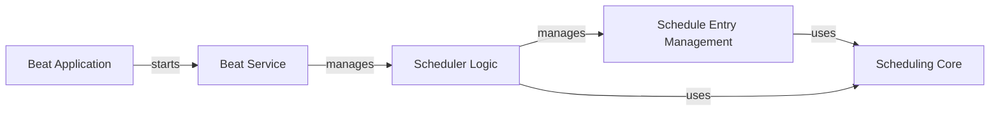

## Component Details

The Periodic Scheduling component in Celery is responsible for executing tasks at predefined intervals. It leverages a scheduler (Celery Beat) that reads scheduled tasks from a persistent store, determines if they are due, and then enqueues them to the message broker for execution by Celery workers. The core flow involves the `Beat Application` initiating the `Beat Service`, which in turn manages the `Scheduler Logic`. The `Scheduler Logic` interacts with `Schedule Entry Management` to handle individual task entries and utilizes `Scheduling Core` to interpret various schedule types (e.g., fixed intervals, cron expressions, solar events). The `PersistentScheduler` ensures that the schedule is maintained across restarts by storing it in a database.

### Scheduling Core
This component provides the fundamental building blocks for defining when periodic tasks should run. It includes base classes for schedules and concrete implementations for time-based intervals (like 'schedule' for fixed delays), cron-like expressions ('crontab'), and solar events ('solar'). It also contains the 'crontab_parser' for interpreting cron strings.

**Related Classes/Methods**:

- <a href="https://github.com/celery/celery/blob/master/celery/schedules.py#L65-L108" target="_blank" rel="noopener noreferrer">`celery.schedules.BaseSchedule` (65:108)</a>
- <a href="https://github.com/celery/celery/blob/master/celery/schedules.py#L111-L193" target="_blank" rel="noopener noreferrer">`celery.schedules.schedule` (111:193)</a>
- <a href="https://github.com/celery/celery/blob/master/celery/schedules.py#L196-L320" target="_blank" rel="noopener noreferrer">`celery.schedules.crontab_parser` (196:320)</a>
- <a href="https://github.com/celery/celery/blob/master/celery/schedules.py#L323-L700" target="_blank" rel="noopener noreferrer">`celery.schedules.crontab` (323:700)</a>
- <a href="https://github.com/celery/celery/blob/master/celery/schedules.py#L717-L887" target="_blank" rel="noopener noreferrer">`celery.schedules.solar` (717:887)</a>
- <a href="https://github.com/celery/celery/blob/master/celery/schedules.py#L61-L62" target="_blank" rel="noopener noreferrer">`celery.schedules.ParseException` (61:62)</a>

### Schedule Entry Management
This component represents a single entry in the periodic task schedule. It holds information about a task, its arguments, options, and crucially, its associated schedule. It determines if a task is due to run based on its schedule and updates its state after execution.

**Related Classes/Methods**:

- <a href="https://github.com/celery/celery/blob/master/celery/beat.py#L81-L197" target="_blank" rel="noopener noreferrer">`celery.beat.ScheduleEntry` (81:197)</a>

### Scheduler Logic
This is the core scheduling engine. It manages a collection of 'ScheduleEntry' objects, determines which tasks are due, and applies them asynchronously. It uses a heap to efficiently manage the next scheduled events and handles synchronization of the schedule. 'PersistentScheduler' is a concrete implementation that persists the schedule to a database.

**Related Classes/Methods**:

- <a href="https://github.com/celery/celery/blob/master/celery/beat.py#L218-L501" target="_blank" rel="noopener noreferrer">`celery.beat.Scheduler` (218:501)</a>
- <a href="https://github.com/celery/celery/blob/master/celery/beat.py#L504-L608" target="_blank" rel="noopener noreferrer">`celery.beat.PersistentScheduler` (504:608)</a>

### Beat Service
This component orchestrates the overall Celery Beat process. It initializes and manages a 'Scheduler' instance, handles the main loop for ticking the scheduler, and manages shutdown signals. It can run as a standalone process or embedded within another process.

**Related Classes/Methods**:

- <a href="https://github.com/celery/celery/blob/master/celery/beat.py#L611-L678" target="_blank" rel="noopener noreferrer">`celery.beat.Service` (611:678)</a>

### Beat Application
This component serves as the command-line interface and entry point for running the Celery Beat service. It parses command-line arguments, sets up logging, process titles, and then initiates the 'Beat Service'.

**Related Classes/Methods**:

- <a href="https://github.com/celery/celery/blob/master/celery/apps/beat.py#L40-L160" target="_blank" rel="noopener noreferrer">`celery.apps.beat.Beat` (40:160)</a>

### [FAQ](https://github.com/CodeBoarding/GeneratedOnBoardings/tree/main?tab=readme-ov-file#faq)