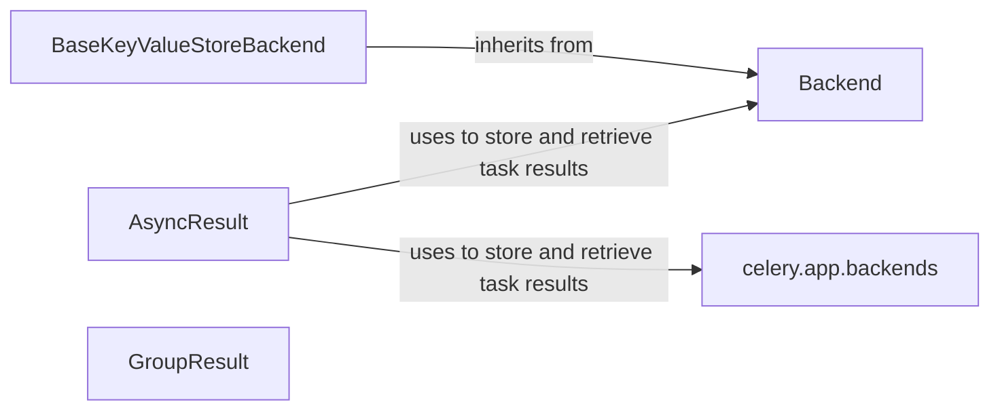

## Component Details

The Result Backend component in Celery is responsible for managing the storage and retrieval of task results. It provides an abstraction layer that allows Celery to use various storage systems, such as Redis, databases, or caches, to persist task results and metadata. This component defines base classes for backend implementations, specific backend classes for different storage systems, and interfaces for interacting with task results, including checking task status and retrieving results. The `AsyncResult` class serves as the primary interface for users to interact with task results, while the `GroupResult` class handles results for task groups. The `celery.app.backends` module provides mechanisms for registering and retrieving backend instances by name or URL.

### Backend
Defines the base class for Celery backends, providing the interface for storing and retrieving task results. It includes methods for getting result metadata and setting task results.

**Related Classes/Methods**:

- <a href="https://github.com/celery/celery/blob/master/celery/backends/cosmosdbsql.py#L25-L194" target="_blank" rel="noopener noreferrer">`celery.backends.base.Backend` (25:194)</a>
- `celery.backends.base.Backend._get_result_meta` (121:124)

### BaseKeyValueStoreBackend
An abstract class that extends `Backend` and provides a base for key-value store backends. It includes methods for generating keys for tasks and groups, and handling chord callbacks.

**Related Classes/Methods**:

- <a href="https://github.com/celery/celery/blob/master/celery/backends/cosmosdbsql.py#L200-L447" target="_blank" rel="noopener noreferrer">`celery.backends.base.BaseKeyValueStoreBackend` (200:447)</a>
- `celery.backends.base.BaseKeyValueStoreBackend.__init__` (217:221)
- `celery.backends.base.BaseKeyValueStoreBackend.get_key_for_task` (230:233)
- `celery.backends.base.BaseKeyValueStoreBackend.get_key_for_group` (236:239)
- `celery.backends.base.BaseKeyValueStoreBackend.on_chord_part_return` (330:349)
- `celery.backends.base.BaseKeyValueStoreBackend._apply_chord_incr` (351:368)
- `celery.backends.base.BaseKeyValueStoreBackend._set_with_state` (418:421)

### AsyncResult
Represents the result of an asynchronous task. It provides methods for checking the task's status, retrieving the result, and handling errors. It interacts with the backend to fetch the result and may raise exceptions if the task failed or timed out.

**Related Classes/Methods**:

- <a href="https://github.com/celery/celery/blob/master/setup.py#L100-L447" target="_blank" rel="noopener noreferrer">`celery.result.AsyncResult` (100:447)</a>
- `celery.result.AsyncResult.__init__` (149:164)
- `celery.result.AsyncResult.get` (279:322)
- `celery.result.AsyncResult._maybe_reraise_parent_error` (324:334)
- `celery.result.AsyncResult.maybe_throw` (336:348)
- `celery.result.AsyncResult._get_task_meta` (350:362)

### GroupResult
Represents the result of a group of tasks. It provides methods for restoring the group result from a stored state.

**Related Classes/Methods**:

- <a href="https://github.com/celery/celery/blob/master/setup.py#L453-L501" target="_blank" rel="noopener noreferrer">`celery.result.GroupResult` (453:501)</a>
- `celery.result.GroupResult.restore` (484:501)

### celery.app.backends
Manages the registration and retrieval of Celery backends. It provides functions for obtaining a backend instance by name or URL, allowing the application to configure the storage mechanism for task results.

**Related Classes/Methods**:

- <a href="https://github.com/celery/celery/blob/master/celery/app/control.py#L20-L30" target="_blank" rel="noopener noreferrer">`celery.app.backends.by_name` (20:30)</a>
- <a href="https://github.com/celery/celery/blob/master/celery/app/control.py#L33-L43" target="_blank" rel="noopener noreferrer">`celery.app.backends.by_url` (33:43)</a>