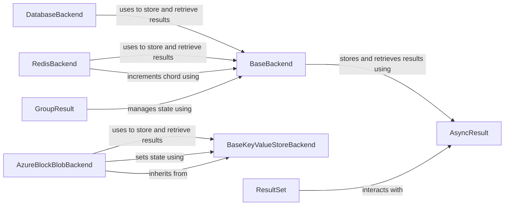

## Component Details

The Result Management component in Celery is responsible for handling the storage, retrieval, and management of task results. It provides an abstraction layer that allows Celery to use different backend implementations for storing results, such as Redis, Azure Blob Storage, or a database. The core of this component revolves around the `BaseBackend` class, which defines the interface for interacting with the result store. Concrete backend implementations, like `RedisBackend`, `AzureBlockBlobBackend`, and `DatabaseBackend`, inherit from `BaseBackend` and provide specific logic for interacting with their respective storage systems. The `AsyncResult` class represents the result of a single task and provides methods for accessing the task's state and return value. Higher-level constructs like `GroupResult`, `ResultSet`, `_chord`, `group`, `chain`, and `Signature` leverage `AsyncResult` and the backend to manage the results of more complex task workflows.

### BaseBackend
The abstract base class for all Celery backends. It defines the common interface for storing and retrieving task results, as well as managing task state. It provides methods for storing results, getting results, and applying chord increments.
- **Related Classes/Methods**: `celery.backends.base.BaseBackend`

### AsyncResult
This class represents the result of an asynchronous task. It provides methods for accessing the task's result, checking its state, and waiting for it to complete. It interacts with the backend to retrieve the task's result and state.
- **Related Classes/Methods**: `celery.result.AsyncResult`

### RedisBackend
This class implements the Celery backend using Redis as the storage mechanism. It inherits from BaseBackend and overrides some methods to interact with Redis. It's responsible for storing and retrieving task results from Redis.
- **Related Classes/Methods**: `celery.backends.redis.RedisBackend`

### AzureBlockBlobBackend
This class implements the Celery backend using Azure Block Blob storage. It inherits from BaseKeyValueStoreBackend and overrides some methods to interact with Azure Block Blob. It's responsible for storing and retrieving task results from Azure.
- **Related Classes/Methods**: `celery.backends.azureblockblob.AzureBlockBlobBackend`

### DatabaseBackend
This class implements the Celery backend using a database as the storage mechanism. It inherits from BaseBackend and overrides some methods to interact with the database. It's responsible for storing and retrieving task results from the database.
- **Related Classes/Methods**: `celery.backends.database.DatabaseBackend`

### BaseKeyValueStoreBackend
This is an abstract base class for backends that use a key-value store. It provides a common implementation for storing and retrieving task results using a key-value store.
- **Related Classes/Methods**: `celery.backends.base.BaseKeyValueStoreBackend`

### GroupResult
This class represents the result of a group of tasks. It provides methods for accessing the results of the individual tasks in the group, as well as for saving and restoring the group result.
- **Related Classes/Methods**: `celery.result.GroupResult`

### ResultSet
This class represents a set of results, typically from multiple tasks. It provides methods for accessing and manipulating the results.
- **Related Classes/Methods**: `celery.result.ResultSet`
