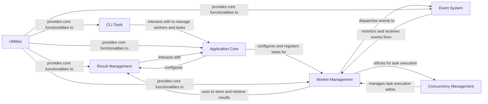

## Component Details

The Result Management component in Celery provides a robust and unified interface for handling the persistence and retrieval of task results, states, and associated metadata. It abstracts away the complexities of various storage backends, supporting a wide range of technologies such as databases, Redis, filesystem, and more. This component is crucial for tracking task execution, enabling features like task chaining (chords) and allowing clients to asynchronously retrieve results. It also manages the serialization and deserialization of task outcomes to ensure data integrity across different storage mechanisms.

### Result Management
Provides a unified interface for various storage backends (e.g., database, Redis, filesystem) to persist and retrieve task results, states, and metadata. It handles serialization and deserialization of results and supports features like chord synchronization. It also provides classes to interact with task results.

**Related Classes/Methods**:

- <a href="https://github.com/celery/celery/blob/master/celery/backends/base.py#L81-L723" target="_blank" rel="noopener noreferrer">`celery.backends.base.Backend` (81:723)</a>
- <a href="https://github.com/celery/celery/blob/master/celery/backends/base.py#L811-L1087" target="_blank" rel="noopener noreferrer">`celery.backends.base.BaseKeyValueStoreBackend` (811:1087)</a>
- `celery.backends.database.DatabaseBackend` (full file reference)
- <a href="https://github.com/celery/celery/blob/master/celery/backends/redis.py#L187-L584" target="_blank" rel="noopener noreferrer">`celery.backends.redis.RedisBackend` (187:584)</a>
- <a href="https://github.com/celery/celery/blob/master/celery/backends/filesystem.py#L25-L112" target="_blank" rel="noopener noreferrer">`celery.backends.filesystem.FilesystemBackend` (25:112)</a>
- <a href="https://github.com/celery/celery/blob/master/celery/backends/cache.py#L90-L163" target="_blank" rel="noopener noreferrer">`celery.backends.cache.CacheBackend` (90:163)</a>
- <a href="https://github.com/celery/celery/blob/master/celery/backends/mongodb.py#L35-L333" target="_blank" rel="noopener noreferrer">`celery.backends.mongodb.MongoBackend` (35:333)</a>
- <a href="https://github.com/celery/celery/blob/master/celery/backends/elasticsearch.py#L30-L283" target="_blank" rel="noopener noreferrer">`celery.backends.elasticsearch.ElasticsearchBackend` (30:283)</a>
- <a href="https://github.com/celery/celery/blob/master/celery/backends/couchbase.py#L23-L114" target="_blank" rel="noopener noreferrer">`celery.backends.couchbase.CouchbaseBackend` (23:114)</a>
- <a href="https://github.com/celery/celery/blob/master/celery/backends/s3.py#L20-L87" target="_blank" rel="noopener noreferrer">`celery.backends.s3.S3Backend` (20:87)</a>
- <a href="https://github.com/celery/celery/blob/master/celery/backends/cosmosdbsql.py#L30-L218" target="_blank" rel="noopener noreferrer">`celery.backends.cosmosdbsql.CosmosDBSQLBackend` (30:218)</a>
- <a href="https://github.com/celery/celery/blob/master/celery/backends/dynamodb.py#L29-L556" target="_blank" rel="noopener noreferrer">`celery.backends.dynamodb.DynamoDBBackend` (29:556)</a>
- <a href="https://github.com/celery/celery/blob/master/celery/backends/rpc.py#L88-L342" target="_blank" rel="noopener noreferrer">`celery.backends.rpc.RPCBackend` (88:342)</a>
- <a href="https://github.com/celery/celery/blob/master/celery/backends/asynchronous.py#L239-L333" target="_blank" rel="noopener noreferrer">`celery.backends.asynchronous.BaseResultConsumer` (239:333)</a>
- `celery.app.backends` (full file reference)
- <a href="https://github.com/celery/celery/blob/master/celery/result.py#L69-L545" target="_blank" rel="noopener noreferrer">`celery.result.AsyncResult` (69:545)</a>
- <a href="https://github.com/celery/celery/blob/master/celery/result.py#L549-L884" target="_blank" rel="noopener noreferrer">`celery.result.ResultSet` (549:884)</a>
- <a href="https://github.com/celery/celery/blob/master/celery/result.py#L888-L980" target="_blank" rel="noopener noreferrer">`celery.result.GroupResult` (888:980)</a>

### Application Core
The Application Core component is responsible for defining the Celery application instance, managing its configuration, registering tasks, and handling the overall application lifecycle. It acts as the central hub for all Celery operations.

**Related Classes/Methods**:

- `celery.app.base` (full file reference)
- `celery.app.task` (full file reference)
- `celery.app.registry` (full file reference)
- `celery.app.utils` (full file reference)

### Worker Management
The Worker Management component orchestrates the execution of tasks. It includes the main worker process, the consumer that fetches tasks from the message broker, and the mechanisms for managing concurrency and task execution pools.

**Related Classes/Methods**:

- `celery.worker.worker` (full file reference)
- `celery.worker.consumer.consumer` (full file reference)
- `celery.worker.state` (full file reference)
- `celery.worker.request` (full file reference)
- `celery.worker.autoscale` (full file reference)

### CLI Tools
The CLI Tools component offers command-line interfaces for interacting with the Celery system. This includes commands for starting workers, managing scheduled tasks (beat), inspecting the system, and performing administrative operations.

**Related Classes/Methods**:

- <a href="https://github.com/celery/celery/blob/master/celery/bin/celery.py#L117-L167" target="_blank" rel="noopener noreferrer">`celery.bin.celery` (117:167)</a>
- <a href="https://github.com/celery/celery/blob/master/celery/bin/worker.py#L298-L360" target="_blank" rel="noopener noreferrer">`celery.bin.worker` (298:360)</a>
- <a href="https://github.com/celery/celery/blob/master/celery/bin/beat.py#L47-L72" target="_blank" rel="noopener noreferrer">`celery.bin.beat` (47:72)</a>
- <a href="https://github.com/celery/celery/blob/master/celery/bin/control.py#L229-L252" target="_blank" rel="noopener noreferrer">`celery.bin.control` (229:252)</a>

### Event System
The Event System component is responsible for generating, dispatching, and receiving events within the Celery ecosystem. These events provide real-time insights into task states, worker activities, and other operational metrics, crucial for monitoring and introspection tools.

**Related Classes/Methods**:

- `celery.events.dispatcher` (full file reference)
- `celery.events.receiver` (full file reference)
- `celery.events.state` (full file reference)
- `celery.events.cursesmon` (full file reference)

### Concurrency Management
The Concurrency Management component handles the parallel execution of tasks within a Celery worker. It provides different concurrency models, such as prefork (multiprocessing), Eventlet, and Gevent, to optimize task processing based on application requirements.

**Related Classes/Methods**:

- `celery.concurrency.base` (full file reference)
- `celery.concurrency.prefork` (full file reference)
- `celery.concurrency.eventlet` (full file reference)
- `celery.concurrency.gevent` (full file reference)
- `celery.concurrency.solo` (full file reference)

### Utilities
The Utilities component comprises a collection of helper functions and classes that provide common functionalities used across various parts of the Celery codebase. These utilities include tools for logging, time handling, imports, collections, and functional programming.

**Related Classes/Methods**:

- `celery.utils` (full file reference)
- `celery.utils.log` (full file reference)
- `celery.utils.time` (full file reference)
- `celery.utils.imports` (full file reference)
- `celery.utils.collections` (full file reference)
- `celery.utils.functional` (full file reference)

### [FAQ](https://github.com/CodeBoarding/GeneratedOnBoardings/tree/main?tab=readme-ov-file#faq)