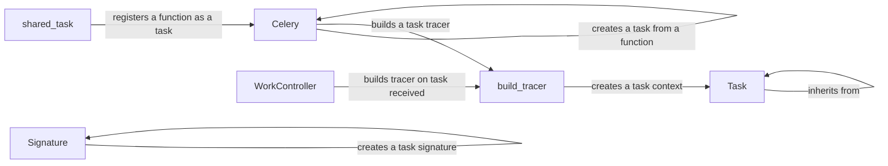

## Component Details

The Task Definition and Execution component in Celery is responsible for defining, registering, and executing tasks. It provides the core mechanisms for turning regular Python functions into asynchronous tasks that can be distributed and processed by Celery workers. This involves using decorators to register tasks, defining task classes for more advanced control, and utilizing the Celery application instance to manage task routing and execution. The component also includes mechanisms for tracing task execution, handling retries, and managing task workflows through chains, groups, and chords.

### Task
The base class for defining Celery tasks. It provides methods for task execution, retries, and signature generation. Tasks inherit from this class to gain access to Celery's task processing features.
- **Related Classes/Methods**: `celery.app.task.Task`

### shared_task
A decorator that registers a function as a Celery task. It simplifies task creation by automatically wrapping the function with the Task class and registering it with the Celery application.
- **Related Classes/Methods**: `celery.app.shared_task`

### Celery
The Celery application instance. It manages task registration, worker configuration, and task routing. It serves as the central point for interacting with the Celery system.
- **Related Classes/Methods**: `celery.app.base.Celery`

### build_tracer
A function that creates a task tracer, which is responsible for wrapping the task function and handling task execution, retries, and error handling. It adds tracing capabilities to the task execution process.
- **Related Classes/Methods**: `celery.app.trace.build_tracer`

### WorkController
The worker component responsible for receiving tasks from the broker and executing them. It manages the task execution process within the worker.
- **Related Classes/Methods**: `celery.worker.worker.WorkController`

### Signature
Represents a task invocation, including the task name, arguments, and options. It's used to create task workflows and specify how tasks should be executed.
- **Related Classes/Methods**: `celery.canvas.signature`
