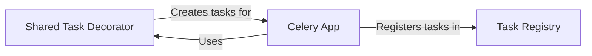

## Component Details

The Task Definition and Management component in Celery is responsible for defining, registering, and managing Celery tasks. It provides mechanisms for developers to create tasks, associate them with the Celery application, and handle task registries. The core functionality revolves around the `shared_task` decorator for task creation, the `TaskRegistry` for managing tasks, and the `Celery` app for binding and executing tasks. This system allows for flexible and organized task management within the Celery ecosystem.

### Shared Task Decorator
The `shared_task` decorator enables the creation of Celery tasks without requiring a direct reference to a Celery application instance. This allows for the definition of reusable tasks that can be bound to a Celery app later. It essentially acts as a task factory, deferring the association with a specific Celery app until the task is actually used.

**Related Classes/Methods**:

- `celery.app.shared_task` (full file reference)

### Task Registry
The `TaskRegistry` class is responsible for managing the collection of registered tasks within a Celery application. It provides methods for registering new tasks, unregistering existing tasks, and retrieving tasks by their name. The registry serves as a central repository for all available tasks within the Celery application, ensuring that tasks can be easily accessed and managed.

**Related Classes/Methods**:

- `celery.app.registry.TaskRegistry` (full file reference)
- `celery.app.registry.TaskRegistry.register` (full file reference)
- `celery.app.registry.TaskRegistry.unregister` (full file reference)

### Celery App
The `Celery` class represents the central application object in Celery. It is used to configure and manage Celery workers and tasks. The `Celery` app provides the `task` decorator, which allows developers to define tasks directly bound to the application instance. Internally, the `Celery` app utilizes the `TaskRegistry` to store and retrieve tasks, ensuring that all defined tasks are properly managed and accessible within the Celery ecosystem.

**Related Classes/Methods**:

- `celery.app.base.Celery` (full file reference)
- `celery.app.base.Celery.task` (full file reference)
- `celery.app.base.Celery._task_from_fun` (full file reference)