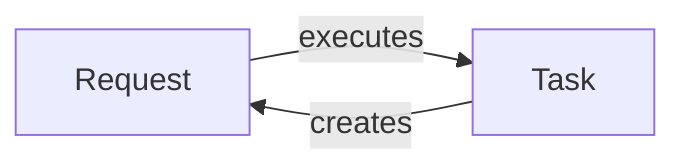

## Component Details

The Task Execution and Concurrency component is responsible for managing the execution of Celery tasks, handling concurrency, and processing task results. It encompasses the lifecycle of a task from its initiation to completion, including managing task states, applying time limits, handling retries, and dealing with success or failure scenarios. This component optimizes resource utilization by executing tasks concurrently and ensuring the reliable and efficient processing of asynchronous workloads.

### Request
The `Request` class encapsulates a single task execution attempt within Celery. It manages the state and context of the task, including handling success, failure, retry, termination, and revocation. It orchestrates the execution of the task function and manages the transitions between different states based on the outcome of the execution.

**Related Classes/Methods**:

- `celery.worker.request.Request` (full file reference)
- `celery.worker.request.Request.execute` (full file reference)
- `celery.worker.request.Request.on_success` (full file reference)
- `celery.worker.request.Request.on_failure` (full file reference)
- `celery.worker.request.Request.on_retry` (full file reference)
- `celery.worker.request.Request.terminate` (full file reference)
- `celery.worker.request.Request.revoked` (full file reference)

### Task
The `Task` class defines the behavior of a Celery task. It encapsulates the task logic and provides methods for executing the task, both synchronously and asynchronously. It also manages task-specific settings and configurations, such as retry policies and time limits. The `Task` class serves as the base class for all Celery tasks.

**Related Classes/Methods**:

- `celery.app.task.Task.__call__` (full file reference)
- `celery.app.task.Task.apply_async` (full file reference)
- `celery.app.task.Task.apply` (full file reference)