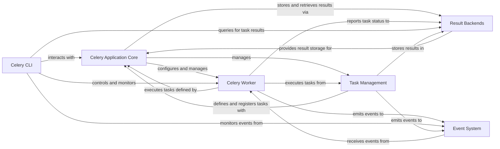

## Component Details

This graph represents the core architecture of the Celery distributed task queue system. It illustrates how tasks are defined, managed, executed by workers, and how their results are stored and monitored. The system is designed for asynchronous task processing, enabling scalable and robust background job execution.

### Celery Application Core
The Celery Application Core is the central component responsible for defining and managing the Celery application. It handles task registration, configuration loading, and provides the main interface for interacting with Celery, including creating tasks, managing task states, and integrating with various components like result backends and message brokers.

**Related Classes/Methods**:

- <a href="https://github.com/celery/celery/blob/master/celery/app/base.py#L213-L1505" target="_blank" rel="noopener noreferrer">`celery.app.base.Celery` (213:1505)</a>
- <a href="https://github.com/celery/celery/blob/master/celery/app/task.py#L164-L1158" target="_blank" rel="noopener noreferrer">`celery.app.task.Task` (164:1158)</a>
- <a href="https://github.com/celery/celery/blob/master/celery/app/registry.py#L12-L58" target="_blank" rel="noopener noreferrer">`celery.app.registry.TaskRegistry` (12:58)</a>
- <a href="https://github.com/celery/celery/blob/master/celery/app/utils.py#L378-L415" target="_blank" rel="noopener noreferrer">`celery.app.utils.find_app` (378:415)</a>

### Celery Worker
The Celery Worker component is the execution engine of Celery. It consumes tasks from message brokers, executes them using various concurrency strategies (e.g., prefork, eventlet, gevent, solo), and manages the worker's lifecycle, including startup, shutdown, and handling of task acknowledgements and results. It interacts closely with the application core, result backends, and the event system.

**Related Classes/Methods**:

- `celery.worker.worker.Worker` (full file reference)
- <a href="https://github.com/celery/celery/blob/master/celery/worker/consumer/consumer.py#L138-L757" target="_blank" rel="noopener noreferrer">`celery.worker.consumer.consumer.Consumer` (138:757)</a>
- `celery.worker.strategy.TaskRevoker` (full file reference)
- `celery.worker.state.WorkerState` (full file reference)
- <a href="https://github.com/celery/celery/blob/master/celery/concurrency/base.py#L47-L180" target="_blank" rel="noopener noreferrer">`celery.concurrency.base.BasePool` (47:180)</a>

### Result Backends
The Result Backends component provides an abstraction layer for storing and retrieving task results. It supports various backend technologies like Redis, RabbitMQ, databases, and more. This component is crucial for monitoring task progress, retrieving return values, and handling exceptions from executed tasks.

**Related Classes/Methods**:

- <a href="https://github.com/celery/celery/blob/master/celery/backends/base.py#L804-L805" target="_blank" rel="noopener noreferrer">`celery.backends.base.BaseBackend` (804:805)</a>
- <a href="https://github.com/celery/celery/blob/master/celery/backends/redis.py#L187-L584" target="_blank" rel="noopener noreferrer">`celery.backends.redis.RedisBackend` (187:584)</a>
- `celery.backends.database.DatabaseBackend` (full file reference)
- <a href="https://github.com/celery/celery/blob/master/celery/backends/rpc.py#L88-L342" target="_blank" rel="noopener noreferrer">`celery.backends.rpc.RPCBackend` (88:342)</a>

### Celery CLI
The Celery CLI (Command Line Interface) component provides a set of command-line tools for interacting with and managing Celery. This includes commands for starting workers, inspecting the cluster, managing scheduled tasks (beat), and other administrative operations. It acts as the primary user interface for controlling Celery deployments.

**Related Classes/Methods**:

- `celery.bin.celery.CeleryCommand` (full file reference)
- <a href="https://github.com/celery/celery/blob/master/celery/bin/worker.py#L298-L360" target="_blank" rel="noopener noreferrer">`celery.bin.worker.worker` (298:360)</a>
- <a href="https://github.com/celery/celery/blob/master/celery/bin/beat.py#L47-L72" target="_blank" rel="noopener noreferrer">`celery.bin.beat.beat` (47:72)</a>
- <a href="https://github.com/celery/celery/blob/master/celery/bin/control.py#L229-L252" target="_blank" rel="noopener noreferrer">`celery.bin.control.control` (229:252)</a>

### Event System
The Event System component is responsible for emitting and receiving events related to the Celery application's operation. These events provide real-time insights into task lifecycle (e.g., task started, succeeded, failed), worker status, and other operational metrics. It is essential for monitoring, logging, and building custom introspection tools.

**Related Classes/Methods**:

- <a href="https://github.com/celery/celery/blob/master/celery/events/dispatcher.py#L19-L229" target="_blank" rel="noopener noreferrer">`celery.events.dispatcher.EventDispatcher` (19:229)</a>
- <a href="https://github.com/celery/celery/blob/master/celery/events/receiver.py#L22-L135" target="_blank" rel="noopener noreferrer">`celery.events.receiver.EventReceiver` (22:135)</a>
- <a href="https://github.com/celery/celery/blob/master/celery/events/state.py#L398-L720" target="_blank" rel="noopener noreferrer">`celery.events.state.State` (398:720)</a>

### Task Management
This component is responsible for defining the core `Task` abstraction, managing its lifecycle from registration to execution, and handling various aspects like retries, error handling, and interaction with result storage. It integrates with the Celery application's core for task registration and tracing, and with result backends for storing task outcomes.

**Related Classes/Methods**:

- <a href="https://github.com/celery/celery/blob/master/celery/app/task.py#L164-L1158" target="_blank" rel="noopener noreferrer">`celery.app.task.Task` (164:1158)</a>
- <a href="https://github.com/celery/celery/blob/master/celery/app/task.py#L60-L160" target="_blank" rel="noopener noreferrer">`celery.app.task.Context` (60:160)</a>
- <a href="https://github.com/celery/celery/blob/master/celery/app/registry.py#L12-L58" target="_blank" rel="noopener noreferrer">`celery.app.registry.TaskRegistry` (12:58)</a>
- `celery.app.trace` (full file reference)

### [FAQ](https://github.com/CodeBoarding/GeneratedOnBoardings/tree/main?tab=readme-ov-file#faq)