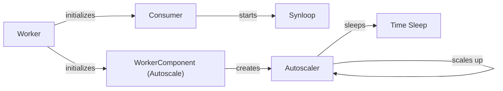

## Component Details

The Worker Management component in Celery is responsible for orchestrating the execution of tasks. It involves initializing worker processes, consuming messages from the broker, managing task execution, and dynamically adjusting the number of worker processes based on the workload. The main flow includes the worker process starting up, connecting to the broker via the consumer, receiving tasks, executing them, and the autoscaler adjusting the number of workers based on queue length. Its purpose is to ensure efficient and scalable task processing.

### Worker
The main worker process that initializes and manages the consumer and autoscaler components. It sets up the environment for task execution, including signal handling and process management. It orchestrates the overall task processing workflow.
- **Related Classes/Methods**: `celery.worker.worker.Worker`

### Consumer
Responsible for consuming messages from the broker and processing them as tasks. It manages the connection to the broker, prefetching messages, and delegating task execution to worker processes. It also handles task acknowledgments and retries.
- **Related Classes/Methods**: `celery.worker.consumer.consumer.Consumer`

### Synloop
The main loop that the consumer runs in to receive and process messages. It continuously polls the broker for new messages and dispatches them to the appropriate task handlers. It ensures that tasks are processed in a timely and efficient manner.
- **Related Classes/Methods**: `celery.worker.loops.synloop`

### WorkerComponent (Autoscale)
A component of the worker that manages the autoscaler. It is responsible for creating and managing the Autoscaler instance, as well as providing it with the necessary information about the worker's state. It acts as an intermediary between the worker and the autoscaler.
- **Related Classes/Methods**: `celery.worker.autoscale.WorkerComponent`

### Autoscaler
Dynamically adjusts the number of worker processes based on the current workload. It monitors the queue length and scales the number of processes up or down accordingly. It uses a feedback loop to maintain optimal resource utilization and task processing throughput.
- **Related Classes/Methods**: `celery.worker.autoscale.Autoscaler`

### Time Sleep
A standard Python function used by the autoscaler to introduce delays between scaling decisions. This prevents the autoscaler from making too frequent adjustments, which could lead to instability.
- **Related Classes/Methods**: `time.sleep`
