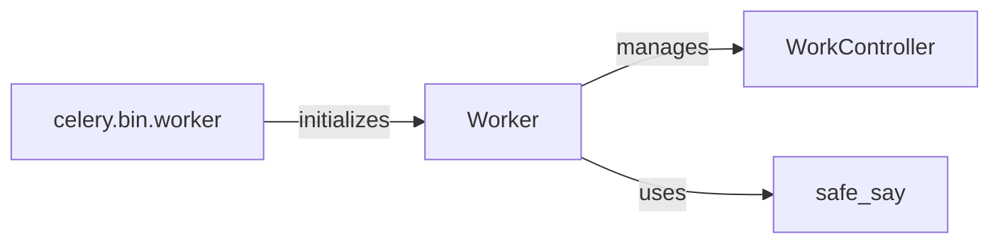

## Component Details

The Worker Management component is responsible for the lifecycle management of Celery worker processes. It encompasses the initialization, execution, monitoring, and termination of workers. The component utilizes command-line arguments to configure worker settings, sets up the worker environment, establishes connections to the message broker, and manages task consumption. It also provides mechanisms for sending control commands to workers and monitoring their status.

### Worker
The Worker class is the main application class for running a Celery worker. It handles the initialization, setup, and running of the worker, including setting up logging, installing platform tweaks, and managing the consumer. It orchestrates the different stages of the worker lifecycle, from initialization to shutdown.

**Related Classes/Methods**:

- `celery.apps.worker.Worker` (full file reference)
- `celery.apps.worker.Worker:on_before_init` (full file reference)
- `celery.apps.worker.Worker:on_after_init` (full file reference)
- `celery.apps.worker.Worker:on_init_blueprint` (full file reference)
- `celery.apps.worker.Worker:on_start` (full file reference)
- `celery.apps.worker.Worker:on_consumer_ready` (full file reference)

### WorkController
The WorkController class manages the worker's execution, including setting up queues, handling includes, and managing the consumer. It also handles the start, stop, and termination of the worker. It interacts with the message broker to consume tasks and manage worker state.

**Related Classes/Methods**:

- `celery.worker.worker.WorkController` (full file reference)
- `celery.worker.worker.WorkController:__init__` (full file reference)
- `celery.worker.worker.WorkController:setup_instance` (full file reference)
- `celery.worker.worker.WorkController:on_start` (full file reference)
- `celery.worker.worker.WorkController:on_stopped` (full file reference)
- `celery.worker.worker.WorkController:setup_queues` (full file reference)
- `celery.worker.worker.WorkController:signal_consumer_close` (full file reference)
- <a href="https://github.com/celery/celery/blob/master/celery/worker/control.py#L243-L245" target="_blank" rel="noopener noreferrer">`celery.worker.worker.WorkController:terminate` (243:245)</a>
- `celery.worker.worker.WorkController:stop` (full file reference)
- `celery.worker.worker.WorkController:_shutdown` (full file reference)
- `celery.worker.worker.WorkController:register_with_event_loop` (full file reference)

### celery.bin.worker
This module defines the `worker` function, which is the entry point for the `celery worker` command-line tool. It uses `click` to define the command-line options and arguments, and then configures and starts the Celery worker. It parses command-line arguments and initializes the Worker application.

**Related Classes/Methods**:

- `celery.bin.worker:worker` (full file reference)

### safe_say
The `safe_say` function is a utility function that safely writes a message to standard output. It handles potential errors when writing to the output stream, such as when the stream is not a TTY. It's used for displaying messages to the user during worker startup and shutdown.

**Related Classes/Methods**:

- `celery.apps.worker:safe_say` (full file reference)