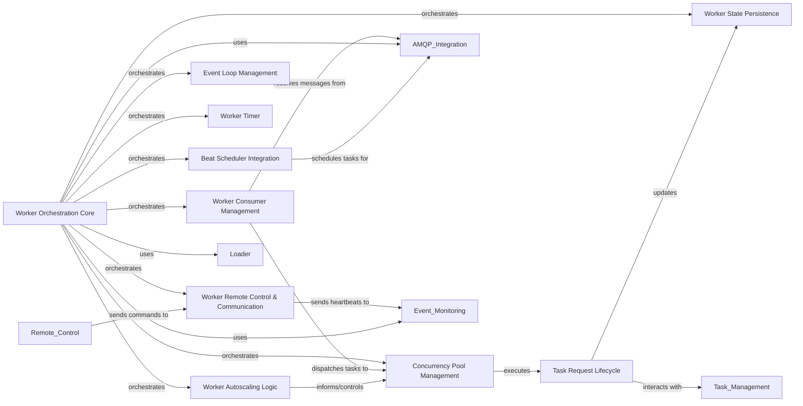

## Component Details

The Worker Orchestration component in Celery is the core of a Celery worker process. It is responsible for managing the entire lifecycle of a worker, from startup and configuration to task execution, shutdown, and inter-worker communication. This component orchestrates various sub-components such as the consumer (for message reception), the concurrency pool (for task execution), the beat scheduler (for periodic tasks), state management, event loop, and remote control mechanisms. Its primary purpose is to ensure efficient and reliable processing of tasks within the Celery distributed system.

### Worker Orchestration Core
Manages the overall lifecycle of a Celery worker process, including startup, shutdown, and coordination of various internal worker components. It sets up queues, handles module imports, and integrates with concurrency pools, consumers, and the beat scheduler.

**Related Classes/Methods**:

- <a href="https://github.com/celery/celery/blob/master/celery/worker/worker.py#L63-L435" target="_blank" rel="noopener noreferrer">`celery.celery.worker.worker.WorkController` (63:435)</a>
- <a href="https://github.com/celery/celery/blob/master/celery/apps/worker.py#L85-L279" target="_blank" rel="noopener noreferrer">`celery.celery.apps.worker.Worker` (85:279)</a>

### Worker Consumer Management
Responsible for establishing and maintaining connections to the message broker, actively consuming task messages from queues, deserializing them, and dispatching them to the worker's execution pool for processing.

**Related Classes/Methods**:

- <a href="https://github.com/celery/celery/blob/master/celery/worker/components.py#L215-L240" target="_blank" rel="noopener noreferrer">`celery.celery.worker.components.Consumer` (215:240)</a>

### Concurrency Pool Management
Manages a pool of processes or threads to handle concurrent task execution, receiving tasks from the consumer and executing them.

**Related Classes/Methods**:

- <a href="https://github.com/celery/celery/blob/master/celery/worker/components.py#L98-L175" target="_blank" rel="noopener noreferrer">`celery.celery.worker.components.Pool` (98:175)</a>

### Beat Scheduler Integration
Integrates the periodic task scheduler (Celery Beat) into the worker, allowing it to read scheduled tasks and send them to the message broker for execution.

**Related Classes/Methods**:

- <a href="https://github.com/celery/celery/blob/master/celery/worker/components.py#L178-L199" target="_blank" rel="noopener noreferrer">`celery.celery.worker.components.Beat` (178:199)</a>

### Worker State Persistence
Manages the internal operational state of a Celery worker, tracking active tasks, reserved tasks, and handling state transitions during task execution and worker shutdown. It also provides mechanisms for persisting this state between restarts.

**Related Classes/Methods**:

- <a href="https://github.com/celery/celery/blob/master/celery/worker/components.py#L202-L212" target="_blank" rel="noopener noreferrer">`celery.celery.worker.components.StateDB` (202:212)</a>
- `celery.celery.worker.state` (full file reference)
- <a href="https://github.com/celery/celery/blob/master/celery/worker/state.py#L77-L85" target="_blank" rel="noopener noreferrer">`celery.celery.worker.state.reset_state` (77:85)</a>
- <a href="https://github.com/celery/celery/blob/master/celery/worker/state.py#L88-L93" target="_blank" rel="noopener noreferrer">`celery.celery.worker.state.maybe_shutdown` (88:93)</a>
- <a href="https://github.com/celery/celery/blob/master/celery/worker/state.py#L96-L101" target="_blank" rel="noopener noreferrer">`celery.celery.worker.state.task_reserved` (96:101)</a>
- <a href="https://github.com/celery/celery/blob/master/celery/worker/state.py#L104-L115" target="_blank" rel="noopener noreferrer">`celery.celery.worker.state.task_accepted` (104:115)</a>
- <a href="https://github.com/celery/celery/blob/master/celery/worker/state.py#L118-L129" target="_blank" rel="noopener noreferrer">`celery.celery.worker.state.task_ready` (118:129)</a>
- <a href="https://github.com/celery/celery/blob/master/celery/worker/state.py#L192-L288" target="_blank" rel="noopener noreferrer">`celery.celery.worker.state.Persistent` (192:288)</a>

### Event Loop Management
Provides and manages the event loop for asynchronous operations within the worker, especially when using eventlet or gevent concurrency pools.

**Related Classes/Methods**:

- <a href="https://github.com/celery/celery/blob/master/celery/worker/components.py#L56-L95" target="_blank" rel="noopener noreferrer">`celery.celery.worker.components.Hub` (56:95)</a>

### Worker Timer
Manages scheduled events and callbacks within the worker, providing a timing mechanism for various internal operations.

**Related Classes/Methods**:

- <a href="https://github.com/celery/celery/blob/master/celery/worker/components.py#L32-L53" target="_blank" rel="noopener noreferrer">`celery.celery.worker.components.Timer` (32:53)</a>

### Worker Remote Control & Communication
Facilitates inter-worker communication, handles remote control commands, enables worker discovery (mingling and gossip protocols), and manages the worker's heartbeat mechanism for liveness monitoring.

**Related Classes/Methods**:

- <a href="https://github.com/celery/celery/blob/master/celery/worker/pidbox.py#L20-L76" target="_blank" rel="noopener noreferrer">`celery.celery.worker.pidbox.Pidbox` (20:76)</a>
- <a href="https://github.com/celery/celery/blob/master/celery/worker/pidbox.py#L79-L122" target="_blank" rel="noopener noreferrer">`celery.celery.worker.pidbox.gPidbox` (79:122)</a>
- <a href="https://github.com/celery/celery/blob/master/celery/worker/consumer/control.py#L18-L33" target="_blank" rel="noopener noreferrer">`celery.celery.worker.consumer.control.Control` (18:33)</a>
- <a href="https://github.com/celery/celery/blob/master/celery/worker/consumer/mingle.py#L13-L76" target="_blank" rel="noopener noreferrer">`celery.celery.worker.consumer.mingle.Mingle` (13:76)</a>
- <a href="https://github.com/celery/celery/blob/master/celery/worker/consumer/gossip.py#L23-L206" target="_blank" rel="noopener noreferrer">`celery.celery.worker.consumer.gossip.Gossip` (23:206)</a>
- <a href="https://github.com/celery/celery/blob/master/celery/worker/heartbeat.py#L14-L61" target="_blank" rel="noopener noreferrer">`celery.celery.worker.heartbeat.Heart` (14:61)</a>

### Task Request Lifecycle
Responsible for encapsulating and managing individual task requests received by the worker, including their deserialization, validation, and the application of execution strategies.

**Related Classes/Methods**:

- <a href="https://github.com/celery/celery/blob/master/celery/worker/request.py#L67-L731" target="_blank" rel="noopener noreferrer">`celery.celery.worker.request.Request` (67:731)</a>
- <a href="https://github.com/celery/celery/blob/master/celery/worker/request.py#L734-L790" target="_blank" rel="noopener noreferrer">`celery.celery.worker.request.create_request_cls` (734:790)</a>
- <a href="https://github.com/celery/celery/blob/master/celery/worker/strategy.py#L99-L208" target="_blank" rel="noopener noreferrer">`celery.celery.worker.strategy.default` (99:208)</a>
- <a href="https://github.com/celery/celery/blob/master/celery/worker/strategy.py#L25-L63" target="_blank" rel="noopener noreferrer">`celery.celery.worker.strategy.hybrid_to_proto2` (25:63)</a>
- <a href="https://github.com/celery/celery/blob/master/celery/worker/strategy.py#L66-L96" target="_blank" rel="noopener noreferrer">`celery.celery.worker.strategy.proto1_to_proto2` (66:96)</a>

### Worker Autoscaling Logic
Implements the logic for dynamically adjusting the worker's concurrency based on current load and configured thresholds, ensuring efficient resource utilization.

**Related Classes/Methods**:

- <a href="https://github.com/celery/celery/blob/master/celery/worker/autoscale.py#L31-L58" target="_blank" rel="noopener noreferrer">`celery.celery.worker.autoscale.WorkerComponent` (31:58)</a>
- <a href="https://github.com/celery/celery/blob/master/celery/worker/autoscale.py#L61-L154" target="_blank" rel="noopener noreferrer">`celery.celery.worker.autoscale.Autoscaler` (61:154)</a>

### [FAQ](https://github.com/CodeBoarding/GeneratedOnBoardings/tree/main?tab=readme-ov-file#faq)