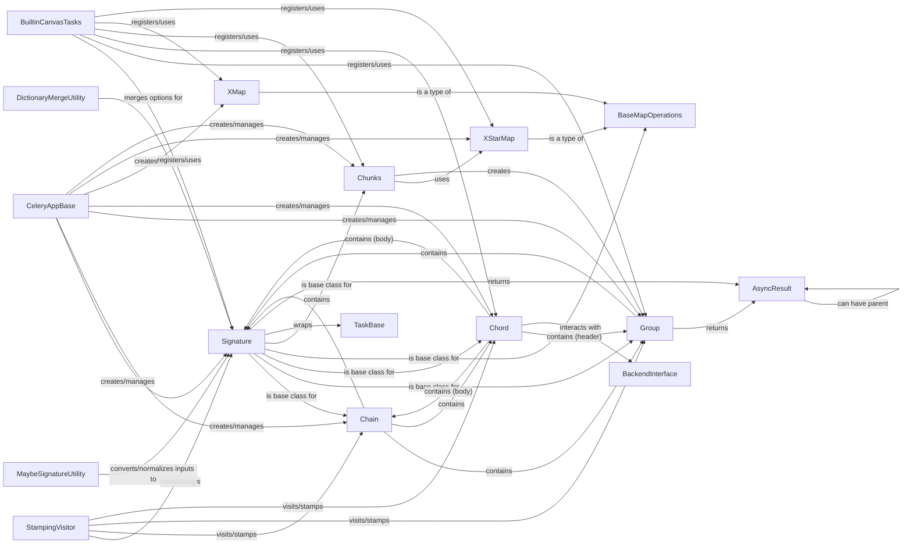

## Component Details

The Workflow Canvas subsystem in Celery provides a high-level API for composing complex task workflows. It enables users to define sequential execution (chains), parallel execution (groups), and synchronized execution with callbacks (chords). The core building block is the `Signature`, representing a single task invocation. Various utilities and base classes support the creation, manipulation, and execution of these canvas primitives, allowing for flexible and powerful task orchestration within the Celery framework.

### Signature
The fundamental building block of Celery workflows, representing a single task invocation with its arguments, keyword arguments, and execution options. It can be linked to other tasks as callbacks or errbacks and serves as the base for more complex canvas primitives.

**Related Classes/Methods**:

- <a href="https://github.com/celery/celery/blob/master/celery/canvas.py#L232-L871" target="_blank" rel="noopener noreferrer">`celery.celery.canvas.Signature` (232:871)</a>

### Chain
A canvas primitive that orchestrates the sequential execution of tasks. Each task in the chain is executed only after the successful completion of the preceding task, allowing for the creation of linear workflows.

**Related Classes/Methods**:

- <a href="https://github.com/celery/celery/blob/master/celery/canvas.py#L932-L1305" target="_blank" rel="noopener noreferrer">`celery.celery.canvas._chain` (932:1305)</a>
- <a href="https://github.com/celery/celery/blob/master/celery/canvas.py#L1308-L1368" target="_blank" rel="noopener noreferrer">`celery.celery.canvas.chain` (1308:1368)</a>

### Group
A canvas primitive designed for parallel task execution. It allows multiple tasks to be run concurrently and provides mechanisms to collect their results. A group can also form the 'header' of a Chord.

**Related Classes/Methods**:

- <a href="https://github.com/celery/celery/blob/master/celery/canvas.py#L1478-L1946" target="_blank" rel="noopener noreferrer">`celery.celery.canvas.group` (1478:1946)</a>

### Chord
A synchronization primitive that ensures a set of 'header' tasks completes before a 'body' task (or chain of tasks) is executed. The body task receives the results of all header tasks as its input.

**Related Classes/Methods**:

- <a href="https://github.com/celery/celery/blob/master/celery/canvas.py#L1950-L2364" target="_blank" rel="noopener noreferrer">`celery.celery.canvas._chord` (1950:2364)</a>

### StampingVisitor
An abstract class providing an API for injecting custom headers or metadata ('stamps') into canvas primitives during their processing. It defines hooks for various stages of stamping signatures, groups, chains, and chords.

**Related Classes/Methods**:

- <a href="https://github.com/celery/celery/blob/master/celery/canvas.py#L118-L228" target="_blank" rel="noopener noreferrer">`celery.celery.canvas.StampingVisitor` (118:228)</a>

### MaybeSignatureUtility
A utility function responsible for normalizing various inputs (like dictionaries or existing signatures) into proper Signature objects. This ensures type consistency and proper handling of task definitions within the canvas.

**Related Classes/Methods**:

- <a href="https://github.com/celery/celery/blob/master/celery/canvas.py#L2392-L2416" target="_blank" rel="noopener noreferrer">`celery.celery.canvas.maybe_signature` (2392:2416)</a>

### DictionaryMergeUtility
An internal utility function used for recursively merging two dictionaries. It's primarily used within the Signature class to combine task options and headers, handling potential duplicates by either aggregating or overwriting values.

**Related Classes/Methods**:

- <a href="https://github.com/celery/celery/blob/master/celery/canvas.py#L73-L115" target="_blank" rel="noopener noreferrer">`celery.celery.canvas._merge_dictionaries` (73:115)</a>

### BaseMapOperations
An abstract base class that provides common functionality for map-like operations (like xmap and xstarmap) on tasks. It defines the structure for applying a task to an iterable of arguments.

**Related Classes/Methods**:

- <a href="https://github.com/celery/celery/blob/master/celery/canvas.py#L1371-L1392" target="_blank" rel="noopener noreferrer">`celery.celery.canvas._basemap` (1371:1392)</a>

### XMap
A specialized map operation for tasks that applies a given task to each item in an iterable, executing them sequentially within the current process. It is a concrete implementation of BaseMapOperations.

**Related Classes/Methods**:

- <a href="https://github.com/celery/celery/blob/master/celery/canvas.py#L1396-L1408" target="_blank" rel="noopener noreferrer">`celery.celery.canvas.xmap` (1396:1408)</a>

### XStarMap
A specialized map operation for tasks similar to XMap, but it unpacks arguments from the iterable using star arguments. It is also a concrete implementation of BaseMapOperations.

**Related Classes/Methods**:

- <a href="https://github.com/celery/celery/blob/master/celery/canvas.py#L1412-L1419" target="_blank" rel="noopener noreferrer">`celery.celery.canvas.xstarmap` (1412:1419)</a>

### Chunks
A canvas primitive that partitions a task and its iterable arguments into smaller, manageable chunks. These chunks are then processed in parallel, typically by creating a Group of XStarMap tasks.

**Related Classes/Methods**:

- <a href="https://github.com/celery/celery/blob/master/celery/canvas.py#L1423-L1458" target="_blank" rel="noopener noreferrer">`celery.celery.canvas.chunks` (1423:1458)</a>

### CeleryAppBase
The core Celery application class, which provides methods for creating and managing canvas primitives (signatures, chains, groups, chords) and integrating them into the overall Celery ecosystem.

**Related Classes/Methods**:

- <a href="https://github.com/celery/celery/blob/master/celery/app/base.py#L213-L1505" target="_blank" rel="noopener noreferrer">`celery.celery.app.base.Celery` (213:1505)</a>

### BuiltinCanvasTasks
A module responsible for registering and providing access to Celery's built-in tasks that leverage canvas primitives, such as unlock_chord_task, map_task, and group_task.

**Related Classes/Methods**:

- `celery.celery.app.builtins` (full file reference)

### TaskBase
The foundational class for all Celery tasks. Signature objects wrap instances or names of this class to define a callable unit of work.

**Related Classes/Methods**:

- <a href="https://github.com/celery/celery/blob/master/celery/app/task.py#L164-L1158" target="_blank" rel="noopener noreferrer">`celery.app.task.Task` (164:1158)</a>

### AsyncResult
Represents the result of an asynchronously executed task. It provides methods to check the task's state, retrieve its return value, or wait for its completion.

**Related Classes/Methods**:

- <a href="https://github.com/celery/celery/blob/master/celery/result.py#L69-L545" target="_blank" rel="noopener noreferrer">`celery.result.AsyncResult` (69:545)</a>

### BackendInterface
An abstract interface for Celery backends, responsible for storing task results, managing task states, and providing synchronization mechanisms, particularly crucial for Chord operations like tracking header completion.

**Related Classes/Methods**:

- <a href="https://github.com/celery/celery/blob/master/celery/backends/base.py#L81-L723" target="_blank" rel="noopener noreferrer">`celery.celery.backends.base.Backend` (81:723)</a>
- <a href="https://github.com/celery/celery/blob/master/celery/backends/base.py#L811-L1087" target="_blank" rel="noopener noreferrer">`celery.celery.backends.base.BaseKeyValueStoreBackend` (811:1087)</a>
- <a href="https://github.com/celery/celery/blob/master/celery/backends/gcs.py#L160-L352" target="_blank" rel="noopener noreferrer">`celery.celery.backends.gcs.GCSBackend` (160:352)</a>
- <a href="https://github.com/celery/celery/blob/master/celery/backends/redis.py#L187-L584" target="_blank" rel="noopener noreferrer">`celery.celery.backends.redis.RedisBackend` (187:584)</a>
- <a href="https://github.com/celery/celery/blob/master/celery/backends/rpc.py#L88-L342" target="_blank" rel="noopener noreferrer">`celery.celery.backends.rpc.RPCBackend` (88:342)</a>

### [FAQ](https://github.com/CodeBoarding/GeneratedOnBoardings/tree/main?tab=readme-ov-file#faq)