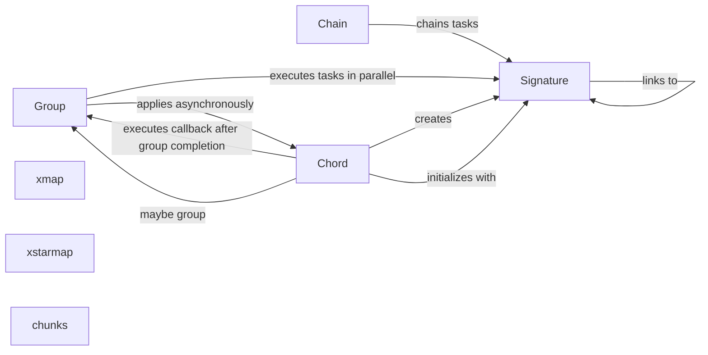

## Component Details

The Workflow Composition (Canvas) component in Celery provides the building blocks for constructing complex asynchronous workflows. It offers primitives like signatures, chains, groups, and chords, enabling users to define task dependencies and execution order. This system allows for the creation of sophisticated execution patterns, including sequential, parallel, and fan-out/fan-in task arrangements.

### Signature
Represents a Celery task and its execution options. It encapsulates the task's name, arguments, and execution settings, such as callbacks and error handlers. Signatures are the fundamental units for composing workflows, allowing tasks to be linked together and executed with specific configurations.

**Related Classes/Methods**:

- <a href="https://github.com/celery/celery/blob/master/setup.py#L147-L629" target="_blank" rel="noopener noreferrer">`celery.canvas.Signature` (147:629)</a>
- `celery.canvas.Signature.__call__` (278:281)
- `celery.canvas.Signature.apply_async` (300:320)
- `celery.canvas.Signature.link` (323:334)
- `celery.canvas.Signature.link_error` (337:348)
- `celery.canvas.Signature._merge` (409:434)
- `celery.canvas.Signature.type` (269:272)
- `celery.canvas.Signature._apply_async` (351:391)
- `celery.canvas.Signature.__init__` (174:266)
- `celery.canvas.Signature.clone` (617:629)

### Chain
Represents a sequence of tasks that are executed sequentially. The output of each task is passed as input to the next task in the chain. Chains are useful for creating linear workflows where tasks must be executed in a specific order.

**Related Classes/Methods**:

- <a href="https://github.com/celery/celery/blob/master/setup.py#L632-L678" target="_blank" rel="noopener noreferrer">`celery.canvas.chain` (632:678)</a>
- <a href="https://github.com/celery/celery/blob/master/setup.py#L681-L700" target="_blank" rel="noopener noreferrer">`celery.canvas._chain` (681:700)</a>
- `celery.canvas.chain.__new__` (644:678)

### Group
Represents a collection of tasks that are executed in parallel. Groups are useful for distributing work across multiple workers and aggregating the results. Tasks within a group are executed concurrently, and the group completes when all tasks have finished.

**Related Classes/Methods**:

- <a href="https://github.com/celery/celery/blob/master/setup.py#L703-L774" target="_blank" rel="noopener noreferrer">`celery.canvas.group` (703:774)</a>
- `celery.canvas.group.__init__` (714:717)
- `celery.canvas.group.apply_async` (720:738)
- `celery.canvas.group.apply` (741:759)
- `celery.canvas.group.freeze` (762:774)
- `celery.canvas.group._freeze_gid` (994:1003)
- `celery.canvas.group._prepared` (777:780)
- `celery.canvas.group._apply_tasks` (783:793)

### Chord
Represents a group of tasks with a callback to be executed after all tasks in the group have finished. Chords are useful for implementing fan-out/fan-in patterns, where a task needs to wait for the completion of multiple subtasks before proceeding.

**Related Classes/Methods**:

- <a href="https://github.com/celery/celery/blob/master/setup.py#L800-L878" target="_blank" rel="noopener noreferrer">`celery.canvas._chord` (800:878)</a>
- `celery.canvas._chord.__init__` (811:814)
- `celery.canvas._chord.apply_async` (817:835)
- `celery.canvas._chord._get_app` (838:841)
- `celery.canvas._chord.apply` (844:862)
- `celery.canvas._chord.run` (865:875)
- `celery.canvas._chord._maybe_group` (878:878)

### xmap
Represents a task that applies a function to each element of an iterable. It's similar to the built-in `map` function, but executes the function asynchronously using Celery. It efficiently distributes the processing of iterable elements across available workers.

**Related Classes/Methods**:

- <a href="https://github.com/celery/celery/blob/master/setup.py#L881-L920" target="_blank" rel="noopener noreferrer">`celery.canvas.xmap` (881:920)</a>

### xstarmap
Represents a task that applies a function to each element of an iterable, where each element is a tuple of arguments. It's similar to the built-in `itertools.starmap` function, but executes the function asynchronously using Celery. This is useful when the function to be applied takes multiple arguments.

**Related Classes/Methods**:

- <a href="https://github.com/celery/celery/blob/master/setup.py#L923-L962" target="_blank" rel="noopener noreferrer">`celery.canvas.xstarmap` (923:962)</a>

### chunks
Represents a task that splits an iterable into chunks and applies a function to each chunk. It's useful for processing large datasets in parallel, by dividing the data into smaller, manageable pieces that can be processed independently.

**Related Classes/Methods**:

- <a href="https://github.com/celery/celery/blob/master/setup.py#L965-L991" target="_blank" rel="noopener noreferrer">`celery.canvas.chunks` (965:991)</a>