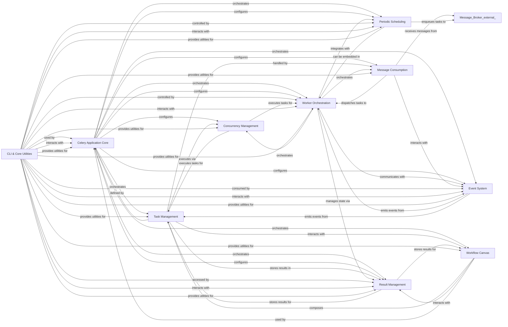

## Component Details

The Celery architecture is designed for distributed task processing, enabling asynchronous execution of tasks across multiple worker nodes. The core flow involves a client application defining tasks using the Celery Application Core, which are then sent to a message broker. Worker Orchestration components consume these messages, execute the tasks using Concurrency Management, and store results via Result Management. Periodic tasks are handled by the Periodic Scheduling component, while the Workflow Canvas allows for complex task compositions. The Event System provides real-time monitoring, and CLI & Core Utilities offer administrative and foundational functionalities.

### Celery Application Core
The central application instance that serves as the entry point for defining, configuring, and interacting with Celery. It manages the overall application lifecycle, loads configurations, registers tasks, and provides access to core services like AMQP, event dispatchers, and result backends.

**Related Classes/Methods**:

- <a href="https://github.com/celery/celery/blob/master/celery/app/base.py#L213-L1505" target="_blank" rel="noopener noreferrer">`celery.celery.app.base.Celery` (213:1505)</a>
- <a href="https://github.com/celery/celery/blob/master/celery/app/base.py#L169-L210" target="_blank" rel="noopener noreferrer">`celery.celery.app.base.PendingConfiguration` (169:210)</a>
- <a href="https://github.com/celery/celery/blob/master/celery/app/utils.py#L70-L209" target="_blank" rel="noopener noreferrer">`celery.celery.app.utils.Settings` (70:209)</a>
- <a href="https://github.com/celery/celery/blob/master/celery/app/utils.py#L289-L313" target="_blank" rel="noopener noreferrer">`celery.celery.app.utils.AppPickler` (289:313)</a>
- `celery.celery.app.builtins` (full file reference)
- `celery.celery.app.shared_task` (full file reference)
- `celery.celery.app.defaults` (full file reference)
- `celery.celery.app.autoretry` (full file reference)
- `celery.celery.app.log` (full file reference)
- `celery.celery.app.registry` (full file reference)
- `celery.celery.app.annotations` (full file reference)
- `celery.celery.app.backends` (full file reference)

### Task Management
Defines the fundamental `Task` class and manages the registration, execution, and state transitions of tasks within the Celery application. It handles task retries, error handling, and interaction with result storage.

**Related Classes/Methods**:

- <a href="https://github.com/celery/celery/blob/master/celery/app/task.py#L164-L1158" target="_blank" rel="noopener noreferrer">`celery.celery.app.task.Task` (164:1158)</a>
- <a href="https://github.com/celery/celery/blob/master/celery/app/task.py#L60-L160" target="_blank" rel="noopener noreferrer">`celery.celery.app.task.Context` (60:160)</a>
- <a href="https://github.com/celery/celery/blob/master/celery/app/registry.py#L12-L58" target="_blank" rel="noopener noreferrer">`celery.celery.app.registry.TaskRegistry` (12:58)</a>
- `celery.celery.app.trace` (full file reference)

### Worker Orchestration
Manages the lifecycle of a Celery worker process, including startup, shutdown, and coordination of various internal worker components. It sets up queues, handles module imports, and integrates with concurrency pools, consumers, and the beat scheduler.

**Related Classes/Methods**:

- <a href="https://github.com/celery/celery/blob/master/celery/worker/worker.py#L63-L435" target="_blank" rel="noopener noreferrer">`celery.celery.worker.worker.WorkController` (63:435)</a>
- <a href="https://github.com/celery/celery/blob/master/celery/worker/components.py#L32-L53" target="_blank" rel="noopener noreferrer">`celery.celery.worker.components.Timer` (32:53)</a>
- <a href="https://github.com/celery/celery/blob/master/celery/worker/components.py#L56-L95" target="_blank" rel="noopener noreferrer">`celery.celery.worker.components.Hub` (56:95)</a>
- <a href="https://github.com/celery/celery/blob/master/celery/worker/components.py#L98-L175" target="_blank" rel="noopener noreferrer">`celery.celery.worker.components.Pool` (98:175)</a>
- <a href="https://github.com/celery/celery/blob/master/celery/worker/components.py#L178-L199" target="_blank" rel="noopener noreferrer">`celery.celery.worker.components.Beat` (178:199)</a>
- <a href="https://github.com/celery/celery/blob/master/celery/worker/components.py#L202-L212" target="_blank" rel="noopener noreferrer">`celery.celery.worker.components.StateDB` (202:212)</a>
- <a href="https://github.com/celery/celery/blob/master/celery/worker/components.py#L215-L240" target="_blank" rel="noopener noreferrer">`celery.celery.worker.components.Consumer` (215:240)</a>
- <a href="https://github.com/celery/celery/blob/master/celery/apps/worker.py#L85-L279" target="_blank" rel="noopener noreferrer">`celery.celery.apps.worker.Worker` (85:279)</a>
- `celery.celery.worker.state` (full file reference)
- <a href="https://github.com/celery/celery/blob/master/celery/worker/state.py#L77-L85" target="_blank" rel="noopener noreferrer">`celery.celery.worker.state.reset_state` (77:85)</a>
- <a href="https://github.com/celery/celery/blob/master/celery/worker/state.py#L88-L93" target="_blank" rel="noopener noreferrer">`celery.celery.worker.state.maybe_shutdown` (88:93)</a>
- <a href="https://github.com/celery/celery/blob/master/celery/worker/state.py#L96-L101" target="_blank" rel="noopener noreferrer">`celery.celery.worker.state.task_reserved` (96:101)</a>
- <a href="https://github.com/celery/celery/blob/master/celery/worker/state.py#L104-L115" target="_blank" rel="noopener noreferrer">`celery.celery.worker.state.task_accepted` (104:115)</a>
- <a href="https://github.com/celery/celery/blob/master/celery/worker/state.py#L118-L129" target="_blank" rel="noopener noreferrer">`celery.celery.worker.state.task_ready` (118:129)</a>
- <a href="https://github.com/celery/celery/blob/master/celery/worker/state.py#L192-L288" target="_blank" rel="noopener noreferrer">`celery.celery.worker.state.Persistent` (192:288)</a>
- <a href="https://github.com/celery/celery/blob/master/celery/worker/pidbox.py#L20-L76" target="_blank" rel="noopener noreferrer">`celery.celery.worker.pidbox.Pidbox` (20:76)</a>
- <a href="https://github.com/celery/celery/blob/master/celery/worker/pidbox.py#L79-L122" target="_blank" rel="noopener noreferrer">`celery.celery.worker.pidbox.gPidbox` (79:122)</a>
- <a href="https://github.com/celery/celery/blob/master/celery/worker/consumer/control.py#L18-L33" target="_blank" rel="noopener noreferrer">`celery.celery.worker.consumer.control.Control` (18:33)</a>
- <a href="https://github.com/celery/celery/blob/master/celery/worker/consumer/mingle.py#L13-L76" target="_blank" rel="noopener noreferrer">`celery.celery.worker.consumer.mingle.Mingle` (13:76)</a>
- <a href="https://github.com/celery/celery/blob/master/celery/worker/consumer/gossip.py#L23-L206" target="_blank" rel="noopener noreferrer">`celery.celery.worker.consumer.gossip.Gossip` (23:206)</a>
- <a href="https://github.com/celery/celery/blob/master/celery/worker/heartbeat.py#L14-L61" target="_blank" rel="noopener noreferrer">`celery.celery.worker.heartbeat.Heart` (14:61)</a>
- <a href="https://github.com/celery/celery/blob/master/celery/worker/consumer/agent.py#L9-L21" target="_blank" rel="noopener noreferrer">`celery.celery.worker.consumer.agent.Agent` (9:21)</a>
- <a href="https://github.com/celery/celery/blob/master/celery/worker/request.py#L67-L731" target="_blank" rel="noopener noreferrer">`celery.celery.worker.request.Request` (67:731)</a>
- <a href="https://github.com/celery/celery/blob/master/celery/worker/request.py#L734-L790" target="_blank" rel="noopener noreferrer">`celery.celery.worker.request.create_request_cls` (734:790)</a>
- <a href="https://github.com/celery/celery/blob/master/celery/worker/strategy.py#L99-L208" target="_blank" rel="noopener noreferrer">`celery.celery.worker.strategy.default` (99:208)</a>
- <a href="https://github.com/celery/celery/blob/master/celery/worker/strategy.py#L25-L63" target="_blank" rel="noopener noreferrer">`celery.celery.worker.strategy.hybrid_to_proto2` (25:63)</a>
- <a href="https://github.com/celery/celery/blob/master/celery/worker/strategy.py#L66-L96" target="_blank" rel="noopener noreferrer">`celery.celery.worker.strategy.proto1_to_proto2` (66:96)</a>
- <a href="https://github.com/celery/celery/blob/master/celery/worker/autoscale.py#L31-L58" target="_blank" rel="noopener noreferrer">`celery.celery.worker.autoscale.WorkerComponent` (31:58)</a>
- <a href="https://github.com/celery/celery/blob/master/celery/worker/autoscale.py#L61-L154" target="_blank" rel="noopener noreferrer">`celery.celery.worker.autoscale.Autoscaler` (61:154)</a>

### Message Consumption
The core component within a worker responsible for connecting to the message broker, consuming task messages, decoding them, and dispatching them to the appropriate task handlers. It manages prefetch counts and ensures connection stability.

**Related Classes/Methods**:

- <a href="https://github.com/celery/celery/blob/master/celery/worker/consumer/consumer.py#L138-L757" target="_blank" rel="noopener noreferrer">`celery.celery.worker.consumer.consumer.Consumer` (138:757)</a>
- <a href="https://github.com/celery/celery/blob/master/celery/worker/consumer/delayed_delivery.py#L32-L247" target="_blank" rel="noopener noreferrer">`celery.celery.worker.consumer.delayed_delivery.DelayedDelivery` (32:247)</a>
- <a href="https://github.com/celery/celery/blob/master/celery/worker/loops.py#L50-L105" target="_blank" rel="noopener noreferrer">`celery.celery.worker.loops.asynloop` (50:105)</a>
- <a href="https://github.com/celery/celery/blob/master/celery/worker/loops.py#L108-L143" target="_blank" rel="noopener noreferrer">`celery.celery.worker.loops.synloop` (108:143)</a>

### Concurrency Management
Provides various concurrency models (e.g., prefork, eventlet, gevent, threads, solo) to execute tasks in parallel within the worker. It manages the worker pool and the allocation of resources for task execution.

**Related Classes/Methods**:

- <a href="https://github.com/celery/celery/blob/master/celery/concurrency/base.py#L47-L180" target="_blank" rel="noopener noreferrer">`celery.celery.concurrency.base.BasePool` (47:180)</a>
- <a href="https://github.com/celery/celery/blob/master/celery/concurrency/thread.py#L30-L64" target="_blank" rel="noopener noreferrer">`celery.celery.concurrency.thread.TaskPool` (30:64)</a>
- <a href="https://github.com/celery/celery/blob/master/celery/concurrency/solo.py#L11-L31" target="_blank" rel="noopener noreferrer">`celery.celery.concurrency.solo.TaskPool` (11:31)</a>
- <a href="https://github.com/celery/celery/blob/master/celery/concurrency/prefork.py#L92-L172" target="_blank" rel="noopener noreferrer">`celery.celery.concurrency.prefork.TaskPool` (92:172)</a>
- <a href="https://github.com/celery/celery/blob/master/celery/concurrency/gevent.py#L85-L166" target="_blank" rel="noopener noreferrer">`celery.celery.concurrency.gevent.TaskPool` (85:166)</a>
- <a href="https://github.com/celery/celery/blob/master/celery/concurrency/eventlet.py#L88-L181" target="_blank" rel="noopener noreferrer">`celery.celery.concurrency.eventlet.TaskPool` (88:181)</a>
- `celery.celery.concurrency.asynpool` (full file reference)
- `celery.celery.concurrency.get_available_pool_names` (full file reference)

### Result Management
Provides a unified interface for various storage backends (e.g., database, Redis, filesystem) to persist and retrieve task results, states, and metadata. It handles serialization and deserialization of results and supports features like chord synchronization.

**Related Classes/Methods**:

- <a href="https://github.com/celery/celery/blob/master/celery/backends/base.py#L81-L723" target="_blank" rel="noopener noreferrer">`celery.celery.backends.base.Backend` (81:723)</a>
- <a href="https://github.com/celery/celery/blob/master/celery/backends/base.py#L811-L1087" target="_blank" rel="noopener noreferrer">`celery.celery.backends.base.BaseKeyValueStoreBackend` (811:1087)</a>
- `celery.celery.backends.database.DatabaseBackend` (full file reference)
- <a href="https://github.com/celery/celery/blob/master/celery/backends/redis.py#L187-L584" target="_blank" rel="noopener noreferrer">`celery.celery.backends.redis.RedisBackend` (187:584)</a>
- <a href="https://github.com/celery/celery/blob/master/celery/backends/filesystem.py#L25-L112" target="_blank" rel="noopener noreferrer">`celery.celery.backends.filesystem.FilesystemBackend` (25:112)</a>
- <a href="https://github.com/celery/celery/blob/master/celery/backends/cache.py#L90-L163" target="_blank" rel="noopener noreferrer">`celery.celery.backends.cache.CacheBackend` (90:163)</a>
- <a href="https://github.com/celery/celery/blob/master/celery/backends/mongodb.py#L35-L333" target="_blank" rel="noopener noreferrer">`celery.celery.backends.mongodb.MongoBackend` (35:333)</a>
- <a href="https://github.com/celery/celery/blob/master/celery/backends/elasticsearch.py#L30-L283" target="_blank" rel="noopener noreferrer">`celery.celery.backends.elasticsearch.ElasticsearchBackend` (30:283)</a>
- <a href="https://github.com/celery/celery/blob/master/celery/backends/couchbase.py#L23-L114" target="_blank" rel="noopener noreferrer">`celery.celery.backends.couchbase.CouchbaseBackend` (23:114)</a>
- <a href="https://github.com/celery/celery/blob/master/celery/backends/s3.py#L20-L87" target="_blank" rel="noopener noreferrer">`celery.celery.backends.s3.S3Backend` (20:87)</a>
- <a href="https://github.com/celery/celery/blob/master/celery/backends/cosmosdbsql.py#L30-L218" target="_blank" rel="noopener noreferrer">`celery.celery.backends.cosmosdbsql.CosmosDBSQLBackend` (30:218)</a>
- <a href="https://github.com/celery/celery/blob/master/celery/backends/dynamodb.py#L29-L556" target="_blank" rel="noopener noreferrer">`celery.celery.backends.dynamodb.DynamoDBBackend` (29:556)</a>
- <a href="https://github.com/celery/celery/blob/master/celery/backends/rpc.py#L88-L342" target="_blank" rel="noopener noreferrer">`celery.celery.backends.rpc.RPCBackend` (88:342)</a>
- <a href="https://github.com/celery/celery/blob/master/celery/backends/asynchronous.py#L239-L333" target="_blank" rel="noopener noreferrer">`celery.celery.backends.asynchronous.BaseResultConsumer` (239:333)</a>
- `celery.celery.app.backends` (full file reference)
- <a href="https://github.com/celery/celery/blob/master/celery/result.py#L69-L545" target="_blank" rel="noopener noreferrer">`celery.celery.result.AsyncResult` (69:545)</a>
- <a href="https://github.com/celery/celery/blob/master/celery/result.py#L549-L884" target="_blank" rel="noopener noreferrer">`celery.celery.result.ResultSet` (549:884)</a>
- <a href="https://github.com/celery/celery/blob/master/celery/result.py#L888-L980" target="_blank" rel="noopener noreferrer">`celery.celery.result.GroupResult` (888:980)</a>

### Periodic Scheduling
Implements the periodic task scheduler (Celery Beat), which reads scheduled tasks from a persistent store and enqueues them to the message broker at their designated times.

**Related Classes/Methods**:

- <a href="https://github.com/celery/celery/blob/master/celery/beat.py#L81-L197" target="_blank" rel="noopener noreferrer">`celery.celery.beat.ScheduleEntry` (81:197)</a>
- <a href="https://github.com/celery/celery/blob/master/celery/beat.py#L218-L501" target="_blank" rel="noopener noreferrer">`celery.celery.beat.Scheduler` (218:501)</a>
- <a href="https://github.com/celery/celery/blob/master/celery/beat.py#L504-L608" target="_blank" rel="noopener noreferrer">`celery.celery.beat.PersistentScheduler` (504:608)</a>
- <a href="https://github.com/celery/celery/blob/master/celery/beat.py#L611-L678" target="_blank" rel="noopener noreferrer">`celery.celery.beat.Service` (611:678)</a>
- <a href="https://github.com/celery/celery/blob/master/celery/schedules.py#L65-L108" target="_blank" rel="noopener noreferrer">`celery.celery.schedules.BaseSchedule` (65:108)</a>
- <a href="https://github.com/celery/celery/blob/master/celery/schedules.py#L111-L193" target="_blank" rel="noopener noreferrer">`celery.celery.schedules.schedule` (111:193)</a>
- <a href="https://github.com/celery/celery/blob/master/celery/schedules.py#L196-L320" target="_blank" rel="noopener noreferrer">`celery.celery.schedules.crontab_parser` (196:320)</a>
- <a href="https://github.com/celery/celery/blob/master/celery/schedules.py#L323-L700" target="_blank" rel="noopener noreferrer">`celery.celery.schedules.crontab` (323:700)</a>
- <a href="https://github.com/celery/celery/blob/master/celery/schedules.py#L717-L887" target="_blank" rel="noopener noreferrer">`celery.celery.schedules.solar` (717:887)</a>
- <a href="https://github.com/celery/celery/blob/master/celery/apps/beat.py#L40-L160" target="_blank" rel="noopener noreferrer">`celery.celery.apps.beat.Beat` (40:160)</a>

### Workflow Canvas
Provides a high-level API for composing complex task workflows, including chains (sequential execution), groups (parallel execution), and chords (group with a callback). It allows users to define dependencies and control the flow of tasks.

**Related Classes/Methods**:

- <a href="https://github.com/celery/celery/blob/master/celery/canvas.py#L232-L871" target="_blank" rel="noopener noreferrer">`celery.celery.canvas.Signature` (232:871)</a>
- <a href="https://github.com/celery/celery/blob/master/celery/canvas.py#L932-L1305" target="_blank" rel="noopener noreferrer">`celery.celery.canvas._chain` (932:1305)</a>
- <a href="https://github.com/celery/celery/blob/master/celery/canvas.py#L1308-L1368" target="_blank" rel="noopener noreferrer">`celery.celery.canvas.chain` (1308:1368)</a>
- <a href="https://github.com/celery/celery/blob/master/celery/canvas.py#L1371-L1392" target="_blank" rel="noopener noreferrer">`celery.celery.canvas._basemap` (1371:1392)</a>
- <a href="https://github.com/celery/celery/blob/master/celery/canvas.py#L1396-L1408" target="_blank" rel="noopener noreferrer">`celery.celery.canvas.xmap` (1396:1408)</a>
- <a href="https://github.com/celery/celery/blob/master/celery/canvas.py#L1412-L1419" target="_blank" rel="noopener noreferrer">`celery.celery.canvas.xstarmap` (1412:1419)</a>
- <a href="https://github.com/celery/celery/blob/master/celery/canvas.py#L1423-L1458" target="_blank" rel="noopener noreferrer">`celery.celery.canvas.chunks` (1423:1458)</a>
- <a href="https://github.com/celery/celery/blob/master/celery/canvas.py#L1478-L1946" target="_blank" rel="noopener noreferrer">`celery.celery.canvas.group` (1478:1946)</a>
- <a href="https://github.com/celery/celery/blob/master/celery/canvas.py#L1950-L2364" target="_blank" rel="noopener noreferrer">`celery.celery.canvas._chord` (1950:2364)</a>
- <a href="https://github.com/celery/celery/blob/master/celery/canvas.py#L118-L228" target="_blank" rel="noopener noreferrer">`celery.celery.canvas.StampingVisitor` (118:228)</a>

### Event System
Enables real-time monitoring and introspection of the Celery cluster by providing mechanisms for workers and clients to send and receive events (e.g., task started, succeeded, failed, worker online/offline).

**Related Classes/Methods**:

- <a href="https://github.com/celery/celery/blob/master/celery/events/event.py#L18-L30" target="_blank" rel="noopener noreferrer">`celery.celery.events.event.Event` (18:30)</a>
- <a href="https://github.com/celery/celery/blob/master/celery/events/dispatcher.py#L19-L229" target="_blank" rel="noopener noreferrer">`celery.celery.events.dispatcher.EventDispatcher` (19:229)</a>
- <a href="https://github.com/celery/celery/blob/master/celery/events/receiver.py#L22-L135" target="_blank" rel="noopener noreferrer">`celery.celery.events.receiver.EventReceiver` (22:135)</a>
- <a href="https://github.com/celery/celery/blob/master/celery/events/state.py#L398-L720" target="_blank" rel="noopener noreferrer">`celery.celery.events.state.State` (398:720)</a>
- <a href="https://github.com/celery/celery/blob/master/celery/events/state.py#L149-L239" target="_blank" rel="noopener noreferrer">`celery.celery.events.state.Worker` (149:239)</a>
- <a href="https://github.com/celery/celery/blob/master/celery/events/state.py#L243-L395" target="_blank" rel="noopener noreferrer">`celery.celery.events.state.Task` (243:395)</a>
- <a href="https://github.com/celery/celery/blob/master/celery/events/dumper.py#L36-L76" target="_blank" rel="noopener noreferrer">`celery.celery.events.dumper.Dumper` (36:76)</a>
- <a href="https://github.com/celery/celery/blob/master/celery/events/cursesmon.py#L34-L476" target="_blank" rel="noopener noreferrer">`celery.celery.events.cursesmon.CursesMonitor` (34:476)</a>
- <a href="https://github.com/celery/celery/blob/master/celery/events/snapshot.py#L24-L83" target="_blank" rel="noopener noreferrer">`celery.celery.events.snapshot.Polaroid` (24:83)</a>
- <a href="https://github.com/celery/celery/blob/master/celery/events/snapshot.py#L86-L111" target="_blank" rel="noopener noreferrer">`celery.celery.events.snapshot.evcam` (86:111)</a>
- <a href="https://github.com/celery/celery/blob/master/celery/bin/events.py#L82-L94" target="_blank" rel="noopener noreferrer">`celery.celery.bin.events` (82:94)</a>

### CLI & Core Utilities
Provides the command-line interface for interacting with Celery (e.g., starting workers, inspecting the cluster, managing tasks) and a collection of general-purpose helper functions, including platform-specific adaptations and security-related functionalities.

**Related Classes/Methods**:

- <a href="https://github.com/celery/celery/blob/master/celery/bin/celery.py#L117-L167" target="_blank" rel="noopener noreferrer">`celery.celery.bin.celery` (117:167)</a>
- <a href="https://github.com/celery/celery/blob/master/celery/bin/control.py#L229-L252" target="_blank" rel="noopener noreferrer">`celery.celery.bin.control` (229:252)</a>
- <a href="https://github.com/celery/celery/blob/master/celery/bin/migrate.py#L48-L63" target="_blank" rel="noopener noreferrer">`celery.celery.bin.migrate` (48:63)</a>
- <a href="https://github.com/celery/celery/blob/master/celery/bin/purge.py#L31-L70" target="_blank" rel="noopener noreferrer">`celery.celery.bin.purge` (31:70)</a>
- `celery.celery.bin.list` (full file reference)
- <a href="https://github.com/celery/celery/blob/master/celery/bin/events.py#L82-L94" target="_blank" rel="noopener noreferrer">`celery.celery.bin.events` (82:94)</a>
- <a href="https://github.com/celery/celery/blob/master/celery/bin/logtool.py#L116-L117" target="_blank" rel="noopener noreferrer">`celery.celery.bin.logtool` (116:117)</a>
- <a href="https://github.com/celery/celery/blob/master/celery/bin/amqp.py#L64-L71" target="_blank" rel="noopener noreferrer">`celery.celery.bin.amqp` (64:71)</a>
- <a href="https://github.com/celery/celery/blob/master/celery/bin/beat.py#L47-L72" target="_blank" rel="noopener noreferrer">`celery.celery.bin.beat` (47:72)</a>
- <a href="https://github.com/celery/celery/blob/master/celery/bin/graph.py#L14-L15" target="_blank" rel="noopener noreferrer">`celery.celery.bin.graph` (14:15)</a>
- <a href="https://github.com/celery/celery/blob/master/celery/bin/call.py#L58-L71" target="_blank" rel="noopener noreferrer">`celery.celery.bin.call` (58:71)</a>
- `celery.celery.bin.base` (full file reference)
- <a href="https://github.com/celery/celery/blob/master/celery/bin/worker.py#L298-L360" target="_blank" rel="noopener noreferrer">`celery.celery.bin.worker` (298:360)</a>
- <a href="https://github.com/celery/celery/blob/master/celery/bin/multi.py#L472-L480" target="_blank" rel="noopener noreferrer">`celery.celery.bin.multi` (472:480)</a>
- <a href="https://github.com/celery/celery/blob/master/celery/bin/upgrade.py#L15-L16" target="_blank" rel="noopener noreferrer">`celery.celery.bin.upgrade` (15:16)</a>
- <a href="https://github.com/celery/celery/blob/master/celery/bin/result.py#L21-L30" target="_blank" rel="noopener noreferrer">`celery.celery.bin.result` (21:30)</a>
- <a href="https://github.com/celery/celery/blob/master/celery/bin/shell.py#L120-L173" target="_blank" rel="noopener noreferrer">`celery.celery.bin.shell` (120:173)</a>
- `celery.celery.utils.text` (full file reference)
- `celery.celery.utils.annotations` (full file reference)
- `celery.celery.utils.collections` (full file reference)
- `celery.celery.utils.nodenames` (full file reference)
- `celery.celery.utils.log` (full file reference)
- `celery.celery.utils.imports` (full file reference)
- `celery.celery.utils.deprecated` (full file reference)
- `celery.celery.utils.time` (full file reference)
- `celery.celery.utils.sysinfo` (full file reference)
- `celery.celery.utils.debug` (full file reference)
- `celery.celery.utils.threads` (full file reference)
- `celery.celery.utils.graph` (full file reference)
- `celery.celery.utils.objects` (full file reference)
- `celery.celery.utils.serialization` (full file reference)
- `celery.celery.utils.functional` (full file reference)
- <a href="https://github.com/celery/celery/blob/master/celery/utils/saferepr.py#L66-L77" target="_blank" rel="noopener noreferrer">`celery.celery.utils.saferepr` (66:77)</a>
- `celery.celery.local` (full file reference)
- `celery.celery._state` (full file reference)
- <a href="https://github.com/celery/celery/blob/master/celery/platforms.py#L125-L238" target="_blank" rel="noopener noreferrer">`celery.celery.platforms.Pidfile` (125:238)</a>
- <a href="https://github.com/celery/celery/blob/master/celery/platforms.py#L310-L373" target="_blank" rel="noopener noreferrer">`celery.celery.platforms.DaemonContext` (310:373)</a>
- <a href="https://github.com/celery/celery/blob/master/celery/platforms.py#L594-L691" target="_blank" rel="noopener noreferrer">`celery.celery.platforms.Signals` (594:691)</a>
- <a href="https://github.com/celery/celery/blob/master/celery/platforms.py#L723-L732" target="_blank" rel="noopener noreferrer">`celery.celery.platforms.set_process_title` (723:732)</a>
- <a href="https://github.com/celery/celery/blob/master/celery/platforms.py#L528-L555" target="_blank" rel="noopener noreferrer">`celery.celery.platforms.maybe_drop_privileges` (528:555)</a>
- <a href="https://github.com/celery/celery/blob/master/celery/platforms.py#L788-L830" target="_blank" rel="noopener noreferrer">`celery.celery.platforms.check_privileges` (788:830)</a>
- <a href="https://github.com/celery/celery/blob/master/celery/platforms.py#L376-L429" target="_blank" rel="noopener noreferrer">`celery.celery.platforms.detached` (376:429)</a>
- <a href="https://github.com/celery/celery/blob/master/celery/platforms.py#L244-L263" target="_blank" rel="noopener noreferrer">`celery.celery.platforms.create_pidlock` (244:263)</a>
- <a href="https://github.com/celery/celery/blob/master/celery/security/key.py#L12-L35" target="_blank" rel="noopener noreferrer">`celery.celery.security.key.PrivateKey` (12:35)</a>
- <a href="https://github.com/celery/celery/blob/master/celery/security/certificate.py#L31-L73" target="_blank" rel="noopener noreferrer">`celery.celery.security.certificate.Certificate` (31:73)</a>
- <a href="https://github.com/celery/celery/blob/master/celery/security/certificate.py#L76-L97" target="_blank" rel="noopener noreferrer">`celery.celery.security.certificate.CertStore` (76:97)</a>
- <a href="https://github.com/celery/celery/blob/master/celery/security/serialization.py#L20-L77" target="_blank" rel="noopener noreferrer">`celery.celery.security.serialization.SecureSerializer` (20:77)</a>
- `celery.celery.security.setup_security` (full file reference)
- <a href="https://github.com/celery/celery/blob/master/celery/fixups/django.py#L64-L115" target="_blank" rel="noopener noreferrer">`celery.celery.fixups.django.DjangoFixup` (64:115)</a>
- <a href="https://github.com/celery/celery/blob/master/celery/fixups/django.py#L118-L218" target="_blank" rel="noopener noreferrer">`celery.celery.fixups.django.DjangoWorkerFixup` (118:218)</a>
- <a href="https://github.com/celery/celery/blob/master/celery/contrib/django/task.py#L8-L21" target="_blank" rel="noopener noreferrer">`celery.celery.contrib.django.task.DjangoTask` (8:21)</a>
- <a href="https://github.com/celery/celery/blob/master/celery/contrib/migrate.py#L31-L47" target="_blank" rel="noopener noreferrer">`celery.celery.contrib.migrate.State` (31:47)</a>
- <a href="https://github.com/celery/celery/blob/master/celery/contrib/migrate.py#L99-L118" target="_blank" rel="noopener noreferrer">`celery.celery.contrib.migrate.migrate_tasks` (99:118)</a>
- <a href="https://github.com/celery/celery/blob/master/celery/contrib/migrate.py#L247-L334" target="_blank" rel="noopener noreferrer">`celery.celery.contrib.migrate.Filterer` (247:334)</a>
- <a href="https://github.com/celery/celery/blob/master/celery/contrib/rdb.py#L84-L172" target="_blank" rel="noopener noreferrer">`celery.celery.contrib.rdb.Rdb` (84:172)</a>
- <a href="https://github.com/celery/celery/blob/master/celery/contrib/rdb.py#L183-L187" target="_blank" rel="noopener noreferrer">`celery.celery.contrib.rdb.set_trace` (183:187)</a>

### [FAQ](https://github.com/CodeBoarding/GeneratedOnBoardings/tree/main?tab=readme-ov-file#faq)