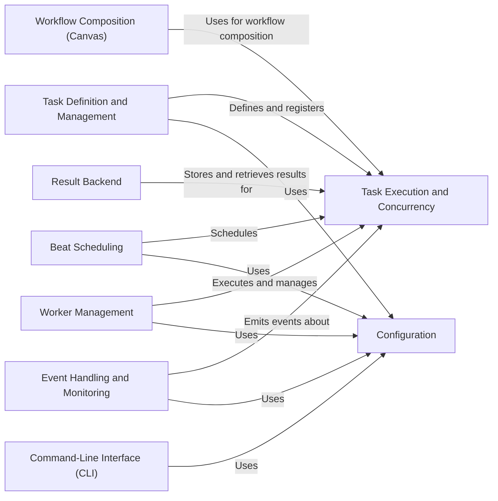

## Component Details

Celery is an asynchronous task queue or distributed job queue. It enables applications to delegate tasks to a background process, allowing the main application to remain responsive. Celery supports scheduling, monitoring, and managing these tasks, making it suitable for various use cases, including web applications, data processing, and background jobs. The core flow involves defining tasks, submitting them to the queue, and having worker processes execute them. Results can be stored in a backend for later retrieval.

### Task Definition and Management
This component focuses on defining, registering, and managing Celery tasks. It provides the tools and mechanisms for developers to create tasks, associate them with the Celery application, and handle task registries. It is responsible for creating task instances and making them available for execution by Celery workers.

**Related Classes/Methods**:

- `celery.app.shared_task` (full file reference)
- `celery.app.registry.TaskRegistry` (full file reference)
- `celery.app.registry.TaskRegistry.register` (full file reference)
- `celery.app.registry.TaskRegistry.unregister` (full file reference)
- `celery.app.base.Celery.task` (full file reference)
- `celery.app.base.Celery._task_from_fun` (full file reference)

### Task Execution and Concurrency
This component handles the execution of Celery tasks and manages concurrency. It receives task requests, manages task states, and processes task results. It includes the core logic for running tasks, applying time limits, managing task retries, and handling success/failure scenarios. It interacts with the concurrency management component to execute tasks concurrently, optimizing resource utilization.

**Related Classes/Methods**:

- `celery.worker.request.Request` (full file reference)
- `celery.worker.request.Request.execute` (full file reference)
- `celery.worker.request.Request.on_success` (full file reference)
- `celery.worker.request.Request.on_failure` (full file reference)
- `celery.worker.request.Request.on_retry` (full file reference)
- `celery.worker.request.Request.terminate` (full file reference)
- `celery.worker.request.Request.revoked` (full file reference)
- `celery.app.task.Task.__call__` (full file reference)
- `celery.app.task.Task.apply_async` (full file reference)
- `celery.app.task.Task.apply` (full file reference)

### Workflow Composition (Canvas)
This component provides the building blocks for composing complex workflows using Celery primitives like chains, groups, and chords. It includes the classes and functions for creating and manipulating task signatures, as well as utilities for combining tasks into more elaborate execution patterns. It enables users to define dependencies and execution order between tasks, creating sophisticated asynchronous workflows.

**Related Classes/Methods**:

- `celery.canvas.Signature` (full file reference)
- `celery.canvas.chain` (full file reference)
- `celery.canvas.group` (full file reference)
- `celery.canvas._chord` (full file reference)
- `celery.canvas.xmap` (full file reference)
- `celery.canvas.xstarmap` (full file reference)
- `celery.canvas.chunks` (full file reference)

### Worker Management
This component deals with the management and control of Celery workers. It includes starting and stopping workers, monitoring worker status, and sending control commands to workers. It encompasses the classes and functions for running the Celery worker process and interacting with it remotely. It relies on the configuration component for worker settings and the task execution component to process tasks.

**Related Classes/Methods**:

- `celery.worker.worker.WorkController` (full file reference)
- `celery.apps.worker.Worker` (full file reference)
- `celery.bin.worker.worker` (full file reference)

### Beat Scheduling
This component is responsible for scheduling periodic tasks using Celery Beat. It includes the classes and functions for defining schedules, managing schedule entries, and running the Celery Beat process to dispatch tasks at specified intervals. It uses the configuration component to load schedule settings and the task definition component to dispatch registered tasks according to the defined schedules.

**Related Classes/Methods**:

- `celery.beat.Scheduler` (full file reference)
- `celery.beat.PersistentScheduler` (full file reference)
- `celery.beat.ScheduleEntry` (full file reference)
- `celery.schedules.crontab` (full file reference)
- `celery.schedules.solar` (full file reference)
- <a href="https://github.com/celery/celery/blob/master/celery/apps/beat.py#L40-L160" target="_blank" rel="noopener noreferrer">`celery.apps.beat.Beat` (40:160)</a>

### Result Backend
This component handles the storage and retrieval of task results using various backend implementations. It includes the base classes for defining backends, as well as specific backend implementations for different storage systems like Redis, database, and cache. It provides an interface for retrieving task status and results, allowing applications to track the progress and outcome of asynchronous tasks.

**Related Classes/Methods**:

- `celery.backends.base.Backend` (full file reference)
- `celery.backends.base.BaseKeyValueStoreBackend` (full file reference)
- `celery.result.AsyncResult` (full file reference)
- `celery.result.GroupResult` (full file reference)
- `celery.app.backends.by_name` (full file reference)
- `celery.app.backends.by_url` (full file reference)

### Event Handling and Monitoring
This component provides the infrastructure for emitting and processing Celery events, enabling monitoring and introspection of Celery tasks and workers. It includes the classes and functions for dispatching events, receiving events, and maintaining task state based on event streams. It allows for real-time monitoring of task execution and worker status, providing insights into the Celery system's behavior.

**Related Classes/Methods**:

- `celery.events.Dispatcher` (full file reference)
- `celery.events.Receiver` (full file reference)
- `celery.events.State` (full file reference)
- `celery.events.event` (full file reference)
- `celery.events.cursesmon` (full file reference)

### Configuration
This component manages the configuration settings for Celery, including default values, option parsing, and configuration loading. It encompasses the classes and functions for defining configuration options, loading settings from various sources, and providing a consistent configuration interface. It is used by other components to retrieve configuration values, ensuring consistent behavior across the Celery system.

**Related Classes/Methods**:

- `celery.app.defaults` (full file reference)
- `celery.app.utils.Settings` (full file reference)
- <a href="https://github.com/celery/celery/blob/master/celery/loaders/base.py#L33-L236" target="_blank" rel="noopener noreferrer">`celery.loaders.base.BaseLoader` (33:236)</a>
- `celery.loaders.default.Loader` (full file reference)

### Command-Line Interface (CLI)
This component provides the command-line interface for interacting with Celery, including commands for running workers, starting Beat, and managing Celery tasks. It encompasses the classes and functions for defining command-line options, parsing arguments, and executing Celery commands. It serves as the entry point for users to interact with Celery, providing a convenient way to manage and control the system.

**Related Classes/Methods**:

- `celery.bin.celery` (full file reference)
- `celery.bin.worker` (full file reference)
- `celery.bin.beat` (full file reference)
- <a href="https://github.com/celery/celery/blob/master/celery/bin/control.py#L229-L252" target="_blank" rel="noopener noreferrer">`celery.bin.control` (229:252)</a>