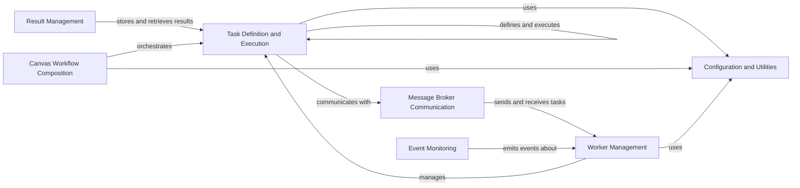

## Component Details

Celery is an asynchronous task queue or job queue which is based on distributed message passing. It is focused on real-time operation, but supports scheduling as well. Celery is used to execute tasks asynchronously (in the background) outside the main application flow. The core components of Celery include task definition and execution, message broker communication, result management, workflow composition, worker management, event monitoring, and configuration. These components work together to enable the reliable and efficient execution of asynchronous tasks.

### Task Definition and Execution
This component is responsible for defining, registering, and executing Celery tasks. It provides the necessary tools and infrastructure for developers to define the logic of their tasks and manage their execution within the Celery worker processes. It encompasses the task decorator, base task class, and mechanisms for automatic task discovery, ensuring that tasks are properly defined and ready for execution.
- **Related Classes/Methods**: `celery.app.task`, `celery.app.shared_task`, `celery.worker.worker`

### Message Broker Communication
This component handles all interactions with the message broker, such as RabbitMQ or Redis. It is responsible for sending tasks to the broker, receiving tasks from the broker, and managing the communication channels between the Celery application and the worker processes. This component ensures reliable and efficient task distribution, enabling Celery to handle a large volume of asynchronous tasks.
- **Related Classes/Methods**: `celery.app.amqp`, `celery.backends.redis`, `celery.backends.rabbitmq`

### Result Management
This component manages the storage and retrieval of task results. It provides a consistent interface for accessing task results, regardless of the underlying backend implementation. It is responsible for persisting task results and making them available to the Celery application, allowing developers to track the progress and outcome of their asynchronous tasks.
- **Related Classes/Methods**: `celery.backends.base`, `celery.backends.redis`, `celery.backends.database`, `celery.result`

### Canvas Workflow Composition
This component provides primitives for composing complex task workflows. It allows users to define dependencies and execution order between tasks, creating chains, groups, and chords. It is responsible for orchestrating the execution of multiple tasks in a coordinated manner, enabling developers to build sophisticated asynchronous workflows.
- **Related Classes/Methods**: `celery.canvas`, `celery.canvas.chain`, `celery.canvas.group`, `celery.canvas._chord`

### Worker Management
This component manages the Celery worker processes. It is responsible for starting, stopping, and monitoring worker processes, as well as managing their configuration and resource allocation. It ensures that worker processes are available to execute tasks and that they are running efficiently, allowing Celery to handle a large volume of asynchronous tasks.
- **Related Classes/Methods**: `celery.worker.worker`, `celery.worker.consumer`, `celery.worker.autoscale`

### Event Monitoring
This component provides real-time monitoring capabilities by emitting events related to task execution and worker status. These events can be used for monitoring, tracing, and management purposes. It is responsible for providing insights into the Celery system's behavior and performance, enabling developers to monitor and manage their asynchronous tasks effectively.
- **Related Classes/Methods**: `celery.events`, `celery.events.state`, `celery.events.dumper`

### Configuration and Utilities
This component handles the configuration of the Celery application, including settings for the broker, backend, task serialization, and other parameters. It also provides various utility functions and helper classes used throughout the Celery codebase. It is responsible for providing a consistent and flexible configuration system for Celery, allowing developers to customize Celery to their specific needs.
- **Related Classes/Methods**: `celery.app.defaults`, `celery.app.utils`