```mermaid
graph LR
    cellpose_models_Model["cellpose.models.Model"]
    cellpose_models_eval["cellpose.models.eval"]
    cellpose_models__run_net["cellpose.models._run_net"]
    cellpose_models__compute_masks["cellpose.models._compute_masks"]
    cellpose_dynamics_compute_masks["cellpose.dynamics.compute_masks"]
    cellpose_dynamics_follow_flows["cellpose.dynamics.follow_flows"]
    cellpose_dynamics_remove_bad_flow_masks["cellpose.dynamics.remove_bad_flow_masks"]
    cellpose_models_eval -- "uses" --> cellpose_models_Model
    cellpose_models_eval -- "calls" --> cellpose_models__run_net
    cellpose_models_eval -- "passes outputs to" --> cellpose_models__compute_masks
    cellpose_models_Model -- "provides to" --> cellpose_models_eval
    cellpose_models__run_net -- "returns to" --> cellpose_models_eval
    cellpose_models__compute_masks -- "hands off to" --> cellpose_dynamics_compute_masks
    cellpose_dynamics_compute_masks -- "invokes" --> cellpose_dynamics_follow_flows
    cellpose_dynamics_compute_masks -- "calls" --> cellpose_dynamics_remove_bad_flow_masks
    cellpose_dynamics_follow_flows -- "provides to" --> cellpose_dynamics_compute_masks
    cellpose_dynamics_remove_bad_flow_masks -- "returns to" --> cellpose_dynamics_compute_masks
```

## Details

The Core ML Segmentation Engine subsystem is primarily defined by the modules `cellpose.models` and `cellpose.dynamics`. These modules encapsulate the deep learning model definition, inference execution, and the core algorithms for converting model outputs into segmentation masks.

### cellpose.models.Model
Manages the deep learning model architecture and its trained weights. It serves as the primary interface for loading, configuring, and providing the neural network for inference. This component is fundamental as it represents the core ML asset.

**Related Classes/Methods**:

- <a href="https://github.com/MouseLand/cellpose/blob/main/cellpose/models.py" target="_blank" rel="noopener noreferrer">`cellpose.models.Model`</a>

### cellpose.models.eval
Orchestrates the entire segmentation inference process. It coordinates the forward pass of the neural network and the subsequent steps to compute masks. This is the main entry point for performing segmentation on an image, making it a critical control component.

**Related Classes/Methods**:

- <a href="https://github.com/MouseLand/cellpose/blob/main/cellpose/models.py#L156-L366" target="_blank" rel="noopener noreferrer">`cellpose.models.eval`:156-366</a>

### cellpose.models._run_net
Executes the forward pass of the deep learning model. It takes the pre-processed image and returns the raw predictions, specifically the cell probabilities and flow fields. This component is crucial for the actual neural network computation.

**Related Classes/Methods**:

- <a href="https://github.com/MouseLand/cellpose/blob/main/cellpose/models.py#L453-L493" target="_blank" rel="noopener noreferrer">`cellpose.models._run_net`:453-493</a>

### cellpose.models._compute_masks
Pre-processes and prepares the raw outputs (probabilities and flow fields) from the neural network for the subsequent mask generation algorithms implemented in `cellpose.dynamics`. This includes tasks like resizing or normalizing outputs, acting as a vital data preparation step.

**Related Classes/Methods**:

- <a href="https://github.com/MouseLand/cellpose/blob/main/cellpose/models.py#L495-L556" target="_blank" rel="noopener noreferrer">`cellpose.models._compute_masks`:495-556</a>

### cellpose.dynamics.compute_masks
The central algorithmic component for converting the predicted flow fields and cell probabilities into discrete, labeled segmentation masks. It orchestrates the flow-following and mask refinement steps, making it the core of the post-processing pipeline.

**Related Classes/Methods**:

- <a href="https://github.com/MouseLand/cellpose/blob/main/cellpose/dynamics.py#L624-L691" target="_blank" rel="noopener noreferrer">`cellpose.dynamics.compute_masks`:624-691</a>

### cellpose.dynamics.follow_flows
Implements the core flow-following algorithm. This function traces paths along the predicted flow fields to delineate individual cell boundaries and generate initial mask outlines. It's a key algorithmic primitive for mask generation.

**Related Classes/Methods**:

- <a href="https://github.com/MouseLand/cellpose/blob/main/cellpose/dynamics.py#L375-L397" target="_blank" rel="noopener noreferrer">`cellpose.dynamics.follow_flows`:375-397</a>

### cellpose.dynamics.remove_bad_flow_masks
Refines the generated masks by identifying and correcting masks that do not meet quality criteria or exhibit inconsistencies (e.g., masks that are too small, have poor flow quality, or are duplicates). This component ensures the quality and validity of the final segmentation output.

**Related Classes/Methods**:

- <a href="https://github.com/MouseLand/cellpose/blob/main/cellpose/dynamics.py#L400-L446" target="_blank" rel="noopener noreferrer">`cellpose.dynamics.remove_bad_flow_masks`:400-446</a>

### [FAQ](https://github.com/CodeBoarding/GeneratedOnBoardings/tree/main?tab=readme-ov-file#faq)