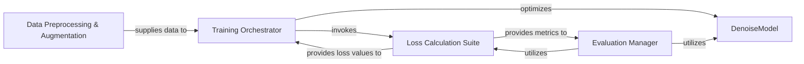

## Details

The denoising subsystem in `cellpose` is structured around a central `DenoiseModel`, which is a specialized neural network for image restoration. The `Training Orchestrator` component drives the learning process, iteratively refining the `DenoiseModel` by minimizing losses computed by the `Loss Calculation Suite`. Input data is prepared and augmented by the `Data Preprocessing & Augmentation` component to ensure robust training. Post-training, the `Evaluation Manager` assesses the model's efficacy, again relying on the `Loss Calculation Suite` for performance metrics. This modular design facilitates clear separation of concerns, enabling efficient development and maintenance of the denoising capabilities.

### DenoiseModel
This component represents the neural network architecture specifically designed for image denoising. It is the core machine learning model that learns to transform noisy input images into cleaner outputs. Its architectural importance lies in being the central intellectual property and the primary asset for the denoising task.

**Related Classes/Methods**:

- <a href="https://github.com/MouseLand/cellpose/blob/main/cellpose/models.py#L67-L556" target="_blank" rel="noopener noreferrer">`cellpose.models.CellposeModel`:67-556</a>

### Training Orchestrator
Manages the entire lifecycle of training the `DenoiseModel`. This includes iterating over datasets, performing forward and backward passes, updating model weights, and logging training progress. It is architecturally important as it orchestrates the learning process, ensuring the model is effectively trained.

**Related Classes/Methods**:

- <a href="https://github.com/MouseLand/cellpose/blob/main/cellpose/denoise.py" target="_blank" rel="noopener noreferrer">`cellpose.denoise.train_loss`</a>

### Evaluation Manager
Responsible for assessing the performance of a trained `DenoiseModel` on unseen data (validation or test sets). It ensures the model's generalization capabilities are measured accurately. This component is crucial for validating the effectiveness of the trained model.

**Related Classes/Methods**:

- <a href="https://github.com/MouseLand/cellpose/blob/main/cellpose/denoise.py" target="_blank" rel="noopener noreferrer">`cellpose.denoise.test_loss`</a>

### Loss Calculation Suite
A collection of functions dedicated to computing various loss components (e.g., perceptual, reconstruction) that guide the training process and quantify model performance. Its architectural importance lies in providing the objective functions necessary for model optimization and evaluation.

**Related Classes/Methods**:

- <a href="https://github.com/MouseLand/cellpose/blob/main/cellpose/denoise.py#L49-L52" target="_blank" rel="noopener noreferrer">`cellpose.denoise.loss_fn_rec`:49-52</a>
- <a href="https://github.com/MouseLand/cellpose/blob/main/cellpose/denoise.py#L55-L63" target="_blank" rel="noopener noreferrer">`cellpose.denoise.loss_fn_seg`:55-63</a>
- <a href="https://github.com/MouseLand/cellpose/blob/main/cellpose/denoise.py#L101-L119" target="_blank" rel="noopener noreferrer">`cellpose.denoise.loss_fn_per`:101-119</a>

### Data Preprocessing & Augmentation
Handles the preparation of raw image data for consumption by the `DenoiseModel`, including operations like random rotations, resizing, and the addition of synthetic noise for training robustness. This component is vital for ensuring the model receives appropriately formatted and diverse input data.

**Related Classes/Methods**:

- <a href="https://github.com/MouseLand/cellpose/blob/main/cellpose/denoise.py#L211-L344" target="_blank" rel="noopener noreferrer">`cellpose.denoise.add_noise`:211-344</a>
- <a href="https://github.com/MouseLand/cellpose/blob/main/cellpose/denoise.py#L189-L208" target="_blank" rel="noopener noreferrer">`cellpose.denoise.img_norm`:189-208</a>

### [FAQ](https://github.com/CodeBoarding/GeneratedOnBoardings/tree/main?tab=readme-ov-file#faq)