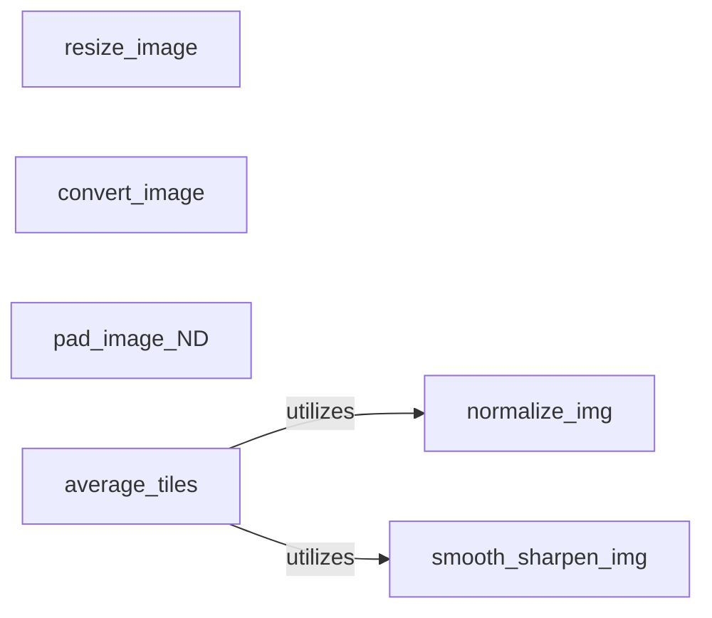

## Details

The `cellpose.transforms` subsystem is responsible for a suite of image preprocessing and post-processing operations essential for preparing images for the Cellpose model and refining its outputs. Key components include `normalize_img` for intensity standardization, `resize_image` for dimension adjustments, `convert_image` for data type and structural transformations, and `pad_image_ND` for shape uniformity. For handling large images, `average_tiles` processes images in segments, leveraging `normalize_img` and `smooth_sharpen_img` to ensure consistent and enhanced tile processing before reconstruction. `smooth_sharpen_img` further refines image features through filtering. This subsystem ensures robust and efficient image handling, adapting diverse input images to the model's requirements and optimizing output quality.

### normalize_img
Standardizes image pixel intensities to a consistent range (e.g., 0-1 or mean 0, std dev 1), which is crucial for stable model input and training.

**Related Classes/Methods**:

- <a href="https://github.com/MouseLand/cellpose/blob/main/cellpose/transforms.py#L195-L314" target="_blank" rel="noopener noreferrer">`normalize99_tile`:195-314</a>
- <a href="https://github.com/MouseLand/cellpose/blob/main/cellpose/transforms.py#L162-L192" target="_blank" rel="noopener noreferrer">`normalize99`:162-192</a>

### resize_image
Adjusts image dimensions to meet specific model input requirements or user-defined scales, vital for consistent input size for neural networks.

**Related Classes/Methods**:

- <a href="https://github.com/MouseLand/cellpose/blob/main/cellpose/transforms.py#L782-L816" target="_blank" rel="noopener noreferrer">`resize_safe`:782-816</a>

### convert_image
Manages image data type conversions (e.g., float to uint8) and structural transformations, particularly for handling 3D image data, ensuring compatibility with downstream processing.

**Related Classes/Methods**:

- <a href="https://github.com/MouseLand/cellpose/blob/main/cellpose/transforms.py#L450-L538" target="_blank" rel="noopener noreferrer">`_convert_image_3d`:450-538</a>

### pad_image_ND
Adds padding to images to achieve uniform N-dimensional shapes, often a prerequisite for batch processing or specific convolutional neural network architectures.

**Related Classes/Methods**:

- <a href="https://github.com/MouseLand/cellpose/blob/main/cellpose/transforms.py#L873-L887" target="_blank" rel="noopener noreferrer">`get_pad_yx`:873-887</a>

### smooth_sharpen_img
Applies various filters (e.g., Gaussian blur for smoothing, unsharp mask for sharpening) to enhance or suppress specific image features, impacting segmentation quality.

**Related Classes/Methods**:

- <a href="https://github.com/MouseLand/cellpose/blob/main/cellpose/transforms.py#L317-L336" target="_blank" rel="noopener noreferrer">`gaussian_kernel`:317-336</a>

### average_tiles
Facilitates processing very large images by dividing them into smaller tiles, processing each independently, and then averaging results to reconstruct the full image, enabling efficient memory usage.

**Related Classes/Methods**:

- <a href="https://github.com/MouseLand/cellpose/blob/main/cellpose/transforms.py#L15-L35" target="_blank" rel="noopener noreferrer">`_taper_mask`:15-35</a>

### [FAQ](https://github.com/CodeBoarding/GeneratedOnBoardings/tree/main?tab=readme-ov-file#faq)