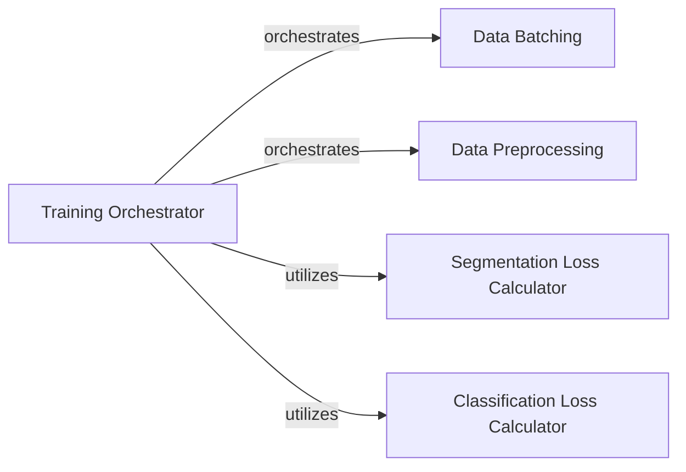

## Details

The `Model Training` subsystem is primarily encapsulated within the `cellpose/train.py` module. This module orchestrates the entire training pipeline for Cellpose models, from data preparation to model optimization.

### Training Orchestrator
Manages the entire training lifecycle, including iterating through epochs, coordinating data loading, invoking loss calculations, performing backpropagation, and updating model parameters. It acts as the primary control flow for the training process.

**Related Classes/Methods**:

- <a href="https://github.com/MouseLand/cellpose/blob/main/cellpose/train.py#L309-L548" target="_blank" rel="noopener noreferrer">`cellpose.train.train_seg`:309-548</a>

### Data Batching
Efficiently prepares and delivers batches of training and validation data to the Training Orchestrator during each iteration of the training loop.

**Related Classes/Methods**:

- <a href="https://github.com/MouseLand/cellpose/blob/main/cellpose/train.py#L88-L113" target="_blank" rel="noopener noreferrer">`cellpose.train._get_batch`:88-113</a>

### Data Preprocessing
Handles the initial preparation of the dataset, including splitting it into training and testing subsets and performing any necessary pre-training transformations or validations.

**Related Classes/Methods**:

- <a href="https://github.com/MouseLand/cellpose/blob/main/cellpose/train.py#L139-L306" target="_blank" rel="noopener noreferrer">`cellpose.train._process_train_test`:139-306</a>

### Segmentation Loss Calculator
Computes the specific loss function for the image segmentation task, providing the error signal required for optimizing the model's segmentation output.

**Related Classes/Methods**:

- <a href="https://github.com/MouseLand/cellpose/blob/main/cellpose/train.py#L33-L53" target="_blank" rel="noopener noreferrer">`cellpose.train._loss_fn_seg`:33-53</a>

### Classification Loss Calculator
Computes the loss function for any classification components within the Cellpose model (e.g., for distinguishing foreground/background or different cell types), contributing to the overall training objective.

**Related Classes/Methods**:

- <a href="https://github.com/MouseLand/cellpose/blob/main/cellpose/train.py#L15-L31" target="_blank" rel="noopener noreferrer">`cellpose.train._loss_fn_class`:15-31</a>

### [FAQ](https://github.com/CodeBoarding/GeneratedOnBoardings/tree/main?tab=readme-ov-file#faq)