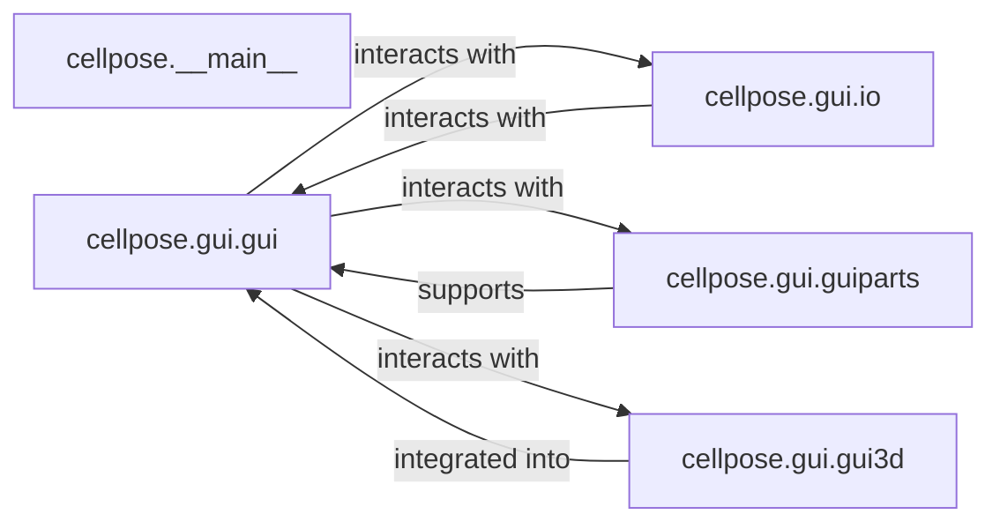

## Details

The `User Interfaces (GUI & CLI)` subsystem serves as the primary interaction layer for the `cellpose` project, enabling users to load data, perform segmentation, and initiate training through both graphical and command-line interfaces. It acts as an orchestrator, translating user actions into calls to the core ML and data handling components.

### cellpose.__main__
This component serves as the main command-line interface for `cellpose`. It is responsible for parsing command-line arguments and orchestrating high-level operations such as model evaluation, training, and running segmentation directly from the terminal. It acts as a bridge between user commands and the core ML functionalities.

**Related Classes/Methods**:

- <a href="https://github.com/MouseLand/cellpose/blob/main/cellpose/__main__.py" target="_blank" rel="noopener noreferrer">`cellpose.__main__`</a>

### cellpose.gui.gui
This is the central orchestrator for the 2D graphical user interface. It manages the display of images, handles user input (e.g., mouse clicks for mask editing), maintains the GUI state, and triggers core ML operations (segmentation, training) within the GUI context. It provides the primary visual user experience.

**Related Classes/Methods**:

- <a href="https://github.com/MouseLand/cellpose/blob/main/cellpose/gui/gui.py" target="_blank" rel="noopener noreferrer">`cellpose.gui.gui`</a>

### cellpose.gui.io
This component specifically handles the loading and saving of image data and segmentation masks for the GUI. It prepares data for display within the GUI and persists user modifications or segmentation results, acting as an intermediary between the GUI and the underlying data handling mechanisms.

**Related Classes/Methods**:

- <a href="https://github.com/MouseLand/cellpose/blob/main/cellpose/gui/io.py" target="_blank" rel="noopener noreferrer">`cellpose.gui.io`</a>

### cellpose.gui.guiparts
This component provides lower-level building blocks and interaction logic for drawing and handling events (e.g., mouse clicks, hovers) on specific GUI elements, particularly those related to mask drawing, selection, and display. It abstracts the details of rendering and user interaction for the main GUI.

**Related Classes/Methods**:

- <a href="https://github.com/MouseLand/cellpose/blob/main/cellpose/gui/guiparts.py" target="_blank" rel="noopener noreferrer">`cellpose.gui.guiparts`</a>

### cellpose.gui.gui3d
This component provides specialized 3D visualization and interaction capabilities within the GUI, including orthogonal views and Z-stack navigation for volumetric data. It extends the GUI's capabilities to handle multi-dimensional image data, enhancing the user's ability to inspect and interact with 3D datasets.

**Related Classes/Methods**:

- <a href="https://github.com/MouseLand/cellpose/blob/main/cellpose/gui/gui3d.py" target="_blank" rel="noopener noreferrer">`cellpose.gui.gui3d`</a>

### [FAQ](https://github.com/CodeBoarding/GeneratedOnBoardings/tree/main?tab=readme-ov-file#faq)