```mermaid
graph LR
    Data_Management_I_O_["Data Management (I/O)"]
    Image_Preprocessing["Image Preprocessing"]
    Core_ML_Segmentation_Engine["Core ML Segmentation Engine"]
    Model_Training["Model Training"]
    User_Interfaces_GUI_CLI_["User Interfaces (GUI & CLI)"]
    Visualization["Visualization"]
    Denoising_Module["Denoising Module"]
    User_Interfaces_GUI_CLI_ -- "initiates data loading/saving via" --> Data_Management_I_O_
    Data_Management_I_O_ -- "provides raw image data to" --> Image_Preprocessing
    Image_Preprocessing -- "feeds processed data to" --> Core_ML_Segmentation_Engine
    Core_ML_Segmentation_Engine -- "outputs final segmentation masks to" --> Data_Management_I_O_
    Core_ML_Segmentation_Engine -- "sends results to" --> Visualization
    User_Interfaces_GUI_CLI_ -- "triggers segmentation execution within" --> Core_ML_Segmentation_Engine
    User_Interfaces_GUI_CLI_ -- "initiates" --> Model_Training
    Model_Training -- "updates model weights within" --> Core_ML_Segmentation_Engine
    Denoising_Module -- "can pre-process images, feeding into" --> Image_Preprocessing
    click Image_Preprocessing href "https://github.com/CodeBoarding/GeneratedOnBoardings/blob/main/cellpose/Image_Preprocessing.md" "Details"
    click Core_ML_Segmentation_Engine href "https://github.com/CodeBoarding/GeneratedOnBoardings/blob/main/cellpose/Core_ML_Segmentation_Engine.md" "Details"
    click Model_Training href "https://github.com/CodeBoarding/GeneratedOnBoardings/blob/main/cellpose/Model_Training.md" "Details"
    click User_Interfaces_GUI_CLI_ href "https://github.com/CodeBoarding/GeneratedOnBoardings/blob/main/cellpose/User_Interfaces_GUI_CLI_.md" "Details"
    click Denoising_Module href "https://github.com/CodeBoarding/GeneratedOnBoardings/blob/main/cellpose/Denoising_Module.md" "Details"
```

## Details

The `cellpose` project is structured as a modular machine learning toolkit, designed for robust cellular image segmentation. At its core, the **Core ML Segmentation Engine** processes images, leveraging deep learning models to generate segmentation masks. This engine is supported by **Data Management (I/O)** for handling all input and output, and **Image Preprocessing** for preparing data. The system's extensibility is highlighted by the **Model Training** component, which allows for continuous improvement of the core models, and a dedicated **Denoising Module** for image quality enhancement. User interaction is facilitated through versatile **User Interfaces (GUI & CLI)**, which orchestrate the segmentation and training workflows, with results visually presented by the **Visualization** component. This architecture emphasizes a clear separation of concerns, enabling efficient data flow from raw image input to segmented output, and providing multiple access points for diverse user needs.

### Data Management (I/O)
Manages the loading of raw image data and associated labels, as well as the saving of processed segmentation masks and related outputs. It acts as the primary interface for data persistence.

**Related Classes/Methods**:

- <a href="https://github.com/MouseLand/cellpose/blob/main/cellpose/io.py" target="_blank" rel="noopener noreferrer">`cellpose/io.py`</a>

### Image Preprocessing [[Expand]](./Image_Preprocessing.md)
Prepares raw image data for consumption by the core ML models. This includes normalization, resizing, and other transformations necessary for model input or data augmentation during training.

**Related Classes/Methods**:

- <a href="https://github.com/MouseLand/cellpose/blob/main/cellpose/transforms.py" target="_blank" rel="noopener noreferrer">`cellpose/transforms.py`</a>

### Core ML Segmentation Engine [[Expand]](./Core_ML_Segmentation_Engine.md)
The central machine learning component. It encapsulates the Cellpose deep learning models, handles the forward pass for predicting cell probabilities and flow fields, and implements the algorithms to convert these raw outputs into discrete, labeled segmentation masks (flow following, mask refinement).

**Related Classes/Methods**:

- <a href="https://github.com/MouseLand/cellpose/blob/main/cellpose/models.py" target="_blank" rel="noopener noreferrer">`cellpose/models.py`</a>
- <a href="https://github.com/MouseLand/cellpose/blob/main/cellpose/dynamics.py" target="_blank" rel="noopener noreferrer">`cellpose/dynamics.py`</a>

### Model Training [[Expand]](./Model_Training.md)
Manages the entire training pipeline for Cellpose models. This includes data batching, loss calculation, backpropagation, and optimization of model parameters.

**Related Classes/Methods**:

- <a href="https://github.com/MouseLand/cellpose/blob/main/cellpose/train.py" target="_blank" rel="noopener noreferrer">`cellpose/train.py`</a>

### User Interfaces (GUI & CLI) [[Expand]](./User_Interfaces_GUI_CLI_.md)
Provides interactive (GUI) and scriptable (CLI) access points for users to load data, run segmentation, and initiate training. It orchestrates interactions with the core ML components.

**Related Classes/Methods**:

- <a href="https://github.com/MouseLand/cellpose/blob/main/cellpose/gui/gui.py" target="_blank" rel="noopener noreferrer">`cellpose/gui/gui.py`</a>
- <a href="https://github.com/MouseLand/cellpose/blob/main/cellpose/__main__.py" target="_blank" rel="noopener noreferrer">`cellpose/__main__.py`</a>

### Visualization
Provides utilities for rendering and displaying images, segmentation masks, flow fields, and other visual outputs. This is essential for user feedback, debugging, and result presentation.

**Related Classes/Methods**:

- <a href="https://github.com/MouseLand/cellpose/blob/main/cellpose/plot.py" target="_blank" rel="noopener noreferrer">`cellpose/plot.py`</a>

### Denoising Module [[Expand]](./Denoising_Module.md)
Offers specialized functionalities for image denoising, which can be used as a pre-processing step or a standalone feature. It includes its own training and evaluation routines for denoising models.

**Related Classes/Methods**:

- <a href="https://github.com/MouseLand/cellpose/blob/main/cellpose/denoise.py" target="_blank" rel="noopener noreferrer">`cellpose/denoise.py`</a>

### [FAQ](https://github.com/CodeBoarding/GeneratedOnBoardings/tree/main?tab=readme-ov-file#faq)